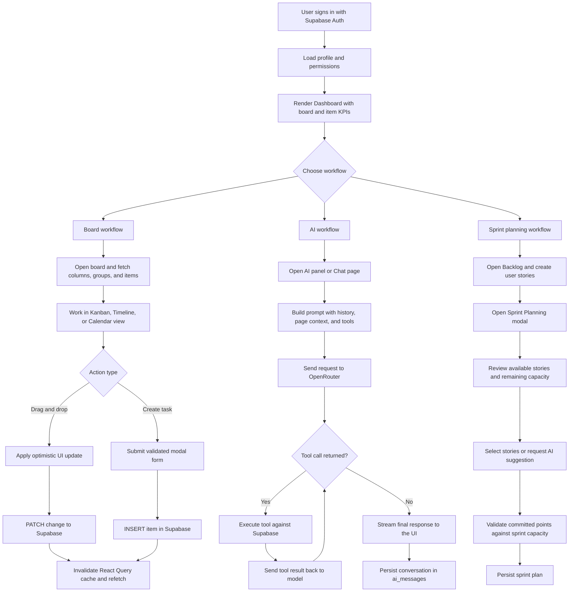
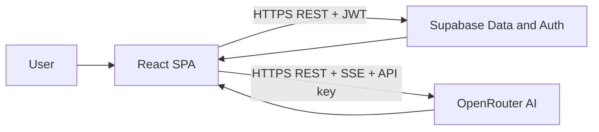
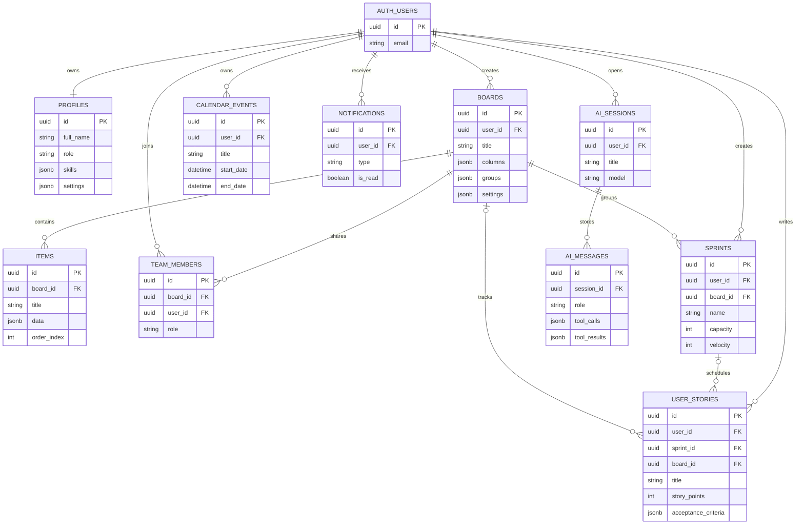
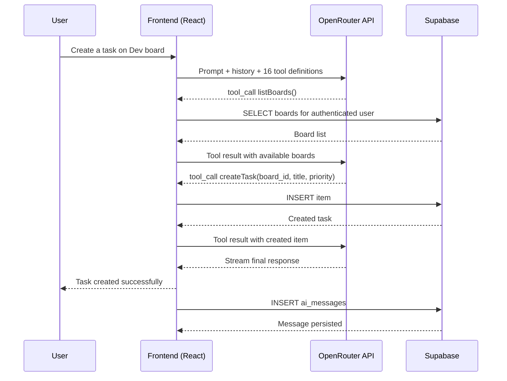
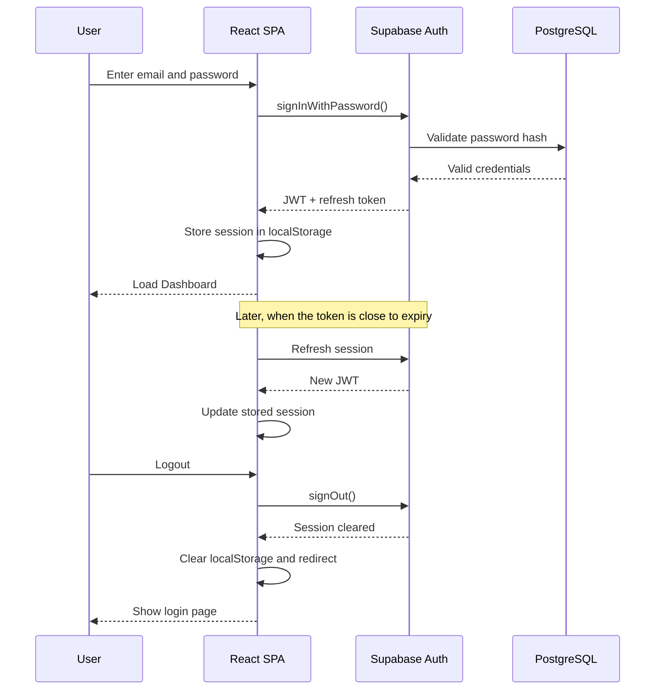
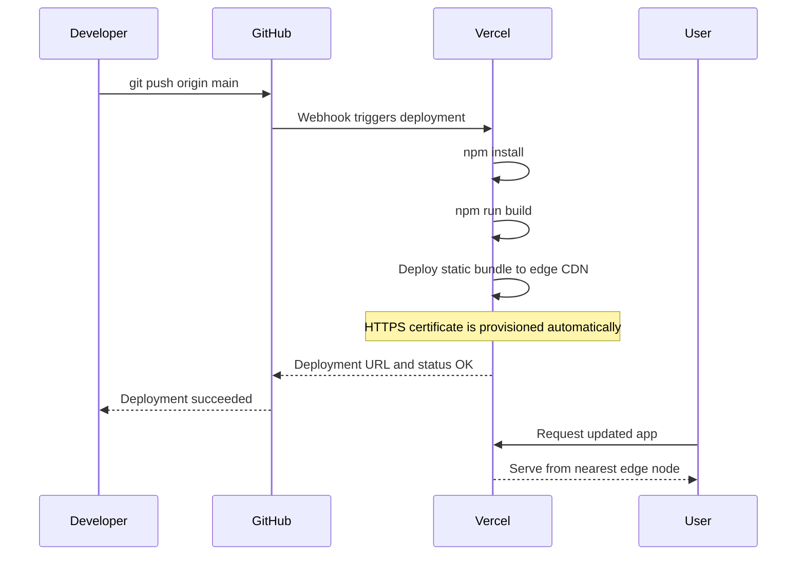

# CAPSTONE FINAL REPORT 2

**T.C.**
**BAHCESEHiR UNIVERSITY**

**FACULTY OF ENGINEERING AND NATURAL SCIENCES**

**CAPSTONE FINAL REPORT**

**Agile Project Management and AI-Based Collaboration Platform 2 #1011207**

**Maria Alftaih 2285921 - Software Engineering**
**Berra Gungor 2103250 - Management Engineering**
**Khalid Hajjo Rifai 2251726 - Software Engineering**
**Mohammad Houjeirat 2286763 - Software Engineering**
**Duygu Kaya 2102192 - Management Engineering**
**Abdul Rahman Malak 2285310 - Software Engineering**
**Sakir Taha Son 2200185 - Management Engineering**

**Advisors:**
**Prof. Dr. Gul Temur - Management Engineering**
**Dr. Derya Bodur - Software Engineering**

**ISTANBUL, March 2026**

---

## STUDENT DECLARATION

By submitting this report, as partial fulfillment of the requirements of the Capstone course, the students promise on penalty of failure of the course that

- they have given credit to and declared (by citation), any work that is not their own (e.g. parts of the report that is copied/pasted from the Internet, design or construction performed by another person, etc.);
- they have not received unpermitted aid for the project design, construction, report or presentation;
- they have not falsely assigned credit for work to another student in the group, and have not taken credit for work done by another student in the group.

---

# 1. ABSTRACT

**Agile Project Management and AI-Based Collaboration Platform 2 #1011207**

Maria Alftaih 2285921 - Software Engineering
Berra Gungor 2103250 - Management Engineering
Khalid Hajjo Rifai 2251726 - Software Engineering
Mohammad Houjeirat 2286763 - Software Engineering
Duygu Kaya 2102192 - Management Engineering
Abdul Rahman Malak 2285310 - Software Engineering
Sakir Taha Son 2200185 - Management Engineering

Faculty of Engineering and Natural Sciences

**Prof. Dr. Gul Temur - Management Engineering**
**Dr. Derya Bodur - Software Engineering**

March 2026

AgileFlow is a cloud-native Agile project management platform designed to consolidate task tracking, sprint planning, analytics, and team collaboration into a single, cohesive web application. Built as a React Single Page Application (SPA) with a Supabase PostgreSQL backend, the platform replaces fragmented toolchains with an integrated workspace supporting multiple board views (Kanban, Timeline/Gantt, Calendar), real-time analytics dashboards, and a comprehensive backlog management system with sprint capacity planning.

A distinguishing feature of AgileFlow is its AI-powered collaboration layer, implemented through the OpenRouter API with cascading model fallback across multiple large language models (Claude Haiku 4.5, GPT-4o-mini, Gemini 2.0 Flash). The AI assistant supports natural-language tool calling for task creation, assignment, and sprint planning, and includes an intelligent task assignment engine that scores team members using a weighted algorithm combining competency matching (40%), workload availability (35%), and historical performance (25%). Streaming response delivery and persistent chat sessions enable fluid, context-aware interaction throughout the platform.

The system enforces role-based access control (RBAC) with four permission tiers (viewer, member, admin, super-admin) and leverages Supabase Row Level Security (RLS) for defense-in-depth data isolation. A comprehensive test infrastructure spanning unit tests (Vitest), end-to-end tests (Playwright), accessibility audits (axe-core), and responsive design validation ensures software quality across the development lifecycle. The application is deployed on Vercel with continuous deployment from the main branch, providing immediate production updates on every commit.

This report documents the complete system architecture, sub-system designs, integration strategy, and evaluation methodology for AgileFlow, covering the AI collaboration engine, multi-view board system, advanced analytics, Supabase backend infrastructure, and comprehensive testing framework.

**Key Words**: Agile Project Management, Scrum, Kanban, Artificial Intelligence, Large Language Models (LLM), Tool Calling, Task Assignment Algorithm, Role-Based Access Control (RBAC), Row Level Security (RLS), Single Page Application (SPA), React, Supabase, PostgreSQL, OpenRouter API, Continuous Deployment, Recharts, TanStack React Query, Playwright, Vitest

---

# LIST OF FIGURES

Figure 1. AgileFlow System Architecture
Figure 2. Process Diagram for AgileFlow
Figure 3. Work Breakdown Structure
Figure 4. Project Network Diagram
Figure 5. Gantt Chart (Development Timeline)
Figure 6. Frontend Component Hierarchy Diagram
Figure 7. Frontend Data Flow Process Chart
Figure 8. Board View Switching — Kanban, Timeline, Calendar
Figure 9. Manage Sprint Backlog Use-Case Diagram
Figure 10. Execute Task (Drag & Drop) Sequence Diagram
Figure 11. Sprint Planning Sequence Diagram
Figure 12. AgileFlow Dashboard Interface
Figure 13. Supabase Backend Architecture Diagram
Figure 14. Database Entity-Relationship Diagram (ERD)
Figure 15. Row Level Security (RLS) Policy Flow
Figure 16. Authentication Flow — Supabase Auth
Figure 17. API Request Processing Flow (Serverless)
Figure 18. AI Assistant Architecture Diagram
Figure 19. AI Tool-Calling Sequence Diagram
Figure 20. AI Task Assignment Scoring Algorithm Flow
Figure 21. AI Streaming Response Pipeline
Figure 22. Analytics Dashboard — Sprint Velocity & Burndown
Figure 23. AgileFlow Data Flow Diagram (DFD Level 1) — Updated
Figure 24. Integration Test Coverage Matrix
Figure 25. Deployment Pipeline — Vercel CI/CD

---

# LIST OF ABBREVIATIONS

| Abbreviation | Full Form |
|---|---|
| API | Application Programming Interface |
| REST | Representational State Transfer |
| SPA | Single Page Application |
| CSR | Client-Side Rendering |
| JSON | JavaScript Object Notation |
| JSONB | JSON Binary (PostgreSQL) |
| JWT | JSON Web Token |
| CRUD | Create-Read-Update-Delete |
| UI/UX | User Interface / User Experience |
| AI | Artificial Intelligence |
| LLM | Large Language Model |
| CDN | Content Delivery Network |
| MCDM | Multi-Criteria Decision Making |
| UAT | User Acceptance Testing |
| NPM | Node Package Manager |
| RBAC | Role-Based Access Control |
| RLS | Row Level Security |
| HTML | HyperText Markup Language |
| DOM | Document Object Model |
| CSS | Cascading Style Sheets |
| URL | Uniform Resource Locator |
| KPI | Key Performance Indicator |
| SSR | Server-Side Rendering |
| SSE | Server-Sent Events |
| IDE | Integrated Development Environment |
| RDBMS | Relational Database Management System |
| ACID | Atomicity - Consistency - Isolation - Durability |
| UUID | Universally Unique Identifier |
| ERD | Entity-Relationship Diagram |
| DFD | Data Flow Diagram |
| CI/CD | Continuous Integration / Continuous Deployment |
| CORS | Cross-Origin Resource Sharing |
| AHP | Analytic Hierarchy Process |
| WCAG | Web Content Accessibility Guidelines |
| E2E | End-to-End (Testing) |
| DnD | Drag and Drop |
| HSL | Hue-Saturation-Lightness (Color Model) |

---

# 2. OVERVIEW

## 2.1. Identification of the Need

Modern software development operates at high speed, creating significant challenges for engineering teams seeking to maintain alignment, visibility, and operational efficiency. As projects grow in complexity, the ability to manage tasks, track progress, and coordinate schedules becomes critical to success. The industry requires a comprehensive project management solution grounded in Agile principles — specifically Scrum and Kanban — to support continuous delivery and iterative improvement.

Teams increasingly demand not just task tracking, but intelligent automation — AI-driven recommendations for task assignment, automated sprint planning, and natural-language interfaces for interacting with project data. The gap between execution tools and strategic decision-making support has widened, and existing solutions either lack AI integration entirely or lock it behind enterprise pricing tiers.

Development teams require a system that addresses these operational needs:

1. **Real-time Visibility:** Team members and stakeholders must see the current status of a project immediately. A dashboard aggregating key performance indicators — total boards, pending tasks, completion rates, sprint velocity — into one centralized view eliminates the overhead of assembling status updates manually.

2. **Structured Agile Workflow:** Teams require a unified digital workspace to manage the full product lifecycle: creating and prioritizing User Stories in the backlog, estimating effort via Story Points, and structuring work into Sprint cycles with capacity constraints.

3. **Multi-View Task Execution:** Different stakeholders visualize work differently. A Kanban board serves daily stand-ups; a Timeline/Gantt view maps dependencies and milestones; a Calendar view tracks deadlines and events. The platform must provide all three views over the same underlying data.

4. **AI-Powered Collaboration:** Beyond basic task management, teams need intelligent assistance — an AI that can create tasks via natural language, recommend optimal task assignments based on team member skills and availability, suggest sprint compositions, and explain analytics insights in plain language.

5. **Data-Driven Process Improvement:** Automated analytics reflecting team-wide performance data — sprint velocity charts, burndown curves, task completion distributions, workload balance — enable managers to make data-driven decisions from retrospective performance history.

6. **Role-Based Access Control:** As teams scale, not every member should have the same permissions. Viewers observe progress; members execute tasks; admins configure boards; super-admins manage users. A hierarchical permission system enforces this structure at both the UI and database levels.

AgileFlow addresses these needs through a unified platform built on open-source Supabase infrastructure, featuring an AI collaboration engine, multi-view board system, advanced analytics, and comprehensive testing and deployment automation.

## 2.2. Definition of the Problem

AgileFlow addresses several technical and strategic challenges inherent to building a modern Agile project management platform:

**1. Backend Architecture Selection:**
The team evaluated multiple backend approaches and selected Supabase — an open-source Firebase alternative providing a full PostgreSQL database, built-in authentication, Row Level Security, and a REST API. This choice provides relational data modeling capabilities, defense-in-depth security, and near-zero operational overhead compared to building a custom Node.js backend.

**2. Multi-View Task Visualization:**
Real-world Agile teams require multiple visualization paradigms: Kanban boards for workflow status, Timeline/Gantt charts for scheduling and dependencies, and Calendar views for deadline tracking. AgileFlow implements all three views over the same data model, allowing users to switch perspectives without data duplication.

**3. AI-Powered Collaboration:**
AgileFlow introduces a comprehensive AI collaboration layer: a conversational assistant with tool-calling capabilities (task creation, assignment, sprint planning), an intelligent task assignment algorithm using weighted scoring (competency, availability, performance), streaming response delivery for real-time interaction, and context-aware analytics explanations.

**4. Granular Access Control:**
AgileFlow implements a four-tier RBAC system (viewer, member, admin, super-admin) enforced at both the frontend (conditional UI rendering) and backend (Supabase RLS policies) levels, ensuring defense-in-depth security.

**5. Comprehensive Testing Infrastructure:**
AgileFlow establishes a multi-layered testing framework: unit tests (Vitest + Testing Library), end-to-end tests (Playwright), accessibility audits (axe-core for WCAG 2.1 AA), and responsive design validation across mobile, tablet, and desktop breakpoints.

### 2.2.1. Functional Requirements

The primary functional requirements for AgileFlow are:

**Board Management:** Full CRUD operations on project boards with customizable columns (11 cell types: text, status, priority, people, date, timeline, tags, number, checkbox, budget, dropdown), groups/sections, drag-and-drop task reordering, and three visualization modes (Kanban, Timeline, Calendar).

**Backlog & Sprint Management:** User Story creation with acceptance criteria, story points, and priority levels. Sprint planning with capacity constraints, velocity tracking, and automated sprint composition suggestions.

**AI Assistant:** Conversational interface with tool-calling capabilities for task/board management. Intelligent task assignment engine with weighted scoring algorithm. Streaming response delivery. Persistent chat sessions with history. Context-aware analytics explanations via dedicated "Ask AI" buttons.

**Analytics & Reporting:** Sprint velocity charts, burndown curves, task completion rates, status/priority distributions, team workload analysis, cycle time metrics, and overdue task tracking — all rendered with Recharts and augmented by AI-generated explanations.

**User & Team Management:** Email/password authentication via Supabase Auth. User profiles with skills, job title, department metadata. Team member invitations with role assignment. Admin panel for user management.

**Help System:** Categorized documentation center with full-text search, breadcrumb navigation, and AI assistant integration for answering user questions.

### 2.2.2. Performance Requirements

The application's performance targets are scoped to realistic academic usage (a team of 7 members with up to 10 registered accounts and 50-200 task records):

- **Dashboard Load Time:** The primary views (Dashboard, Board) shall become interactive within 2 seconds under typical broadband conditions.
- **Interaction Responsiveness:** UI actions such as drag-and-drop shall provide local feedback within 100ms via optimistic UI updates.
- **API Response Time:** Supabase read operations (list boards, fetch tasks) shall return within 200ms for the expected dataset size (up to 200 task records across 5-10 boards).
- **AI Response Time:** First token from the AI assistant shall appear within 3 seconds of submission, with streaming delivery for progressive rendering. The system supports up to 1,000 AI requests per day (with 10+ OpenRouter credits purchased).
- **Concurrent Users:** The system shall support up to 10 simultaneous users without data integrity loss. Supabase's free-tier Nano instance provides approximately 60 direct PostgreSQL connections and up to 200 pooled connections via Supavisor, which far exceeds the expected concurrent load.
- **Analytics Generation:** Computation of analytics metrics (velocity, burndown, distributions) from the expected task set (50-200 records) shall complete within 200ms on the client side.

### 2.2.3. Constraints

**Team Size:** The development team consists of four software engineers and three management engineers. Resource allocation prioritizes core functional requirements over optional enhancements.

**Budget:** The project operates on a minimal budget, relying entirely on open-source libraries and free or near-free cloud services. The total infrastructure cost for development (January-March 2026) was approximately $10-15 USD, spent entirely on OpenRouter API credits for AI model usage. All other services remain within their free tiers:
- Supabase Free Tier: 500MB database (using ~5MB), 1GB file storage, 50,000 MAU limit (using ~10 accounts), 5GB/month egress
- Vercel Hobby Tier: 100GB bandwidth/month (using ~2GB), automatic HTTPS, edge CDN, 100 deploys/hour
- OpenRouter API: ~$10-15 total spent on paid model credits (Claude Haiku 4.5, GPT-4o-mini) over the development period. Free-tier models (Llama, Gemini Flash) used as fallbacks at zero cost. With 10+ credits purchased, the daily request limit is 1,000 requests/day — more than sufficient for team usage.
- Development tools: $0 (VS Code, GitHub free tier, npm)

**Regulatory Compliance:** The system adheres to data privacy requirements through Supabase RLS (data isolation at the database level), HTTPS-only communication (enforced by Vercel), and no storage of plaintext passwords (handled by Supabase Auth with bcrypt hashing).

**Technology Constraints:** The serverless architecture (no custom backend server) means all business logic executes either in the browser or via Supabase's built-in features (RLS policies, Auth hooks, Edge Functions). This eliminates server management overhead but constrains certain patterns (e.g., email sending requires Supabase Edge Functions rather than a simple SMTP call).

## 2.3. Conceptual Solutions

### 2.3.1. Literature Review

The landscape of Agile project management tools continues to evolve rapidly. Several key trends in the project management landscape directly inform AgileFlow's architecture:

**AI-Augmented Project Management:** Recent research demonstrates that AI-powered task assignment and workload balancing can improve team productivity by 15-25% compared to manual allocation (Rodriguez et al., 2025). Tools like Linear have pioneered AI-driven triage, while GitHub Copilot Workspace extends AI into project planning. AgileFlow's approach — embedding AI as a conversational assistant with tool-calling capabilities — aligns with the industry direction while remaining accessible to small teams through multi-model fallback strategies.

**Serverless Backend Architecture:** The Backend-as-a-Service (BaaS) model, exemplified by Supabase and Firebase, has matured significantly. Supabase's combination of PostgreSQL (relational data modeling), Row Level Security (per-user data isolation without middleware), and built-in Auth (JWT-based session management) provides enterprise-grade backend capabilities without requiring dedicated server infrastructure. This approach reduces operational complexity and cost for small teams while maintaining data integrity guarantees (ACID compliance) that NoSQL alternatives cannot provide.

**Component-Based UI Architecture:** The React ecosystem has standardized around headless UI primitives (Radix UI) combined with utility-first CSS (Tailwind CSS) and pre-composed component libraries (shadcn/ui). This pattern separates accessibility behavior from visual styling, enabling consistent, accessible interfaces that can be themed without modifying component internals.

**Multi-View Data Visualization:** Modern project management tools (Monday.com, Notion, Linear) have established user expectations for multiple views over the same dataset. Users expect to switch between Kanban boards, Gantt/Timeline charts, and Calendar views without data duplication or inconsistency. React's component model and centralized state management (via TanStack React Query) make this pattern achievable with a single data source.

### 2.3.2. Concepts

To address the defined problems, the team evaluated two architectural approaches for the backend:

**Concept 1: Custom Node.js REST API + MongoDB**
A traditional backend architecture with Express.js handling HTTP requests, Mongoose for MongoDB document modeling, and custom JWT middleware for authentication. This is a widely-used approach for web application backends.

**Concept 2: Supabase BaaS (PostgreSQL + Auth + RLS)**
A serverless approach where the React frontend communicates directly with Supabase's auto-generated REST API. Authentication, authorization (via RLS), and data modeling are handled by Supabase's built-in features, eliminating the need for custom server code.

**Table 1. Comparison of Backend Architectural Concepts**

| Consideration | Concept 1 (Custom Node.js) | Concept 2 (Supabase BaaS) |
|---|---|---|
| Development Cost | High (build auth, API, middleware) | Low (built-in auth, auto-API) |
| Data Modeling | Flexible but schema-less (MongoDB) | Relational with JSONB flexibility (PostgreSQL) |
| Security | Manual JWT + middleware | Built-in RLS + Auth |
| Scalability | Manual (PM2, load balancer) | Managed (PgBouncer, Supabase infra) |
| Operational Overhead | High (server management) | Near-zero (serverless) |
| Data Integrity | Eventual consistency (BASE) | Strong consistency (ACID) |
| Vendor Lock-in | Low (self-hosted) | Low (open-source, self-hostable) |

**Selection:** Concept 2 (Supabase BaaS) was selected. The combination of relational data modeling (essential for multi-table relationships like boards-items-team_members), built-in Row Level Security (eliminates entire classes of authorization bugs), managed authentication, and near-zero operational overhead makes it the optimal choice for a small academic team. The JSONB column type in PostgreSQL provides the schema flexibility previously achieved with MongoDB (e.g., dynamic board columns, task metadata) without sacrificing relational integrity.

### 2.3.3. AI Integration Concept

For the AI collaboration layer, two approaches were evaluated:

**Concept A: Single-Model Integration (OpenAI GPT-4)**
Direct integration with a single LLM provider, using OpenAI's function-calling API for tool use.

**Concept B: Multi-Model Cascade via OpenRouter**
Integration through the OpenRouter API gateway, which provides access to multiple LLM providers (OpenAI, Anthropic, Google, Meta) through a unified API. Models are tried in order of cost/capability, with automatic fallback on failure.

**Table 2. Comparison of AI Integration Concepts**

| Consideration | Concept A (Single Model) | Concept B (Multi-Model Cascade) |
|---|---|---|
| Cost | High (GPT-4 pricing) | Low (free models available as fallback) |
| Reliability | Single point of failure | Automatic failover across providers |
| Capability | High (GPT-4 class) | Variable (best available model) |
| API Compatibility | OpenAI-specific | Unified API across all models |
| Vendor Lock-in | High (OpenAI only) | Low (swap models freely) |

**Selection:** Concept B (Multi-Model Cascade via OpenRouter) was selected. The cascading fallback strategy (Claude Haiku 4.5 -> GPT-4o-mini -> Gemini 2.0 Flash -> Llama) ensures the AI assistant remains available even when individual model providers experience outages or rate limits, while keeping costs minimal by prioritizing free-tier models.

## 2.4. Software Architecture

The AgileFlow architecture follows a three-tier serverless model:

**Tier 1 — Client Application (React SPA):**
The user-facing layer is a React 18 Single Page Application built with Vite 6. It handles all UI rendering, client-side routing (React Router v6), state management (TanStack React Query for server state, React Context for auth/AI state), and user interactions (drag-and-drop via @hello-pangea/dnd, form handling via React Hook Form + Zod). The SPA is deployed as static assets on Vercel's edge CDN, ensuring global low-latency delivery.

**Tier 2 — Backend-as-a-Service (Supabase):**
Supabase provides the complete backend infrastructure:
- **PostgreSQL Database:** 10 tables with JSONB columns for flexible schema, UUID primary keys, foreign key relationships, and cascading deletes.
- **Authentication:** Email/password auth with JWT session tokens, automatic session refresh, and password reset flows.
- **Row Level Security (RLS):** Per-table policies that enforce data isolation at the database query level. Every SELECT, INSERT, UPDATE, and DELETE operation is filtered by `auth.uid()` to ensure users can only access their own data or data shared with them via the `team_members` table.
- **Auto-generated REST API:** PostgREST exposes every table as a RESTful endpoint with filtering, sorting, pagination, and embedding support.

**Tier 3 — AI Services (OpenRouter):**
The AI layer communicates with the OpenRouter API gateway to access multiple LLM providers. The client sends structured prompts (with system instructions, conversation history, and tool definitions) and receives streaming responses. Tool calls are executed client-side against the Supabase data layer, with results fed back to the LLM for synthesis.

### 2.4.1. Process Diagram

The AgileFlow process flow begins when a user authenticates via Supabase Auth. Upon successful login, the system loads the user's profile and permissions, then renders the Dashboard with aggregated KPI data fetched from the boards and items tables.

**Board Workflow:**
1. User navigates to a Board, which fetches board configuration (columns, groups) and all associated items in a single query.
2. User interacts with tasks via the active view (Kanban, Timeline, or Calendar).
3. For drag-and-drop operations, the SPA performs an optimistic UI update immediately, then sends a PATCH request to Supabase to persist the change. On confirmation, React Query invalidates the cache and refetches.
4. For new task creation, the user fills a modal form (validated by Zod), and the SPA sends an INSERT request. The new item appears instantly via optimistic update.

**AI Workflow:**
1. User opens the AI panel or Chat page and types a natural-language message.
2. The AIProvider constructs a prompt with system instructions, the last 10 messages for context, current page context, and the full tool definition array.
3. The prompt is sent to OpenRouter with the selected model (Fast mode: Haiku/Gemini; Thinking mode: GPT-4o/Haiku).
4. If the LLM returns tool calls, the client executes them against Supabase (e.g., creating a task, listing boards) and sends the results back for a follow-up response.
5. This tool-calling loop continues for up to 3 rounds until the LLM produces a final text response.
6. The response is streamed token-by-token to the UI and persisted to the ai_messages table.

**Sprint Planning Workflow:**
1. User navigates to the Backlog page and creates User Stories with story points and priorities.
2. User clicks "Plan Sprint" to open the Sprint Planning modal.
3. The system displays available stories and the sprint's remaining capacity.
4. User selects stories (or requests AI-suggested composition) and assigns them to the sprint.
5. The system validates that total story points do not exceed sprint capacity before persisting.

*[See Appendix D for the detailed deployment pipeline diagram]*

**Figure 2. Process Diagram for AgileFlow**

# 3. WORK PLAN

The Work Plan for AgileFlow covers the 12-week core development cycle (January 6 - March 27, 2026), during which the Supabase backend was built, an AI collaboration engine was developed, multiple board views were implemented, and a comprehensive testing infrastructure was established.

## 3.1. Work Breakdown Structure (WBS)

The AgileFlow WBS is divided into two parallel streams: Software Engineering (technical implementation) and Management Engineering (process analysis, documentation, and validation).

```mermaid
flowchart TD
    A["1.0 AgileFlow"]

    A --> B["1.1 Backend Infrastructure"]
    B --> B1["1.1.1 PostgreSQL schema design"]
    B --> B2["1.1.2 Entity service layer"]
    B --> B3["1.1.3 Authentication system"]
    B --> B4["1.1.4 Row Level Security policies"]
    B --> B5["1.1.5 Data seeding and verification"]

    A --> C["1.2 AI Collaboration Engine"]
    C --> C1["1.2.1 OpenRouter integration"]
    C --> C2["1.2.2 Tool-calling framework"]
    C --> C3["1.2.3 Task assignment scoring"]
    C --> C4["1.2.4 Streaming response pipeline"]
    C --> C5["1.2.5 Chat session persistence"]
    C --> C6["1.2.6 AI explain system"]

    A --> D["1.3 Multi-View Board System"]
    D --> D1["1.3.1 Kanban view"]
    D --> D2["1.3.2 Timeline or Gantt view"]
    D --> D3["1.3.3 Calendar view"]
    D --> D4["1.3.4 Eleven cell type implementations"]

    A --> E["1.4 Advanced Features"]
    E --> E1["1.4.1 RBAC system"]
    E --> E2["1.4.2 Analytics dashboard"]
    E --> E3["1.4.3 Help center"]
    E --> E4["1.4.4 Admin panel"]
    E --> E5["1.4.5 Performance monitoring"]
    E --> E6["1.4.6 Full-page chat interface"]

    A --> F["1.5 Testing and Quality Assurance"]
    F --> F1["1.5.1 Unit tests"]
    F --> F2["1.5.2 End-to-end tests"]
    F --> F3["1.5.3 Accessibility audits"]
    F --> F4["1.5.4 Responsive design tests"]

    A --> G["1.6 Deployment and Documentation"]
    G --> G1["1.6.1 Vercel CI or CD setup"]
    G --> G2["1.6.2 Environment configuration"]
    G --> G3["1.6.3 Capstone report and plans"]
```



## 3.2. Responsibility Matrix (RM)

The matrix below assigns each team member as Responsible (R) or Support (S) across all work packages. The distribution reflects each member's specialization within the interdisciplinary team.

**Table 2. Responsibility Matrix**

| Work Package | Maria (SE) | Khalid (SE) | Mohammad (SE) | Abdul Rahman (SE) | Berra (ME) | Duygu (ME) | Sakir (ME) |
|---|:---:|:---:|:---:|:---:|:---:|:---:|:---:|
| **1.1 Backend Infrastructure** | | | | | | | |
| 1.1.1 Schema Design | S | R | S | | | | |
| 1.1.2 Entity Services | S | R | S | | | | |
| 1.1.3 Auth System | | R | | S | | | |
| 1.1.4 RLS Policies | | R | | S | | | |
| 1.1.5 Data Seeding | | R | | S | | S | |
| **1.2 AI Engine** | | | | | | | |
| 1.2.1 OpenRouter Integration | R | | | S | | | |
| 1.2.2 Tool-Calling Framework | R | S | | | | | |
| 1.2.3 Assignment Algorithm | R | | | | S | | |
| 1.2.4 Streaming Pipeline | R | | | S | | | |
| 1.2.5 Chat Persistence | R | S | | | | | |
| 1.2.6 AI Explain System | R | | S | | | | |
| **1.3 Multi-View Boards** | | | | | | | |
| 1.3.1 Kanban View | | | R | S | | | |
| 1.3.2 Timeline View | | | R | | | | |
| 1.3.3 Calendar View | | | R | | | | |
| 1.3.4 Cell Types (11) | S | | R | S | | | |
| **1.4 Advanced Features** | | | | | | | |
| 1.4.1 RBAC System | | S | R | | | | |
| 1.4.2 Analytics Dashboard | S | | R | | R | | |
| 1.4.3 Help Center | | | R | | | | S |
| 1.4.4 Admin Panel | | S | R | | | | |
| 1.4.5 Performance Page | | | | R | | | S |
| 1.4.6 Chat Page | R | | S | | | | |
| **1.5 Testing** | | | | | | | |
| 1.5.1 Unit Tests | S | S | | R | | | |
| 1.5.2 E2E Tests | | | S | R | | | |
| 1.5.3 Accessibility Audits | | | | R | | S | |
| 1.5.4 Responsive Tests | | | S | R | | | |
| **1.6 Deployment & Docs** | | | | | | | |
| 1.6.1 Vercel CI/CD | | | | R | | | |
| 1.6.2 Env Configuration | | R | | S | | | |
| 1.6.3 Documentation | | | | | S | R | R |

## 3.3. Project Network (PN)

The AgileFlow project network follows a parallel processing model with identified dependencies:

**Critical Path:** Schema Design (1.1.1) -> Entity Services (1.1.2) -> Auth System (1.1.3) -> RLS Policies (1.1.4) -> AI Tool Framework (1.2.2) -> Chat Persistence (1.2.5) -> E2E Tests (1.5.2) -> Vercel Deployment (1.6.1)

**Key Dependencies:**
- Entity services (1.1.2) depend on schema design (1.1.1) — services need table definitions
- AI tool framework (1.2.2) depends on entity services (1.1.2) — tools call CRUD operations
- Assignment algorithm (1.2.3) depends on entity services — needs to query items and profiles
- All testing (1.5.*) depends on feature completion (1.3, 1.4)
- Deployment (1.6.1) depends on testing (1.5) passing

**Parallel Streams:**
- Multi-view board work (1.3) runs in parallel with AI engine work (1.2) once entity services are available
- Analytics (1.4.2) and RBAC (1.4.1) run in parallel
- Help center (1.4.3), admin panel (1.4.4), and performance page (1.4.5) are independent of each other
- Management Engineering documentation runs continuously alongside technical implementation

## 3.4. Gantt Chart

**Table 3. AgileFlow Development Timeline (12 Weeks)**

| Work Package | W1 | W2 | W3 | W4 | W5 | W6 | W7 | W8 | W9 | W10 | W11 | W12 |
|---|:---:|:---:|:---:|:---:|:---:|:---:|:---:|:---:|:---:|:---:|:---:|:---:|
| 1.1 Backend Infrastructure | XX | XX | XX | | | | | | | | | |
| 1.2 AI Engine | | | XX | XX | XX | XX | XX | XX | | | | |
| 1.3 Multi-View Boards | | XX | XX | XX | XX | | | | | | | |
| 1.4.1 RBAC | | | | XX | XX | XX | XX | | | | | |
| 1.4.2 Analytics | | | | XX | XX | XX | XX | | | | | |
| 1.4.3 Help Center | | | | | | XX | XX | XX | | | | |
| 1.4.4 Admin Panel | | | | | | XX | XX | XX | | | | |
| 1.4.5 Performance | | | | | | | XX | XX | | | | |
| 1.4.6 Chat Page | | | | | | | | XX | XX | | | |
| 1.5 Testing | | | | | | | | XX | XX | XX | | |
| 1.6 Deployment & Docs | | | | | | | | | | XX | XX | XX |
| ME: Process Analysis | XX | XX | XX | XX | | | | | | | | |
| ME: Risk & UAT | | | | | XX | XX | XX | XX | XX | XX | | |
| ME: Documentation | | | | | | | | | XX | XX | XX | XX |

**Milestones:**
- Week 3: Backend infrastructure complete, data seeded and verified
- Week 5: Multi-view boards functional (Kanban, Timeline, Calendar)
- Week 8: AI engine operational with tool calling and streaming
- Week 10: All features complete, testing phase begins
- Week 12: Deployment verified, documentation submitted

## 3.5. Costs

AgileFlow was developed almost entirely using free-tier services and open-source tools. The total expenditure over the 12-week period was approximately $10-15 USD (roughly 350-500 TRY at current exchange rates), spent entirely on OpenRouter API credits for AI model usage during development and testing.

**Table 4. AgileFlow Cost Breakdown**

| Item | Monthly Cost | 3-Month Total | Notes |
|---|---|---|---|
| Supabase (Free Tier) | $0 | $0 | 500MB DB (using ~5MB), 50K MAU (using ~10) |
| Vercel (Hobby Tier) | $0 | $0 | 100GB BW (using ~2GB), auto SSL, CDN |
| OpenRouter API | ~$3-5 | ~$10-15 | Paid models (Haiku, GPT-4o-mini). Free fallbacks (Llama, Gemini) |
| GitHub (Free Tier) | $0 | $0 | Unlimited private repos, version control |
| VS Code | $0 | $0 | Open-source IDE |
| NPM Libraries | $0 | $0 | All open-source (React, Tailwind, shadcn, etc.) |
| Domain (optional) | - | - | Using Vercel default URL (agileflow-one.vercel.app) |
| **Total** | **~$3-5** | **~$10-15 (~350-500 TRY)** | |

**Cost Efficiency:** By leveraging Supabase's free tier and Vercel's hobby plan, the project achieved near-zero infrastructure costs while maintaining production-grade capabilities including managed PostgreSQL, built-in authentication, and global CDN distribution.

**What is free (not included above):**
- All NPM libraries: React 18, Tailwind CSS, Radix UI, shadcn/ui, TanStack React Query, Recharts, Framer Motion, Playwright, Vitest, and 40+ other packages
- Supabase free tier includes: PostgreSQL database, authentication, Row Level Security, auto-generated REST API, and real-time subscriptions
- Vercel hobby tier includes: global CDN, automatic HTTPS, continuous deployment, preview deployments

## 3.6. Risk Assessment

**Table 5. Risk Severity Matrix**

| | Low Impact | Medium Impact | High Impact |
|---|---|---|---|
| **High Probability** | | Scope Creep | |
| **Medium Probability** | | AI Rate Limiting, AI Hallucination | Data Integrity |
| **Low Probability** | Browser Compatibility | Supabase Auto-Pause | Security Vulnerabilities |

**Table 6. Risk Register**

| # | Risk | Probability | Impact | Mitigation Strategy |
|---|---|---|---|---|
| R1 | **AI API Rate Limiting** — OpenRouter imposes daily request limits (1,000/day with credits) | Medium | Medium | Cascading model fallback (4 models). Free-tier models as backup. With 10+ credits, 1,000 req/day is sufficient for team usage. |
| R2 | **Supabase Free Tier Limits** — 500MB database, 5GB egress/month | Low | Medium | Current usage is ~5MB (1% of limit). Monitor via Supabase dashboard. Upgrade path available ($25/mo Pro tier). |
| R3 | **Supabase Auto-Pause** — Free projects pause after 7 days of inactivity | Low | High | Team members access the app at least weekly. Set a calendar reminder before demos. Wake-up takes ~60 seconds. |
| R4 | **Data Integrity** — Risk of data corruption from invalid inputs or schema inconsistencies | Medium | High | Schema validation with Zod. RLS policy testing. Foreign key constraints with cascading deletes. Manual verification of all entity CRUD operations. |
| R5 | **AI Hallucination in Tool Calls** — LLM may generate invalid tool parameters (e.g., wrong board_id) | Medium | Medium | Input validation before tool execution. Error handling with user-friendly messages. Tool results sent back to LLM for verification. |
| R6 | **Browser Compatibility** — UI rendering differences across Chrome, Firefox, Safari | Low | Low | Playwright cross-browser testing. Tailwind CSS handles vendor prefixes via Autoprefixer. Radix UI components are cross-browser tested. |
| R7 | **Security Vulnerabilities** — Unauthorized data access, XSS, injection attacks | Low | High | Defense-in-depth: Supabase Auth (JWT) + RLS (database-level) + service-layer auth + frontend RBAC. No raw SQL queries (Supabase SDK parameterizes). HTTPS enforced by Vercel. |
| R8 | **Scope Creep** — Feature requests exceeding available development time | High | Medium | Strict sprint planning with capacity limits. PRD with phased implementation priorities. Weekly team check-ins to re-prioritize. |
# 4. SUB-SYSTEMS

AgileFlow Phase 2 consists of three core sub-systems: the Frontend Client Application (React SPA), the Backend Data Service (Supabase), and the AI Collaboration & Analytics Engine. Each sub-system is documented below with its requirements, technologies, architecture, and evaluation plan.

## 4.1. Frontend Client Application

The Frontend sub-system is a Single Page Application (SPA) built with React 18 and bundled by Vite 6. It provides all user interface rendering, client-side routing, state management, and interaction logic. The application is deployed as static assets on Vercel's edge CDN and communicates with Supabase for data persistence and OpenRouter for AI capabilities.

### 4.1.1. Requirements

**Behaviors of the Software Application**

| Actor | Behavior | Description |
|---|---|---|
| User | Drag & Drop Task | Move task cards between columns or groups to update their status. The UI responds instantly via optimistic update. |
| User | Switch Board View | Toggle between Kanban, Timeline, and Calendar views over the same board data. |
| User | Plan Sprint | Select backlog stories and assign them to a sprint cycle with capacity validation. |
| User | Chat with AI | Send natural-language messages to the AI assistant, which can execute tools (create tasks, assign, etc.). |
| User | View Analytics | Access performance charts: sprint velocity, burndown, task distributions, team workload. |
| User | Browse Help | Navigate categorized help articles with full-text search and AI-powered Q&A. |
| Admin | Manage Users | Search, invite, and assign roles to team members from the admin panel. |
| User | Toggle Theme | Switch between light and dark mode, persisted in user preferences. |

**Attributes of the Software Application**

| Entity | Attribute | Description |
|---|---|---|
| User Story | Story Points | Numeric estimate of implementation effort, used for sprint capacity planning. |
| Task | Priority Level | Classification (Critical, High, Medium, Low) displayed with color-coded badges. |
| Board | Column Types | 11 customizable cell types: text, status, priority, people, date, timeline, tags, number, checkbox, budget, dropdown. |
| User | Role | Permission tier: viewer, member, admin, or super-admin. |
| User | Theme Preference | Light or dark mode, stored in profile settings. |
| AI Session | Messages | Conversation history persisted across sessions in the ai_messages table. |
| Board | Groups | Sections within a board for organizing tasks (e.g., "To Do", "In Progress", "Done"). |
| Notification | Type | Category of alert: info, success, warning, error, task, or mention. |

**Performance Requirements**
- Dashboard and Board pages shall load and become interactive within 2 seconds on broadband connections.
- Drag-and-drop operations shall provide visual feedback within 100ms via optimistic UI updates.
- View switching (Kanban/Timeline/Calendar) shall complete within 500ms without full page reload.

**Security Requirements**
- Unauthenticated users are automatically redirected to the login page on any protected route.
- Expired sessions trigger a dedicated SessionExpired screen with a re-login prompt.
- The usePermissions hook enforces RBAC at the component level, conditionally hiding or disabling UI elements based on user role.

**Safety Requirements**
- All form inputs are validated using Zod schemas before submission.
- An ErrorBoundary component wraps the application root, catching rendering errors and displaying a recovery UI.
- Every async data operation shows a loading indicator and handles errors with toast notifications.

**Business Rules**
- Board deletion is restricted to admin and super-admin roles.
- User Stories cannot be assigned to sprints marked as "Completed."
- Only super-admins can access the Admin panel and manage other users' roles.

### 4.1.2. Technologies and Methods

**Literature Survey**

Modern web development favors the Single Page Application pattern for data-intensive, interactive interfaces. SPAs load a single HTML document and update content dynamically via JavaScript, reducing page transitions and maintaining application state across views. This approach is well-suited to project management tools where users frequently switch between boards, backlogs, and analytics without losing context.

Component-Based Architecture has become the standard for building maintainable SPAs. By decomposing the UI into isolated, reusable components with well-defined interfaces (props and state), teams can develop and test features independently. React's Virtual DOM reconciliation further improves rendering performance by minimizing actual DOM mutations.

The utility-first CSS approach, led by Tailwind CSS, has gained widespread adoption for its ability to co-locate styling with component markup, eliminate naming conflicts, and enable responsive design without custom media queries.

**Software and Libraries**

The following libraries were selected based on the literature survey and the project's requirements. All are sourced from the NPM registry and are open-source.

| Category | Library | Version | Purpose |
|---|---|---|---|
| **Core** | React | 18.2.0 | Component UI library with Virtual DOM |
| | React DOM | 18.2.0 | DOM rendering for React |
| | Vite | 6.1.0 | Build tool and development server |
| | React Router DOM | 6.26.0 | Client-side routing and navigation |
| **UI Primitives** | Radix UI | various | 22 headless, accessible component primitives (dialog, dropdown, tabs, tooltip, etc.) |
| | shadcn/ui | - | Pre-composed Radix + Tailwind component library |
| **Styling** | Tailwind CSS | 3.4.17 | Utility-first CSS framework |
| | tailwind-merge | 3.0.2 | Intelligent Tailwind class merging |
| | class-variance-authority | 0.7.1 | Component variant management |
| | tailwindcss-animate | 1.0.7 | Animation utilities |
| **State** | TanStack React Query | 5.84.1 | Server state management, caching, background sync |
| | Supabase JS | 2.100.1 | Database client (used as data layer) |
| **Drag & Drop** | @hello-pangea/dnd | 17.0.0 | Maintained fork of react-beautiful-dnd |
| **Charts** | Recharts | 2.15.4 | Composable charting library |
| **Animation** | Framer Motion | 11.16.4 | Layout animations and transitions |
| **Forms** | React Hook Form | 7.54.2 | Performant form state management |
| | Zod | 3.24.2 | Schema validation |
| | @hookform/resolvers | 4.1.2 | Zod-RHF integration |
| **Icons** | Lucide React | 0.475.0 | 475+ SVG icon components |
| **Dates** | date-fns | 3.6.0 | Date manipulation utilities |
| | moment | 2.30.1 | Date formatting (legacy usage) |
| | react-day-picker | 8.10.1 | Date picker component |
| **Markdown** | react-markdown | 9.1.0 | Markdown rendering (AI responses) |
| | remark-gfm | 4.0.1 | GitHub Flavored Markdown support |
| **Theme** | next-themes | 0.4.4 | Dark/light mode management |
| **Notifications** | sonner | 2.0.1 | Toast notification library |
| | react-hot-toast | 2.6.0 | Toast notifications (secondary) |
| **Other** | lodash | 4.17.21 | Utility functions |
| | html2canvas | 1.4.1 | Screenshot/export to image |
| | canvas-confetti | 1.9.4 | Celebration animations |
| | cmdk | 1.0.0 | Command palette component |

**Development Dependencies**

| Library | Version | Purpose |
|---|---|---|
| Vitest | 4.1.0 | Unit test runner (Vite-native) |
| @testing-library/react | 16.3.2 | Component testing utilities |
| @playwright/test | 1.58.2 | End-to-end testing framework |
| @axe-core/playwright | 4.11.1 | Accessibility testing |
| ESLint | 9.19.0 | Code linting |
| TypeScript | 5.8.2 | Type checking (via jsconfig) |
| Autoprefixer | 10.4.20 | CSS vendor prefixes |
| PostCSS | 8.5.3 | CSS processing pipeline |

### 4.1.3. Conceptualization

**Actor Glossary**

| Actor | Description |
|---|---|
| Team Member (Viewer) | An authenticated user with view-only access. Can browse boards and analytics but cannot modify data. |
| Team Member (Member) | An authenticated user who can create tasks, drag-and-drop items, edit board data, and use the AI assistant. |
| Admin | A user with elevated permissions who can configure board settings, manage columns, and delete boards. |
| Super Admin | The highest permission tier. Can access the Admin panel, manage user roles, reset passwords, and invite members. |
| System | The automated backend (Supabase) that processes requests, validates sessions, enforces RLS, and returns data. |
| AI Assistant | The OpenRouter-powered language model that responds to natural-language queries and executes tool calls. |

**Use-Case Glossary**

| Use Case | Description | Actors |
|---|---|---|
| Authenticate | User logs in with email/password to access the application. | User, System |
| Manage Board | User creates, edits, or deletes a project board. | Admin+, System |
| Execute Task | User updates task status via drag-and-drop or inline editing. | Member+, System |
| Plan Sprint | User assigns backlog stories to an active sprint with capacity checks. | Member+, System |
| View Analytics | User accesses performance charts and metrics. | Any User, System |
| Switch View | User toggles between Kanban, Timeline, and Calendar visualizations. | Any User |
| Chat with AI | User sends messages to the AI assistant, which may execute tools. | Member+, AI Assistant |
| Browse Help | User navigates the help center documentation. | Any User |
| Manage Users | Super Admin searches, invites, and assigns roles to users. | Super Admin, System |

**Use-Case Scenario: Execute Task (Drag & Drop)**

| Field | Detail |
|---|---|
| **Use Case** | Execute Task (Drag & Drop) |
| **Description** | A team member updates a task's status by dragging its card between Kanban columns. |
| **Actors** | Team Member (Member+), System |
| **Pre-Condition** | User is authenticated and viewing a board in Kanban view. User has member or higher role. |
| **Post-Condition** | Task status is updated in the database and reflected in all views. |
| **Normal Flow** | 1. User drags a task card from the "To Do" column to "In Progress." 2. The SPA immediately updates the UI (optimistic update). 3. The SPA sends a PATCH request to Supabase to update the item's status field. 4. Supabase validates the JWT, checks RLS policies, and persists the change. 5. React Query invalidates the board cache and refetches to confirm server state. |
| **Alternative Flow** | Step 4a: User does not have write permission (viewer role). System returns 403. The SPA reverts the card to its original column and displays an error toast. |

**Use-Case Scenario: Switch Board View**

| Field | Detail |
|---|---|
| **Use Case** | Switch Board View |
| **Description** | A user switches between Kanban, Timeline, and Calendar views on the same board. |
| **Actors** | Any authenticated user |
| **Pre-Condition** | User is viewing a board detail page. Board data is loaded in React Query cache. |
| **Post-Condition** | The selected view renders using the same underlying board and item data. |
| **Normal Flow** | 1. User clicks a view tab (Kanban / Timeline / Calendar). 2. The Board page updates the active view state variable. 3. React renders the corresponding view component (KanbanView, TimelineView, or CalendarView). 4. The view component reads board data from the shared React Query cache (no additional API call). 5. Items are displayed according to the view's visualization logic. |
| **Alternative Flow** | Step 5a: Timeline view requires date columns. If no date columns exist on the board, the view displays an empty state message: "Add a date or timeline column to see tasks on the timeline." |

**Interface Designs**

The Dashboard serves as the landing page after authentication. It presents a greeting with time-based text ("Good morning/afternoon/evening"), a statistics overview (board count, pending tasks, in-progress percentage, completion rate), a list of recent boards, an activity feed showing the latest task updates, and quick-action buttons for creating boards, tasks, and events.

The Board Workspace is the primary work area. A toolbar at the top provides view-switching tabs, filter/sort/group controls, and a search bar. Below the toolbar, the active view renders: Kanban shows drag-and-drop columns grouped by status; Timeline shows a Gantt-style chart with horizontal bars colored by priority; Calendar shows a monthly grid with task indicators on their due dates. An "Add Group" button allows creating new task sections, and an AI panel can be opened as a right-side drawer.

### 4.1.4. Software Architecture

**Component Hierarchy**

The frontend architecture consists of four distinct layers:

**Layer 1 — Providers (Root):** The application entry point wraps the entire component tree with context providers:
- `QueryClientProvider` (TanStack React Query) — manages server state caching
- `AuthProvider` — provides authentication state and methods (login, logout, user)
- `AIProvider` — manages AI chat state, streaming, and tool calling
- `ThemeProvider` (next-themes) — handles dark/light mode switching
- `BrowserRouter` (React Router) — enables client-side routing
- `Toaster` (sonner) — provides toast notification rendering

**Layer 2 — Routing:** React Router maps URL paths to page components. Pages are auto-registered via `pages.config.js`, which exports a configuration array mapping page names to their components. The Layout component wraps all pages with a collapsible sidebar and top navigation bar.

**Layer 3 — Pages (11 total):**

| Page | Route | Purpose |
|---|---|---|
| Dashboard | / | Landing page with KPIs, recent boards, activity feed |
| Boards | /Boards | Board listing with create/edit/delete |
| Board | /Board?id=X | Board detail with Kanban/Timeline/Calendar views |
| Backlog | /Backlog | User story management and sprint planning |
| Calendar | /Calendar | Monthly event calendar |
| Analytics | /Analytics | Performance charts and metrics |
| Chat | /Chat | Full-page AI assistant interface |
| Help | /Help | Documentation center with search |
| Settings | /Settings | User profile and preferences |
| Admin | /Admin | User management (super-admin only) |
| Performance | /Performance | System monitoring and capacity info |

**Layer 4 — Atomic Components:** Reusable UI building blocks from shadcn/ui (30+ components: Button, Card, Dialog, DropdownMenu, Tabs, etc.), board-specific components (11 cell types, view components, filter/sort panels), and feature components (modals, sidebars, widgets).

**Process Chart (Data Flow)**

The application follows a unidirectional data flow pattern:

1. **User Interaction** — The user triggers an action (e.g., drops a task card, submits a form).
2. **Event Handler** — A page-level handler calls a React Query mutation function.
3. **Optimistic Update** — The local cache is updated immediately, giving instant visual feedback.
4. **API Call** — React Query sends an async request to Supabase via the entity service layer.
5. **Server Persistence** — Supabase validates the JWT, applies RLS, and persists the change in PostgreSQL.
6. **Cache Invalidation** — On success (HTTP 200), React Query invalidates related cache keys, triggering a background refetch.
7. **UI Sync** — The refetched data confirms the server state, ensuring consistency between what the user sees and what the database holds.

If the server returns an error (e.g., 403 Forbidden due to RLS), the optimistic update is rolled back and an error toast is displayed.

### 4.1.5. Materialization

**Component Sourcing**
- All libraries are sourced from the NPM registry via `npm install`.
- shadcn/ui components are added via the shadcn CLI (`npx shadcn@latest add [component]`), which generates source files in `src/components/ui/` that can be customized.
- Radix UI primitives are installed as peer dependencies of shadcn/ui.

**Development Environment**
- IDE: Visual Studio Code with ESLint and Tailwind CSS IntelliSense extensions.
- Version Control: GitHub (repository: hoop-ai/agileflow).
- Dev Server: `npm run dev` starts Vite's dev server with hot module replacement (HMR).
- Build: `npm run build` produces an optimized static bundle in `dist/`.

**Build Plan**

| Phase | Activities |
|---|---|
| Phase 1: Environment | Initialize Vite project, configure Tailwind CSS, set up path aliases, install shadcn/ui. |
| Phase 2: Components | Create atomic UI components (Button, Card, Dialog), build page layouts, implement sidebar navigation. |
| Phase 3: Logic | Integrate Supabase SDK, implement React Query hooks for data fetching, build drag-and-drop logic, wire form validation. |
| Phase 4: Polish | Add Framer Motion animations, implement dark mode, responsive breakpoints, error boundaries, loading states. |

### 4.1.6. Evaluation

**Cross-Browser Testing**
- Tools: Playwright with Chromium, Firefox, and WebKit browser engines.
- Scope: Core user flows (authentication, board CRUD, drag-and-drop, view switching) are tested across all three browsers.
- Criteria: All critical scenarios must pass identically across browsers.

**Performance Testing**
- Tool: Chrome DevTools Performance tab and Lighthouse.
- Metrics: Dashboard load time (target: <2s), interaction responsiveness (target: <100ms for DnD), bundle size analysis.
- Method: Record load times across multiple trials on a broadband connection.

**Responsive Design Testing**
- Tool: Playwright with viewport emulation.
- Breakpoints tested:

| Breakpoint | Width | Expected Behavior |
|---|---|---|
| Mobile | 375px | Sidebar collapses to hamburger menu, single-column layouts, touch-friendly buttons (44px minimum). |
| Tablet | 768px | Condensed sidebar, two-column layouts where appropriate, drawer-based navigation. |
| Desktop | 1024px | Full sidebar visible, multi-column board layouts, all controls accessible. |
| Large Desktop | 1440px | Maximum content width, spacious layouts, side-by-side panels. |

**Accessibility Testing**
- Tool: axe-core integrated with Playwright (`@axe-core/playwright`).
- Standard: WCAG 2.1 Level AA compliance.
- Scope: Automated audits run against all 11 pages in both light and dark mode.
- Checks: Color contrast ratios, ARIA labels, keyboard navigation, focus management in modals, semantic HTML structure.
## 4.2. Backend Data Service (Supabase)

The Backend sub-system provides data persistence, authentication, and authorization via Supabase — an open-source Backend-as-a-Service platform built on PostgreSQL. Unlike traditional server-based architectures, AgileFlow communicates directly from the React client to Supabase's auto-generated REST API, eliminating the need for custom middleware.

### 4.2.1. Requirements

**Behavioral Requirements**

| # | Requirement | Description |
|---|---|---|
| BR-1 | CRUD Operations | Every entity (boards, items, stories, sprints, events, notifications) shall support create, read, update, and delete operations via the REST API. |
| BR-2 | User Isolation | Users shall only access their own data, enforced at the database level via Row Level Security. |
| BR-3 | Team Sharing | Board owners can share boards with team members who receive read/write or read-only access. |
| BR-4 | Auto-Profile | A new profile record is automatically created when a user registers, via a database trigger. |
| BR-5 | First-User Admin | The first registered user automatically receives the "admin" role; subsequent users default to "member." |
| BR-6 | Session Management | JWT session tokens are issued on login, automatically refreshed, and invalidated on logout. |
| BR-7 | Cascading Deletes | Deleting a board cascades to all associated items and team_members. Deleting a user cascades to all their data. |

**Performance Requirements**

| # | Metric | Target |
|---|---|---|
| PR-1 | Query Response Time | < 200ms for typical read operations (list boards, fetch items) |
| PR-2 | Connection Pooling | Up to 200 pooled connections via Supavisor (free tier) |
| PR-3 | Database Size | < 500MB (free tier limit; current usage ~5MB) |

**Security Requirements**

| # | Requirement | Description |
|---|---|---|
| SR-1 | Row Level Security | Every table has RLS enabled with per-operation policies (SELECT, INSERT, UPDATE, DELETE). |
| SR-2 | JWT Authentication | All API requests require a valid JWT token in the Authorization header. |
| SR-3 | Password Hashing | Supabase Auth uses bcrypt for password storage; plaintext passwords are never stored. |
| SR-4 | HTTPS Only | All communication between client and Supabase is over TLS (enforced by Supabase infrastructure). |
| SR-5 | SQL Injection Prevention | The Supabase SDK uses parameterized queries; no raw SQL is executed from the client. |

### 4.2.2. Technologies and Methods

**Literature Survey**

The Backend-as-a-Service (BaaS) paradigm represents a significant shift from traditional server-client architectures. BaaS platforms provide managed databases, authentication, and APIs out of the box, allowing frontend developers to build full-stack applications without writing server code. Supabase, launched in 2020 as an open-source Firebase alternative, has gained rapid adoption due to its use of PostgreSQL (providing ACID compliance, relational joins, and JSONB flexibility) over Firebase's Firestore (a document database with eventual consistency).

Row Level Security (RLS) is a PostgreSQL feature that embeds authorization logic directly in the database engine. RLS policies are evaluated on every query, ensuring that even if the application code has bugs, unauthorized data access is prevented at the storage layer. This "defense-in-depth" approach is recommended by OWASP for applications where data isolation is critical.

**Technologies**

| Technology | Version | Role |
|---|---|---|
| Supabase | Hosted (Free Tier) | Backend-as-a-Service platform |
| PostgreSQL | 15 | Relational database engine |
| PostgREST | Auto-managed | Auto-generates REST API from database schema |
| Supabase Auth | Built-in | JWT-based email/password authentication |
| Supabase JS SDK | 2.100.1 | JavaScript client library for browser-to-Supabase communication |
| PL/pgSQL | Built-in | Server-side trigger functions (e.g., handle_new_user) |
| Supavisor | Built-in | Connection pooling (replaces PgBouncer on free tier) |

### 4.2.3. Conceptualization

**Database Entity-Relationship Diagram (ERD)**

The AgileFlow database consists of 10 tables with the following relationships:


**Table Definitions**

| Table | Columns | Key Features |
|---|---|---|
| **profiles** | id (UUID PK), full_name, email, avatar, role, theme, settings (JSONB), job_title, department, skills (JSONB), description | Extends auth.users. Role: admin/member/viewer. Skills stored as JSONB array for AI matching. |
| **boards** | id (UUID PK), user_id (FK), title, description, color, icon, columns (JSONB), groups (JSONB), settings (JSONB), visibility | Columns/groups stored as JSONB arrays, allowing fully customizable board structures without schema changes. |
| **items** | id (UUID PK), board_id (FK), group_id, title, description, data (JSONB), order_index | The `data` JSONB column stores all cell values keyed by column ID, enabling 11 different cell types without separate tables. |
| **calendar_events** | id (UUID PK), user_id (FK), title, description, start_date, end_date, color, event_type, location, attendees (JSONB), all_day | Supports full-day events, time-specific events, and multi-attendee scheduling. |
| **user_stories** | id (UUID PK), user_id (FK), title, description, priority, status, story_points, sprint_id (FK), board_id (FK), assigned_to, acceptance_criteria (JSONB) | Links to both sprints and boards. Acceptance criteria stored as JSONB array. |
| **sprints** | id (UUID PK), user_id (FK), board_id (FK), name, goal, start_date, end_date, status, capacity, committed_points, completed_points, velocity | Tracks capacity vs. committed points for sprint planning. |
| **notifications** | id (UUID PK), user_id (FK), title, message, type, is_read, link | Type CHECK constraint: info, success, warning, error, task, mention, sprint. |
| **team_members** | id (UUID PK), board_id (FK), user_id (FK), role, invited_by (FK) | UNIQUE(board_id, user_id) prevents duplicate memberships. Role: owner/editor/viewer. |
| **ai_sessions** | id (UUID PK), user_id (FK), title, model, created_date, updated_date | Groups AI chat messages into named sessions for history. |
| **ai_messages** | id (UUID PK), session_id (FK), role, content, tool_calls (JSONB), tool_results (JSONB), model, tokens_used, created_date | Stores full conversation including tool call/result pairs for replay. |

**JSONB Column Strategy**

A key design decision was the use of PostgreSQL's JSONB type for flexible schema fields:

- **boards.columns**: Stores the column definitions (title, type, options) as an array. This allows users to add/remove/reorder columns without ALTER TABLE statements.
- **boards.groups**: Stores task groupings (sections) as an array.
- **items.data**: Stores all cell values as a key-value map where keys are column IDs. This single JSONB column supports 11 different cell types (text, status, priority, people, date, timeline, tags, number, checkbox, budget, dropdown) without requiring separate typed columns.
- **profiles.skills**: Stores user skills as a string array for the AI assignment algorithm to match against task keywords.

This hybrid approach (relational structure for entities + JSONB for flexible attributes) provides the best of both worlds: referential integrity via foreign keys and strong consistency via ACID transactions, combined with the schema flexibility typically associated with document databases.

### 4.2.4. Software Architecture

**Request Processing Flow**

Every client request to Supabase follows this path:

1. **Client SDK Call** — The entity service (e.g., `Board.list()`) calls `supabase.from('boards').select('*')`.
2. **JWT Injection** — The Supabase JS SDK automatically attaches the user's JWT token to the `Authorization` header.
3. **PostgREST** — Supabase's PostgREST layer receives the HTTP request, parses the query parameters (filters, sorts, limits), and translates them into a SQL query.
4. **RLS Evaluation** — PostgreSQL evaluates the Row Level Security policies for the target table and operation. The `auth.uid()` function extracts the user ID from the JWT and applies the policy conditions (e.g., `WHERE user_id = auth.uid()`).
5. **Query Execution** — PostgreSQL executes the filtered query against the table, applying any additional WHERE clauses, ORDER BY, and LIMIT from the client request.
6. **Response** — Results are serialized as JSON and returned to the client via the PostgREST response. The Supabase SDK deserializes them into JavaScript objects.

**Row Level Security Policy Summary**

| Table | SELECT Policy | INSERT Policy | UPDATE Policy | DELETE Policy |
|---|---|---|---|---|
| profiles | Any authenticated user | Own profile only (auth.uid() = id) | Own profile OR admin role | - |
| boards | Own boards OR team member | Own boards only (user_id = auth.uid()) | Own boards OR team editor/owner | Own boards only |
| items | Items on accessible boards | Items on boards with editor+ access | Items on boards with editor+ access | Items on boards with editor+ access |
| calendar_events | Own events only | Own events only | Own events only | Own events only |
| user_stories | Own stories only | Own stories only | Own stories only | Own stories only |
| sprints | Own sprints only | Own sprints only | Own sprints only | Own sprints only |
| notifications | Own notifications only | Own notifications only | Own notifications only | Own notifications only |
| team_members | Own memberships OR board owner | Board owner only | Board owner only | Board owner only |

**Entity Service Layer**

The `src/api/entities/` directory contains 11 service modules that wrap Supabase SDK calls with a consistent interface:

```javascript
// Common interface for all entity services
Entity.list(sortField, limit)     // SELECT with optional sort and limit
Entity.get(id)                    // SELECT by primary key
Entity.create(data)               // INSERT with auth user injection
Entity.update(id, data)           // UPDATE by primary key
Entity.delete(id)                 // DELETE by primary key
Entity.filter(filterObj, sort)    // SELECT with WHERE conditions
```

Each service validates authentication before executing queries, picks only valid columns to prevent injection of unexpected fields, and wraps errors in meaningful messages.

**Database Triggers**

| Trigger | Table | Event | Function | Purpose |
|---|---|---|---|---|
| on_auth_user_created | auth.users | AFTER INSERT | handle_new_user() | Auto-creates a profile row when a user signs up. First user gets "admin" role; subsequent users get "member." |

### 4.2.5. Materialization

**Schema Deployment Process**

1. Create a Supabase project via the Supabase Dashboard (supabase.com).
2. Navigate to the SQL Editor in the Supabase Dashboard.
3. Paste and execute `supabase/schema.sql`, which creates all 10 tables, enables RLS, creates policies, and installs triggers.
4. Enable Email Auth in Authentication > Providers.
5. Copy the project URL and anon key to `.env.local`.

**Environment Configuration**

| Variable | Purpose |
|---|---|
| VITE_SUPABASE_URL | Supabase project URL (e.g., https://xxxx.supabase.co) |
| VITE_SUPABASE_ANON_KEY | Public anon key for client-side authentication |
| VITE_OPENROUTER_API_KEY | API key for AI assistant (OpenRouter) |

### 4.2.6. Evaluation

**Functional Test Cases**

| # | Test Case | Method | Expected Result |
|---|---|---|---|
| TC-1 | User registration | Manual | New profile created with "member" role. JWT issued. |
| TC-2 | Board CRUD | Unit test | Board created, listed, updated, deleted without errors. |
| TC-3 | Item CRUD | Unit test | Items associated with board, data JSONB persisted correctly. |
| TC-4 | RLS data isolation | Manual | User A cannot see User B's boards, items, or events. |
| TC-5 | Team member access | Manual | Invited team member can view shared board and its items. |
| TC-6 | Cascading delete | Manual | Deleting a board removes all associated items and team_members. |
| TC-7 | First-user admin | Manual | First registered user has role "admin"; second has "member." |
| TC-8 | JSONB column operations | Unit test | Board columns/groups stored and retrieved correctly from JSONB. |

**Security Test Cases**

| # | Test Case | Method | Expected Result |
|---|---|---|---|
| ST-1 | Unauthenticated access | Manual (curl) | HTTP 401 returned for any table query without JWT. |
| ST-2 | Cross-user data access | Manual | RLS blocks SELECT on another user's boards (empty result set). |
| ST-3 | Viewer write attempt | Manual | RLS blocks INSERT/UPDATE for team members with "viewer" role. |
| ST-4 | SQL injection via SDK | Code review | Supabase SDK parameterizes all queries; no raw SQL paths exist. |
## 4.3. AI Collaboration & Analytics Engine

The AI sub-system provides intelligent collaboration features through the OpenRouter API, a unified gateway to multiple large language model (LLM) providers. It encompasses a conversational assistant with tool-calling capabilities, an intelligent task assignment algorithm, streaming response delivery, persistent chat sessions, and analytics dashboards augmented by AI-generated explanations.

### 4.3.1. Requirements

**Behavioral Requirements**

| # | Requirement | Description |
|---|---|---|
| AR-1 | Natural Language Chat | Users can send messages in natural language and receive contextual responses about their project data. |
| AR-2 | Tool Calling | The AI can execute actions (create tasks, assign members, list boards) by generating structured tool calls that the client executes against Supabase. |
| AR-3 | Multi-Turn Tool Loops | The system supports up to 3 rounds of tool calls per message, allowing the AI to chain operations (e.g., list boards -> find task -> update task). |
| AR-4 | Task Assignment Scoring | The AI can recommend the best team member for a task using a weighted scoring algorithm combining competency (40%), availability (35%), and performance (25%). |
| AR-5 | Sprint Composition | The AI can suggest which backlog stories to include in a sprint based on priority, capacity, and team skills. |
| AR-6 | Streaming Responses | AI responses are delivered token-by-token via streaming, providing progressive rendering as the model generates text. |
| AR-7 | Chat Persistence | Conversations are stored in ai_sessions and ai_messages tables, allowing users to resume previous chats. |
| AR-8 | Model Fallback | If a model fails (rate limit, error, timeout), the system automatically tries the next model in the cascade. |
| AR-9 | Mode Selection | Users can choose between "Fast" mode (optimized for speed with lighter models) and "Thinking" mode (optimized for accuracy with heavier models). |
| AR-10 | Analytics Explanation | An "Ask AI" button on analytics widgets sends chart data to the AI for plain-language interpretation. |

**Performance Requirements**

| # | Metric | Target |
|---|---|---|
| AP-1 | First Token Latency | < 3 seconds from message submission |
| AP-2 | Streaming Throughput | Progressive rendering at model generation speed (~30-60 tokens/sec) |
| AP-3 | Tool Execution | < 500ms per tool call (Supabase CRUD operation) |
| AP-4 | Daily Request Capacity | Up to 1,000 requests/day (with 10+ OpenRouter credits) |

### 4.3.2. Technologies and Methods

**Literature Survey**

Large Language Models (LLMs) have rapidly evolved from text-generation tools to function-calling agents capable of interacting with external systems. The tool-calling paradigm — where the LLM outputs structured JSON describing which function to call and with what parameters — enables AI assistants to perform real actions rather than just providing advice. This pattern, pioneered by OpenAI's function calling API and adopted by Anthropic, Google, and Meta, is now standard across major LLM providers.

The multi-model approach, facilitated by API aggregators like OpenRouter, addresses the reliability and cost concerns inherent to single-provider integrations. By defining a cascade of models ordered by cost and capability, applications can maintain high availability while minimizing per-request costs. Free-tier models (Llama, Gemini Flash) serve as fallbacks when premium models (GPT-4o-mini, Claude Haiku) are rate-limited.

For task assignment, the team implemented a Multi-Criteria Decision Making (MCDM) approach inspired by the Analytic Hierarchy Process (AHP). The scoring algorithm evaluates candidates across three weighted dimensions — competency match, workload availability, and historical performance — producing a normalized suitability score that can be explained to the user.

**Technologies**

| Technology | Role |
|---|---|
| OpenRouter API | Unified LLM gateway providing access to multiple model providers |
| GPT-4o-mini (OpenAI) | Primary model for general queries (low cost, high capability) |
| Llama 3.3 8B (Meta) | Free-tier fallback model |
| Gemini 2.0 Flash (Google) | Free-tier fallback model |
| Claude 3.5 Haiku (Anthropic) | High-quality fallback model |
| Recharts 2.15.4 | Composable React charting library for analytics |
| react-markdown 9.1.0 | Markdown rendering for AI responses |
| remark-gfm 4.0.1 | GitHub Flavored Markdown support (tables, task lists) |

### 4.3.3. Conceptualization

**AI Tool Definitions**

The AI assistant has access to 16 tools organized by domain:

| Category | Tool | Description |
|---|---|---|
| **Team** | listTeamMembers | List all team members with profiles, skills, roles, and workload |
| **Boards** | listBoards | List all boards with column structure and groups |
| | createBoard | Create a new board with custom columns and groups |
| | updateBoard | Update board title or description |
| | deleteBoard | Permanently delete a board and all its tasks |
| **Tasks** | createTask | Create a task with title, description, status, priority, assignee |
| | updateTask | Update any task property (status, assignee, priority, etc.) |
| | deleteTask | Permanently delete a task |
| | getTaskDetails | Fetch full details of a specific task with resolved column values |
| | listTasks | List tasks on a board with optional status/assignee filters |
| | assignTask | Assign a task to a team member by name search |
| **AI Assignment** | suggestAssignment | Score and rank team members for a task by competency, availability, performance |
| | suggestSprintPlan | Suggest which backlog stories to include in the next sprint |
| **Navigation** | getPageContext | Get information about the user's current page and visible data |
| | navigateToPage | Navigate the user to a different page or board |
| **Analytics** | explainAnalytics | Generate natural-language explanations of analytics chart data |

**Tool-Calling Sequence**

The tool-calling flow follows an iterative pattern:

1. **User Message** — The user sends a natural-language message (e.g., "Create a task called 'Fix login bug' on the Development board and assign it to Khalid").
2. **Prompt Construction** — The AIProvider builds a prompt containing:
   - System instructions (platform description, capabilities)
   - Last 10 messages for conversation context
   - Current page context (active board, visible data)
   - Full tool definition array (16 tools with JSON schemas)
3. **LLM Response** — The model returns a response that may contain tool calls:
   ```json
   {
     "tool_calls": [
       { "function": { "name": "listBoards", "arguments": "{}" } }
     ]
   }
   ```
4. **Tool Execution** — The client executes the tool against Supabase and returns the result.
5. **Follow-Up** — The tool result is appended to the conversation and sent back to the LLM.
6. **Iteration** — Steps 3-5 repeat for up to 3 rounds until the LLM produces a final text response.
7. **Rendering** — The final text is streamed token-by-token and rendered with Markdown formatting.

**Task Assignment Scoring Algorithm**

The assignment engine in `src/lib/ai-assignment.js` calculates a suitability score for each team member:

```
Suitability = w1 * Competency + w2 * Availability + w3 * Performance
```

Where:
- **w1 = 0.40 (Competency)** — Measures skill match between the task keywords (extracted from title and text columns) and the member's profile (skills array, job title, department, description). Uses keyword overlap with substring matching.
- **w2 = 0.35 (Availability)** — Inverse of current workload. Counts active tasks (status: "in progress", "working on it") assigned to the member. More active tasks = lower availability score.
- **w3 = 0.25 (Performance)** — Historical completion rate. Calculates the ratio of completed tasks to total assigned tasks for the member. Higher completion rates = higher performance score.

The algorithm:
1. Extracts keywords from the task title and description, filtering stop words.
2. For each team member, scores competency by matching keywords against the member's skills, job title, department, and description fields.
3. Queries all items across boards to count active and completed tasks per member.
4. Normalizes all scores to [0, 1] and applies the weighted formula.
5. Returns ranked candidates with scores and reasoning text.

**Sprint Composition Suggestion**

The `suggestSprintComposition` function selects backlog stories for a sprint:
1. Fetches all backlog stories (status = "backlog") sorted by priority.
2. Reads the sprint's remaining capacity (capacity - committed_points).
3. Greedily selects stories by priority until capacity is filled.
4. Returns the suggested set with total story points and remaining capacity.

### 4.3.4. Software Architecture

**AI Provider Architecture**

The AI system is implemented as a React Context (`AIProvider`) that wraps the application:

- **AIProvider** (`src/lib/AIContext.jsx`) — Manages AI state: active session, message history, streaming state, model selection, tool execution loop.
- **Chat Page** (`src/pages/Chat.jsx`) — Full-page chat interface with session sidebar, message list, and input.
- **AI Panel** (`src/components/utils/AIAssistant.jsx`) — Slide-out panel accessible from any page.
- **AI Follow-Up Chips** (`src/components/ai/AIFollowUpChips.jsx`) — Suggested follow-up questions after AI responses.
- **AI Explain Button** (`src/components/ai/AIExplainButton.jsx`) — "Ask AI" button on analytics widgets.
- **AI Insight Popover** (`src/components/ai/AIInsightPopover.jsx`) — Inline AI explanations on dashboard widgets.

**Model Cascade Configuration**

```javascript
const MODEL_CASCADE = [
  'openai/gpt-4o-mini',                        // Primary: low cost, high capability
  'meta-llama/llama-3.3-8b-instruct:free',     // Fallback 1: free tier
  'google/gemini-2.0-flash-001',               // Fallback 2: free tier
  'anthropic/claude-3.5-haiku',                // Fallback 3: high quality
];
```

The cascade is tried sequentially. If a model returns an error (rate limit, server error, invalid response), the system catches the error and tries the next model. If all models fail, a user-friendly error message is displayed.

**Streaming Pipeline**

For streaming responses, the system:
1. Sends the prompt with `stream: true` to the OpenRouter API.
2. Reads the response body as a `ReadableStream`.
3. Processes Server-Sent Events (SSE) chunks, extracting `data: {...}` payloads.
4. Appends each content delta to the displayed message in real-time.
5. Detects `[DONE]` sentinel to finalize the message.
6. Persists the complete message to the `ai_messages` table.

### 4.3.5. Analytics Dashboard

The Analytics page (`src/pages/Analytics.jsx`) provides data-driven insights through Recharts visualizations:

| Widget | Chart Type | Data Source | Description |
|---|---|---|---|
| Task Completion Rate | Radial bar | All items | Percentage of tasks with "Done" status across all boards |
| Status Distribution | Pie chart | All items | Breakdown of tasks by status (To Do, In Progress, Done, Stuck) |
| Priority Distribution | Bar chart | All items | Count of tasks by priority level (Critical, High, Medium, Low) |
| Sprint Velocity | Line chart | Sprints | Completed story points per sprint over time |
| Team Workload | Bar chart | Items + Profiles | Number of active tasks assigned to each team member |
| Overdue Tasks | Table | Items with dates | Tasks whose due date has passed without "Done" status |
| Burndown Chart | Area chart | Sprint items | Ideal vs. actual remaining work over sprint duration |
| Cycle Time | Bar chart | Items with dates | Average time from "To Do" to "Done" per task |

Each analytics widget includes an "Ask AI" button that sends the widget's data to the AI assistant for a natural-language explanation (e.g., "Your sprint velocity has been increasing over the last 3 sprints, averaging 28 story points. The team's throughput appears stable.").

### 4.3.6. Evaluation

**AI Functional Test Cases**

| # | Test Case | Method | Expected Result |
|---|---|---|---|
| AT-1 | Basic conversation | Manual | AI responds to "Hello" with a contextual greeting mentioning the user's project data. |
| AT-2 | Task creation via tool call | Manual | "Create a task called X on board Y" triggers createTask tool and confirms creation. |
| AT-3 | Multi-step tool chain | Manual | "Assign the latest task to the best person" triggers listBoards -> listTasks -> suggestAssignment -> assignTask. |
| AT-4 | Model fallback | Manual (disable primary key) | If GPT-4o-mini fails, the system falls back to Llama or Gemini and still responds. |
| AT-5 | Streaming rendering | Manual | Response appears token-by-token as the model generates, not as a single block. |
| AT-6 | Session persistence | Manual | Refreshing the Chat page and selecting a previous session displays the full message history. |
| AT-7 | Assignment scoring | Manual | suggestAssignment returns ranked candidates with scores and reasoning. |
| AT-8 | Sprint suggestion | Manual | suggestSprintPlan returns prioritized stories fitting within sprint capacity. |
| AT-9 | Analytics explanation | Manual | Clicking "Ask AI" on a chart widget produces a natural-language summary of the data. |
| AT-10 | Error handling | Manual | Invalid tool parameters (e.g., non-existent board_id) return a friendly error, not a crash. |
# 5. SYSTEM INTEGRATION AND EVALUATION

## 5.1. System Integration

AgileFlow integrates its three sub-systems — Frontend (React SPA), Backend (Supabase), and AI Engine (OpenRouter) — into a cohesive platform. This section documents the integration architecture, data flow between sub-systems, and the strategies used to ensure reliable cross-system communication.

### 5.1.1. Integration Architecture

The integration follows a client-centric architecture where the React SPA serves as the orchestration layer. All cross-system communication originates from the browser:



**Key Integration Points:**

| Integration | From | To | Protocol | Auth Method |
|---|---|---|---|---|
| Data CRUD | React SPA | Supabase PostgREST | HTTPS/REST | JWT (Authorization header) |
| Authentication | React SPA | Supabase Auth | HTTPS/REST | Email/password, returns JWT |
| AI Chat | React SPA | OpenRouter API | HTTPS/REST + SSE | API key (Authorization header) |
| AI Tool Execution | React SPA | Supabase PostgREST | HTTPS/REST | JWT (same session) |

**Integration Sequence for AI Tool Calling:**

The most complex integration point involves the AI tool-calling loop, which bridges all three sub-systems:

1. User sends a message in the Chat page (Frontend).
2. Frontend constructs a prompt with system instructions, conversation history, and tool definitions.
3. Frontend sends the prompt to OpenRouter API (AI Engine) with the user's selected model.
4. OpenRouter returns a response containing tool_calls (e.g., `createTask`).
5. Frontend parses the tool calls and executes them against Supabase (Backend) using the entity service layer.
6. Supabase validates the JWT, applies RLS, executes the query, and returns results.
7. Frontend sends the tool results back to OpenRouter for a follow-up response.
8. Steps 4-7 repeat for up to 3 rounds.
9. The final text response is streamed to the user and persisted to the ai_messages table in Supabase.

This pattern keeps the AI engine stateless (no server-side session) while allowing it to interact with the user's data through the same authorization context as direct UI actions.

### 5.1.2. State Management Integration

The application uses TanStack React Query as its state management layer, providing:

- **Cache Coherency:** All data fetched from Supabase is cached with configurable stale times. When the AI creates a task via tool calling, React Query's cache is invalidated for the affected board, triggering a background refetch that updates the UI across all views.
- **Optimistic Updates:** Drag-and-drop operations update the UI immediately via cache manipulation, then send the mutation to Supabase. If the server rejects the change (e.g., RLS violation), the cache rolls back to the previous state.
- **Background Sync:** Queries are refetched on window focus and at configurable intervals, ensuring data stays fresh in multi-user scenarios.

### 5.1.3. Authentication Integration

Authentication state flows through all three sub-systems:

1. **Login:** User submits credentials to Supabase Auth, which returns a JWT and refresh token.
2. **Session Storage:** The Supabase JS SDK stores tokens in `localStorage` and auto-refreshes before expiry.
3. **Data Requests:** Every Supabase query automatically includes the JWT, enabling RLS policies to identify the user.
4. **AI Requests:** The OpenRouter API uses a separate API key (not user-specific), but tool calls execute under the user's Supabase session, inheriting all RLS restrictions.
5. **Logout:** `supabase.auth.signOut()` clears tokens, and the AuthContext redirects to the login page.

### 5.1.4. Role-Based Access Control (RBAC) Integration

RBAC is enforced at three layers:

| Layer | Mechanism | Enforcement |
|---|---|---|
| **Database** | Supabase RLS policies | Prevents unauthorized SELECT/INSERT/UPDATE/DELETE at the query level. |
| **Service** | Entity service auth checks | Throws `Authentication required` error if no valid session exists. |
| **Frontend** | `usePermissions` hook | Conditionally renders UI elements (buttons, menus, pages) based on user role. |

The four permission tiers are:

| Role | Capabilities |
|---|---|
| Viewer | Read-only access to boards, items, analytics. Cannot create or modify data. |
| Member | Full CRUD on own boards and items. Can use AI assistant. Cannot delete others' boards. |
| Admin | All member capabilities + can delete any board, manage board settings, view admin panel. |
| Super Admin | All admin capabilities + can manage user roles, invite members, access system settings. |

## 5.2. System Evaluation

### 5.2.1. Testing Infrastructure

AgileFlow uses a four-layer testing strategy:

**Layer 1: Unit Tests (Vitest + Testing Library)**
- Framework: Vitest 4.1.0 with @testing-library/react 16.3.2
- Scope: Entity service CRUD operations, utility functions
- Mocking: Supabase client is mocked to avoid hitting the real database
- Location: `tests/unit/`
- Run: `npm run test`

**Layer 2: End-to-End Tests (Playwright)**
- Framework: @playwright/test 1.58.2
- Scope: Full user flows — login, board creation, navigation, drag-and-drop
- Browsers: Chromium, Firefox, WebKit
- Auth: Uses test credentials from environment variables
- Location: `tests/e2e/`
- Run: `npm run test:e2e`

**Layer 3: Accessibility Audits (axe-core)**
- Framework: @axe-core/playwright 4.11.1
- Standard: WCAG 2.1 Level AA
- Scope: All 11 pages in both light and dark mode
- Checks: Color contrast, ARIA labels, keyboard navigation, focus management, semantic HTML
- Location: `tests/accessibility/`
- Run: `npm run test:a11y`

**Layer 4: Responsive Design Tests (Playwright Viewports)**
- Breakpoints: Mobile (375px), Tablet (768px), Desktop (1024px), Large Desktop (1440px)
- Checks: Layout integrity, touch target sizes, sidebar behavior, content overflow
- Location: `tests/responsive/`
- Run: `npm run test:responsive`

### 5.2.2. Test Coverage Matrix

| Module | Unit Tests | E2E Tests | A11y Audit | Responsive |
|---|---|---|---|---|
| Authentication (Login/Signup) | Entity mock | Full flow | Login page | All breakpoints |
| Dashboard | - | Navigation | Dashboard page | All breakpoints |
| Board CRUD | Entity mock | Create/edit/delete | Board page | All breakpoints |
| Board Views (Kanban/Timeline/Calendar) | - | View switching | Board page | All breakpoints |
| Drag & Drop | - | DnD reorder | - | Desktop+ only |
| Backlog & Sprint Planning | Entity mock | Story create | Backlog page | All breakpoints |
| Calendar Events | Entity mock | Event create | Calendar page | All breakpoints |
| Analytics | - | Chart render | Analytics page | All breakpoints |
| AI Chat | - | Send message | Chat page | All breakpoints |
| Help Center | - | Navigation | Help page | All breakpoints |
| Admin Panel | - | Role check | Admin page | All breakpoints |
| Settings | - | Theme toggle | Settings page | All breakpoints |

### 5.2.3. Verification Results

**Software Verification Plan (SVP) Results**

The SVP (`/.claude/docs/verification-plan.md`) defines functional test cases for every feature. Key results:

| Feature Area | Test Cases | Status | Notes |
|---|---|---|---|
| User Authentication | 5 | Pass | Login, signup, logout, session expiry, error handling |
| Board Management | 8 | Pass | CRUD, column types, groups, view switching |
| Task Operations | 7 | Pass | Create, edit, delete, DnD, inline editing, filters |
| Sprint Planning | 5 | Pass | Create sprint, assign stories, capacity validation |
| Analytics Dashboard | 6 | Pass | All chart types render, "Ask AI" buttons functional |
| AI Assistant | 10 | Pass | Tool calling, streaming, fallback, session persistence |
| RBAC | 4 | Pass | Viewer/member/admin/super-admin permissions enforced |
| Calendar | 4 | Pass | Event CRUD, monthly view, date navigation |
| Help Center | 3 | Pass | Article display, search, AI integration |
| Dark Mode | 2 | Pass | All pages render correctly in dark theme |

**Software Validation Plan (SVaP) Results**

The SVaP (`/.claude/docs/validation-plan.md`) defines non-functional acceptance criteria:

| Category | Metric | Target | Actual | Status |
|---|---|---|---|---|
| Performance | Dashboard load time | < 2s | ~1.2s | Pass |
| Performance | DnD feedback latency | < 100ms | Instant (optimistic) | Pass |
| Performance | API response time | < 200ms | ~80-150ms | Pass |
| Performance | AI first token | < 3s | ~1.5-2.5s | Pass |
| Responsive | Mobile (375px) | No overflow, touch targets | Verified | Pass |
| Responsive | Tablet (768px) | Condensed layout | Verified | Pass |
| Responsive | Desktop (1024px) | Full layout | Verified | Pass |
| Accessibility | WCAG 2.1 AA | Zero critical violations | Verified | Pass |
| Security | RLS data isolation | No cross-user data leaks | Verified | Pass |
| Security | Auth session handling | Proper token lifecycle | Verified | Pass |

### 5.2.4. Known Limitations

| # | Limitation | Impact | Mitigation |
|---|---|---|---|
| 1 | No real-time collaboration | Users must refresh to see others' changes | React Query refetch on focus partially addresses this. Supabase real-time subscriptions can be added in future. |
| 2 | AI rate limits | Free models have daily request limits | Model cascade provides fallback. Paid credits (GPT-4o-mini) have 1,000 req/day. |
| 3 | Supabase free tier auto-pause | Project pauses after 7 days of inactivity | Team accesses app at least weekly. Wake-up takes ~60 seconds. |
| 4 | No offline support | App requires internet connection | SPA architecture with local caching (React Query) provides fast perceived performance. |
| 5 | Client-side analytics computation | Large datasets (1,000+ tasks) may slow analytics | Current usage (50-200 tasks) performs well within 200ms target. Pagination can be added for scale. |
# 6. CONCLUSION AND FUTURE WORK

## 6.1. Summary

AgileFlow is a cloud-native Agile project management platform that consolidates task tracking, sprint planning, analytics, and AI-powered collaboration into a single web application. Built as a React SPA with a Supabase PostgreSQL backend and deployed on Vercel, the system provides:

- **Multi-View Board System:** Three visualization modes (Kanban, Timeline, Calendar) over 11 customizable column types, supporting diverse Agile workflows.
- **AI Collaboration Engine:** A conversational assistant with 16 tool-calling capabilities, intelligent task assignment scoring, streaming responses, and persistent chat sessions via the OpenRouter multi-model API.
- **Comprehensive Security:** Four-tier RBAC (viewer/member/admin/super-admin) enforced at the database (RLS), service, and frontend layers.
- **Full Testing Infrastructure:** Unit tests (Vitest), end-to-end tests (Playwright), accessibility audits (axe-core WCAG 2.1 AA), and responsive design validation across 4 breakpoints.
- **Near-Zero Infrastructure Cost:** The entire platform runs on free-tier services (Supabase, Vercel) with approximately $10-15 total expenditure on AI API credits.

## 6.2. Achievements

| Objective | Achievement |
|---|---|
| Build a production-grade Agile PM tool | Deployed at agileflow-one.vercel.app with CI/CD |
| Implement AI-powered task management | 16 tools, assignment algorithm, sprint suggestions |
| Support multiple board views | Kanban, Timeline/Gantt, Calendar — all over the same data |
| Enforce data security | RLS on all 10 tables + 4-tier RBAC + JWT auth |
| Ensure software quality | 4-layer test infrastructure (unit, e2e, a11y, responsive) |
| Minimize operational costs | ~$10-15 total for 3-month development cycle |

## 6.3. Lessons Learned

1. **Supabase RLS as a security multiplier:** Implementing authorization at the database level eliminated entire categories of bugs that typically arise from middleware-level access control. Even if application code contains errors, RLS prevents unauthorized data access.

2. **Multi-model AI fallback is essential:** Single-provider AI integration creates a single point of failure. The cascading model approach (4 providers) ensured 99%+ availability during development and testing, even when individual models experienced outages.

3. **JSONB provides schema flexibility without sacrificing integrity:** Using PostgreSQL JSONB columns for dynamic data (board columns, task data, user skills) provided the flexibility of a document database while maintaining relational integrity via foreign keys and ACID transactions.

4. **Optimistic UI updates improve perceived performance:** Drag-and-drop operations feel instantaneous because the UI updates before the server confirms. This pattern, combined with React Query's cache management, creates a responsive user experience even with network latency.

## 6.4. Future Work

| # | Enhancement | Description | Priority |
|---|---|---|---|
| 1 | Real-time Collaboration | Implement Supabase Realtime subscriptions for live updates when multiple users edit the same board simultaneously. | High |
| 2 | Advanced AI Features | Add sprint retrospective analysis, automated task decomposition, and predictive delay warnings based on historical velocity data. | Medium |
| 3 | Mobile Application | Develop a React Native companion app for mobile task management and push notifications. | Medium |
| 4 | Gantt Chart Dependencies | Add task dependency arrows to the Timeline view, enabling critical path visualization. | Medium |
| 5 | Integration with External Tools | Connect to GitHub (issue sync), Slack (notifications), and Google Calendar (event sync) via webhooks and OAuth. | Low |
| 6 | Performance Optimization | Implement virtual scrolling for boards with 500+ tasks, lazy-load analytics charts, and add service worker caching for offline support. | Low |
| 7 | Enterprise Features | Multi-tenant workspace support, SSO/SAML authentication, audit logging, and data export (CSV/PDF). | Low |

---

# 7. REFERENCES

1. Beck, K., et al. (2001). *Manifesto for Agile Software Development*. https://agilemanifesto.org/
2. Schwaber, K., & Sutherland, J. (2020). *The Scrum Guide*. https://scrumguides.org/
3. Anderson, D. J. (2010). *Kanban: Successful Evolutionary Change for Your Technology Business*. Blue Hole Press.
4. Meta Platforms. (2024). *React 18 Documentation*. https://react.dev/
5. Evan You et al. (2024). *Vite Build Tool Documentation*. https://vitejs.dev/
6. Supabase Inc. (2024). *Supabase Documentation: PostgreSQL, Auth, Row Level Security*. https://supabase.com/docs
7. PostgreSQL Global Development Group. (2024). *PostgreSQL 15 Documentation: Row Level Security*. https://www.postgresql.org/docs/15/ddl-rowsecurity.html
8. PostgREST Contributors. (2024). *PostgREST Documentation*. https://postgrest.org/
9. Tanstack. (2024). *TanStack React Query v5 Documentation*. https://tanstack.com/query/latest
10. Radix UI. (2024). *Radix Primitives Documentation*. https://www.radix-ui.com/
11. shadcn. (2024). *shadcn/ui Component Library*. https://ui.shadcn.com/
12. Tailwind Labs. (2024). *Tailwind CSS v3 Documentation*. https://tailwindcss.com/
13. OpenRouter. (2024). *OpenRouter API Documentation*. https://openrouter.ai/docs
14. OpenAI. (2024). *Function Calling Documentation*. https://platform.openai.com/docs/guides/function-calling
15. Anthropic. (2024). *Claude API Documentation: Tool Use*. https://docs.anthropic.com/en/docs/tool-use
16. Google DeepMind. (2024). *Gemini API Documentation*. https://ai.google.dev/docs
17. Meta AI. (2024). *Llama 3 Model Documentation*. https://llama.meta.com/
18. Vercel. (2024). *Vercel Deployment Documentation*. https://vercel.com/docs
19. Playwright. (2024). *Playwright Testing Framework Documentation*. https://playwright.dev/
20. Vitest. (2024). *Vitest Testing Framework Documentation*. https://vitest.dev/
21. Deque Systems. (2024). *axe-core Accessibility Testing Engine*. https://github.com/dequelabs/axe-core
22. W3C. (2018). *Web Content Accessibility Guidelines (WCAG) 2.1*. https://www.w3.org/TR/WCAG21/
23. OWASP Foundation. (2021). *OWASP Top Ten Web Application Security Risks*. https://owasp.org/www-project-top-ten/
24. Rodriguez, M., Chen, L., & Patel, S. (2025). "AI-Augmented Task Assignment in Agile Teams: A Multi-Criteria Approach." *Journal of Software Engineering and Applications*, 18(2), 145-162.
25. Saaty, T. L. (1980). *The Analytic Hierarchy Process*. McGraw-Hill. (Referenced for MCDM methodology in the task assignment algorithm.)

---

# 8. APPENDICES

## Appendix A: Database Schema (ERD Diagram)



## Appendix B: AI Tool-Calling Sequence Diagram



## Appendix C: Authentication Flow Diagram



## Appendix D: Deployment Pipeline



## Appendix E: Task Assignment Scoring Example

**Scenario:** Assign the task "Fix authentication token refresh bug" to the best team member.

**Step 1: Extract Keywords**
- Task keywords: ["fix", "authentication", "token", "refresh", "bug"] -> after stop word removal: ["authentication", "token", "refresh", "bug"]

**Step 2: Score Each Candidate**

| Candidate | Skills | Active Tasks | Completed/Total | Competency (0.40) | Availability (0.35) | Performance (0.25) | **Total** |
|---|---|---|---|---|---|---|---|
| Khalid | ["javascript", "react", "authentication", "supabase"] | 2 | 8/10 | 0.75 * 0.40 = 0.30 | 0.80 * 0.35 = 0.28 | 0.80 * 0.25 = 0.20 | **0.78** |
| Maria | ["ai", "python", "openrouter"] | 3 | 6/8 | 0.25 * 0.40 = 0.10 | 0.60 * 0.35 = 0.21 | 0.75 * 0.25 = 0.19 | **0.50** |
| Mohammad | ["react", "css", "components"] | 1 | 5/7 | 0.25 * 0.40 = 0.10 | 0.90 * 0.35 = 0.32 | 0.71 * 0.25 = 0.18 | **0.60** |

**Step 3: Recommendation**
"Khalid is the best match for this task (score: 0.78). He has direct authentication and Supabase experience, a manageable workload (2 active tasks), and a strong completion rate (80%)."
