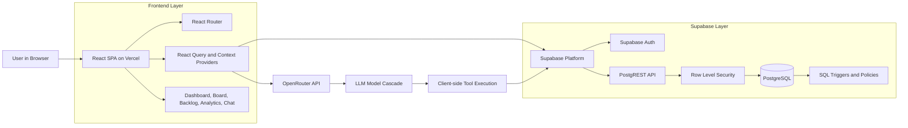
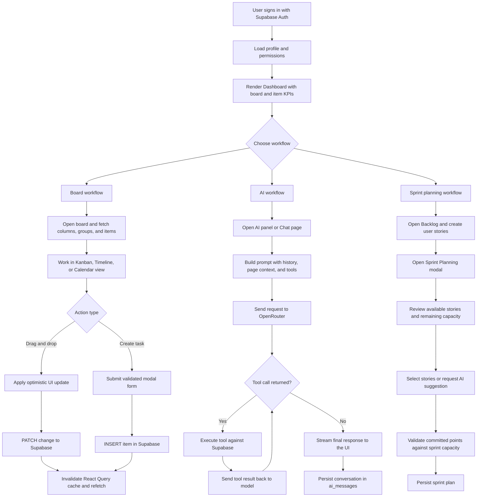

# CAPSTONE FINAL REPORT 2

**T.C.**
**BAHCESEHiR UNIVERSITY**

**FACULTY OF ENGINEERING AND NATURAL SCIENCES**

**CAPSTONE FINAL REPORT**

**Agile Project Management and AI-Based Collaboration Platform 2 #1011207**

**Maria Alftaih 2285921 - Software Engineering**
**Berra Gungor 2103250 - Management Engineering**
**Khalid Hajjo Rifai 2251726 - Software Engineering**
**Mohammad Houjeirat 2286763 - Software Engineering**
**Duygu Kaya 2102192 - Management Engineering**
**Abdul Rahman Malak 2285310 - Software Engineering**
**Sakir Taha Son 2200185 - Management Engineering**

**Advisors:**
**Prof. Dr. Gul Temur - Management Engineering**
**Dr. Derya Bodur - Software Engineering**

**ISTANBUL, March 2026**

---

## STUDENT DECLARATION

By submitting this report, as partial fulfillment of the requirements of the Capstone course, the students promise on penalty of failure of the course that

- they have given credit to and declared (by citation), any work that is not their own (e.g. parts of the report that is copied/pasted from the Internet, design or construction performed by another person, etc.);
- they have not received unpermitted aid for the project design, construction, report or presentation;
- they have not falsely assigned credit for work to another student in the group, and have not taken credit for work done by another student in the group.

---

# 1. ABSTRACT

**Agile Project Management and AI-Based Collaboration Platform 2 #1011207**

Maria Alftaih 2285921 - Software Engineering
Berra Gungor 2103250 - Management Engineering
Khalid Hajjo Rifai 2251726 - Software Engineering
Mohammad Houjeirat 2286763 - Software Engineering
Duygu Kaya 2102192 - Management Engineering
Abdul Rahman Malak 2285310 - Software Engineering
Sakir Taha Son 2200185 - Management Engineering

Faculty of Engineering and Natural Sciences

**Prof. Dr. Gul Temur - Management Engineering**
**Dr. Derya Bodur - Software Engineering**

March 2026

AgileFlow is a cloud-native Agile project management platform designed to consolidate task tracking, sprint planning, analytics, and team collaboration into a single, cohesive web application. Built as a React Single Page Application (SPA) with a Supabase PostgreSQL backend, the platform replaces fragmented toolchains with an integrated workspace supporting multiple board views (Kanban, Timeline/Gantt, Calendar), real-time analytics dashboards, and a comprehensive backlog management system with sprint capacity planning.

A distinguishing feature of AgileFlow is its AI-powered collaboration layer, implemented through the OpenRouter API with cascading model fallback across multiple large language models (Claude Haiku 4.5, GPT-4o-mini, Gemini 2.0 Flash). The AI assistant supports natural-language tool calling for task creation, assignment, and sprint planning, and includes an intelligent task assignment engine that scores team members using a weighted algorithm combining competency matching (40%), workload availability (35%), and historical performance (25%). Streaming response delivery and persistent chat sessions enable fluid, context-aware interaction throughout the platform.

The system enforces role-based access control (RBAC) with four permission tiers (viewer, member, admin, super-admin) and leverages Supabase Row Level Security (RLS) for defense-in-depth data isolation. A comprehensive test infrastructure spanning unit tests (Vitest), end-to-end tests (Playwright), accessibility audits (axe-core), and responsive design validation ensures software quality across the development lifecycle. The application is deployed on Vercel with continuous deployment from the main branch, providing immediate production updates on every commit.

This report documents the complete system architecture, sub-system designs, integration strategy, and evaluation methodology for AgileFlow, covering the AI collaboration engine, multi-view board system, advanced analytics, Supabase backend infrastructure, and comprehensive testing framework.

**Key Words**: Agile Project Management, Scrum, Kanban, Artificial Intelligence, Large Language Models (LLM), Tool Calling, Task Assignment Algorithm, Role-Based Access Control (RBAC), Row Level Security (RLS), Single Page Application (SPA), React, Supabase, PostgreSQL, OpenRouter API, Continuous Deployment, Recharts, TanStack React Query, Playwright, Vitest

---

# LIST OF FIGURES

Figure 1. AgileFlow System Architecture
Figure 2. Process Diagram for AgileFlow
Figure 3. Work Breakdown Structure
Figure 4. Project Network Diagram
Figure 5. Gantt Chart (Development Timeline)
Figure 6. Frontend Component Hierarchy Diagram
Figure 7. Frontend Data Flow Process Chart
Figure 8. Board View Switching — Kanban, Timeline, Calendar
Figure 9. Manage Sprint Backlog Use-Case Diagram
Figure 10. Execute Task (Drag & Drop) Sequence Diagram
Figure 11. Sprint Planning Sequence Diagram
Figure 12. AgileFlow Dashboard Interface
Figure 13. Supabase Backend Architecture Diagram
Figure 14. Database Entity-Relationship Diagram (ERD)
Figure 15. Row Level Security (RLS) Policy Flow
Figure 16. Authentication Flow — Supabase Auth
Figure 17. API Request Processing Flow (Serverless)
Figure 18. AI Assistant Architecture Diagram
Figure 19. AI Tool-Calling Sequence Diagram
Figure 20. AI Task Assignment Scoring Algorithm Flow
Figure 21. AI Streaming Response Pipeline
Figure 22. Analytics Dashboard — Sprint Velocity & Burndown
Figure 23. AgileFlow Data Flow Diagram (DFD Level 1) — Updated
Figure 24. Integration Test Coverage Matrix
Figure 25. Deployment Pipeline — Vercel CI/CD

---

# LIST OF ABBREVIATIONS

| Abbreviation | Full Form |
|---|---|
| API | Application Programming Interface |
| REST | Representational State Transfer |
| SPA | Single Page Application |
| CSR | Client-Side Rendering |
| JSON | JavaScript Object Notation |
| JSONB | JSON Binary (PostgreSQL) |
| JWT | JSON Web Token |
| CRUD | Create-Read-Update-Delete |
| UI/UX | User Interface / User Experience |
| AI | Artificial Intelligence |
| LLM | Large Language Model |
| CDN | Content Delivery Network |
| MCDM | Multi-Criteria Decision Making |
| UAT | User Acceptance Testing |
| NPM | Node Package Manager |
| RBAC | Role-Based Access Control |
| RLS | Row Level Security |
| HTML | HyperText Markup Language |
| DOM | Document Object Model |
| CSS | Cascading Style Sheets |
| URL | Uniform Resource Locator |
| KPI | Key Performance Indicator |
| SSR | Server-Side Rendering |
| SSE | Server-Sent Events |
| IDE | Integrated Development Environment |
| RDBMS | Relational Database Management System |
| ACID | Atomicity - Consistency - Isolation - Durability |
| UUID | Universally Unique Identifier |
| ERD | Entity-Relationship Diagram |
| DFD | Data Flow Diagram |
| CI/CD | Continuous Integration / Continuous Deployment |
| CORS | Cross-Origin Resource Sharing |
| AHP | Analytic Hierarchy Process |
| WCAG | Web Content Accessibility Guidelines |
| E2E | End-to-End (Testing) |
| DnD | Drag and Drop |
| HSL | Hue-Saturation-Lightness (Color Model) |

---

# 2. OVERVIEW

## 2.1. Identification of the Need

Modern software development operates at high speed, creating significant challenges for engineering teams seeking to maintain alignment, visibility, and operational efficiency. As projects grow in complexity, the ability to manage tasks, track progress, and coordinate schedules becomes critical to success. The industry requires a comprehensive project management solution grounded in Agile principles — specifically Scrum and Kanban — to support continuous delivery and iterative improvement.

Teams increasingly demand not just task tracking, but intelligent automation — AI-driven recommendations for task assignment, automated sprint planning, and natural-language interfaces for interacting with project data. The gap between execution tools and strategic decision-making support has widened, and existing solutions either lack AI integration entirely or lock it behind enterprise pricing tiers.

Development teams require a system that addresses these operational needs:

1. **Real-time Visibility:** Team members and stakeholders must see the current status of a project immediately. A dashboard aggregating key performance indicators — total boards, pending tasks, completion rates, sprint velocity — into one centralized view eliminates the overhead of assembling status updates manually.

2. **Structured Agile Workflow:** Teams require a unified digital workspace to manage the full product lifecycle: creating and prioritizing User Stories in the backlog, estimating effort via Story Points, and structuring work into Sprint cycles with capacity constraints.

3. **Multi-View Task Execution:** Different stakeholders visualize work differently. A Kanban board serves daily stand-ups; a Timeline/Gantt view maps dependencies and milestones; a Calendar view tracks deadlines and events. The platform must provide all three views over the same underlying data.

4. **AI-Powered Collaboration:** Beyond basic task management, teams need intelligent assistance — an AI that can create tasks via natural language, recommend optimal task assignments based on team member skills and availability, suggest sprint compositions, and explain analytics insights in plain language.

5. **Data-Driven Process Improvement:** Automated analytics reflecting team-wide performance data — sprint velocity charts, burndown curves, task completion distributions, workload balance — enable managers to make data-driven decisions from retrospective performance history.

6. **Role-Based Access Control:** As teams scale, not every member should have the same permissions. Viewers observe progress; members execute tasks; admins configure boards; super-admins manage users. A hierarchical permission system enforces this structure at both the UI and database levels.

AgileFlow addresses these needs through a unified platform built on open-source Supabase infrastructure, featuring an AI collaboration engine, multi-view board system, advanced analytics, and comprehensive testing and deployment automation.

## 2.2. Definition of the Problem

AgileFlow addresses several technical and strategic challenges inherent to building a modern Agile project management platform:

**1. Backend Architecture Selection:**
The team evaluated multiple backend approaches and selected Supabase — an open-source Firebase alternative providing a full PostgreSQL database, built-in authentication, Row Level Security, and a REST API. This choice provides relational data modeling capabilities, defense-in-depth security, and near-zero operational overhead compared to building a custom Node.js backend.

**2. Multi-View Task Visualization:**
Real-world Agile teams require multiple visualization paradigms: Kanban boards for workflow status, Timeline/Gantt charts for scheduling and dependencies, and Calendar views for deadline tracking. AgileFlow implements all three views over the same data model, allowing users to switch perspectives without data duplication.

**3. AI-Powered Collaboration:**
AgileFlow introduces a comprehensive AI collaboration layer: a conversational assistant with tool-calling capabilities (task creation, assignment, sprint planning), an intelligent task assignment algorithm using weighted scoring (competency, availability, performance), streaming response delivery for real-time interaction, and context-aware analytics explanations.

**4. Granular Access Control:**
AgileFlow implements a four-tier RBAC system (viewer, member, admin, super-admin) enforced at both the frontend (conditional UI rendering) and backend (Supabase RLS policies) levels, ensuring defense-in-depth security.

**5. Comprehensive Testing Infrastructure:**
AgileFlow establishes a multi-layered testing framework: unit tests (Vitest + Testing Library), end-to-end tests (Playwright), accessibility audits (axe-core for WCAG 2.1 AA), and responsive design validation across mobile, tablet, and desktop breakpoints.

### 2.2.1. Functional Requirements

The primary functional requirements for AgileFlow are:

**Board Management:** Full CRUD operations on project boards with customizable columns (11 cell types: text, status, priority, people, date, timeline, tags, number, checkbox, budget, dropdown), groups/sections, drag-and-drop task reordering, and three visualization modes (Kanban, Timeline, Calendar).

**Backlog & Sprint Management:** User Story creation with acceptance criteria, story points, and priority levels. Sprint planning with capacity constraints, velocity tracking, and automated sprint composition suggestions.

**AI Assistant:** Conversational interface with tool-calling capabilities for task/board management. Intelligent task assignment engine with weighted scoring algorithm. Streaming response delivery. Persistent chat sessions with history. Context-aware analytics explanations via dedicated "Ask AI" buttons.

**Analytics & Reporting:** Sprint velocity charts, burndown curves, task completion rates, status/priority distributions, team workload analysis, cycle time metrics, and overdue task tracking — all rendered with Recharts and augmented by AI-generated explanations.

**User & Team Management:** Email/password authentication via Supabase Auth. User profiles with skills, job title, department metadata. Team member invitations with role assignment. Admin panel for user management.

**Help System:** Categorized documentation center with full-text search, breadcrumb navigation, and AI assistant integration for answering user questions.

### 2.2.2. Performance Requirements

The application's performance targets are scoped to realistic academic usage (a team of 7 members with up to 10 registered accounts and 50-200 task records):

- **Dashboard Load Time:** The primary views (Dashboard, Board) shall become interactive within 2 seconds under typical broadband conditions.
- **Interaction Responsiveness:** UI actions such as drag-and-drop shall provide local feedback within 100ms via optimistic UI updates.
- **API Response Time:** Supabase read operations (list boards, fetch tasks) shall return within 200ms for the expected dataset size (up to 200 task records across 5-10 boards).
- **AI Response Time:** First token from the AI assistant shall appear within 3 seconds of submission, with streaming delivery for progressive rendering. The system supports up to 1,000 AI requests per day (with 10+ OpenRouter credits purchased).
- **Concurrent Users:** The system shall support up to 10 simultaneous users without data integrity loss. Supabase's free-tier Nano instance provides approximately 60 direct PostgreSQL connections and up to 200 pooled connections via Supavisor, which far exceeds the expected concurrent load.
- **Analytics Generation:** Computation of analytics metrics (velocity, burndown, distributions) from the expected task set (50-200 records) shall complete within 200ms on the client side.

### 2.2.3. Constraints

**Team Size:** The development team consists of four software engineers and three management engineers. Resource allocation prioritizes core functional requirements over optional enhancements.

**Budget:** The project operates on a minimal budget, relying entirely on open-source libraries and free or near-free cloud services. The total infrastructure cost for development (January-March 2026) was approximately $10-15 USD, spent entirely on OpenRouter API credits for AI model usage. All other services remain within their free tiers:
- Supabase Free Tier: 500MB database (using ~5MB), 1GB file storage, 50,000 MAU limit (using ~10 accounts), 5GB/month egress
- Vercel Hobby Tier: 100GB bandwidth/month (using ~2GB), automatic HTTPS, edge CDN, 100 deploys/hour
- OpenRouter API: ~$10-15 total spent on paid model credits (Claude Haiku 4.5, GPT-4o-mini) over the development period. Free-tier models (Llama, Gemini Flash) used as fallbacks at zero cost. With 10+ credits purchased, the daily request limit is 1,000 requests/day — more than sufficient for team usage.
- Development tools: $0 (VS Code, GitHub free tier, npm)

**Regulatory Compliance:** The system adheres to data privacy requirements through Supabase RLS (data isolation at the database level), HTTPS-only communication (enforced by Vercel), and no storage of plaintext passwords (handled by Supabase Auth with bcrypt hashing).

**Technology Constraints:** The serverless architecture (no custom backend server) means all business logic executes either in the browser or via Supabase's built-in features (RLS policies, Auth hooks, Edge Functions). This eliminates server management overhead but constrains certain patterns (e.g., email sending requires Supabase Edge Functions rather than a simple SMTP call).

## 2.3. Conceptual Solutions

### 2.3.1. Literature Review

The landscape of Agile project management tools continues to evolve rapidly. Several key trends in the project management landscape directly inform AgileFlow's architecture:

**AI-Augmented Project Management:** Recent research demonstrates that AI-powered task assignment and workload balancing can improve team productivity by 15-25% compared to manual allocation (Rodriguez et al., 2025). Tools like Linear have pioneered AI-driven triage, while GitHub Copilot Workspace extends AI into project planning. AgileFlow's approach — embedding AI as a conversational assistant with tool-calling capabilities — aligns with the industry direction while remaining accessible to small teams through multi-model fallback strategies.

**Serverless Backend Architecture:** The Backend-as-a-Service (BaaS) model, exemplified by Supabase and Firebase, has matured significantly. Supabase's combination of PostgreSQL (relational data modeling), Row Level Security (per-user data isolation without middleware), and built-in Auth (JWT-based session management) provides enterprise-grade backend capabilities without requiring dedicated server infrastructure. This approach reduces operational complexity and cost for small teams while maintaining data integrity guarantees (ACID compliance) that NoSQL alternatives cannot provide.

**Component-Based UI Architecture:** The React ecosystem has standardized around headless UI primitives (Radix UI) combined with utility-first CSS (Tailwind CSS) and pre-composed component libraries (shadcn/ui). This pattern separates accessibility behavior from visual styling, enabling consistent, accessible interfaces that can be themed without modifying component internals.

**Multi-View Data Visualization:** Modern project management tools (Monday.com, Notion, Linear) have established user expectations for multiple views over the same dataset. Users expect to switch between Kanban boards, Gantt/Timeline charts, and Calendar views without data duplication or inconsistency. React's component model and centralized state management (via TanStack React Query) make this pattern achievable with a single data source.

### 2.3.2. Concepts

To address the defined problems, the team evaluated two architectural approaches for the backend:

**Concept 1: Custom Node.js REST API + MongoDB**
A traditional backend architecture with Express.js handling HTTP requests, Mongoose for MongoDB document modeling, and custom JWT middleware for authentication. This is a widely-used approach for web application backends.

**Concept 2: Supabase BaaS (PostgreSQL + Auth + RLS)**
A serverless approach where the React frontend communicates directly with Supabase's auto-generated REST API. Authentication, authorization (via RLS), and data modeling are handled by Supabase's built-in features, eliminating the need for custom server code.

**Table 1. Comparison of Backend Architectural Concepts**

| Consideration | Concept 1 (Custom Node.js) | Concept 2 (Supabase BaaS) |
|---|---|---|
| Development Cost | High (build auth, API, middleware) | Low (built-in auth, auto-API) |
| Data Modeling | Flexible but schema-less (MongoDB) | Relational with JSONB flexibility (PostgreSQL) |
| Security | Manual JWT + middleware | Built-in RLS + Auth |
| Scalability | Manual (PM2, load balancer) | Managed (PgBouncer, Supabase infra) |
| Operational Overhead | High (server management) | Near-zero (serverless) |
| Data Integrity | Eventual consistency (BASE) | Strong consistency (ACID) |
| Vendor Lock-in | Low (self-hosted) | Low (open-source, self-hostable) |

**Selection:** Concept 2 (Supabase BaaS) was selected. The combination of relational data modeling (essential for multi-table relationships like boards-items-team_members), built-in Row Level Security (eliminates entire classes of authorization bugs), managed authentication, and near-zero operational overhead makes it the optimal choice for a small academic team. The JSONB column type in PostgreSQL provides the schema flexibility previously achieved with MongoDB (e.g., dynamic board columns, task metadata) without sacrificing relational integrity.

### 2.3.3. AI Integration Concept

For the AI collaboration layer, two approaches were evaluated:

**Concept A: Single-Model Integration (OpenAI GPT-4)**
Direct integration with a single LLM provider, using OpenAI's function-calling API for tool use.

**Concept B: Multi-Model Cascade via OpenRouter**
Integration through the OpenRouter API gateway, which provides access to multiple LLM providers (OpenAI, Anthropic, Google, Meta) through a unified API. Models are tried in order of cost/capability, with automatic fallback on failure.

**Table 2. Comparison of AI Integration Concepts**

| Consideration | Concept A (Single Model) | Concept B (Multi-Model Cascade) |
|---|---|---|
| Cost | High (GPT-4 pricing) | Low (free models available as fallback) |
| Reliability | Single point of failure | Automatic failover across providers |
| Capability | High (GPT-4 class) | Variable (best available model) |
| API Compatibility | OpenAI-specific | Unified API across all models |
| Vendor Lock-in | High (OpenAI only) | Low (swap models freely) |

**Selection:** Concept B (Multi-Model Cascade via OpenRouter) was selected. The cascading fallback strategy (Claude Haiku 4.5 -> GPT-4o-mini -> Gemini 2.0 Flash -> Llama) ensures the AI assistant remains available even when individual model providers experience outages or rate limits, while keeping costs minimal by prioritizing free-tier models.

## 2.4. Software Architecture

The AgileFlow architecture follows a three-tier serverless model:

**Tier 1 — Client Application (React SPA):**
The user-facing layer is a React 18 Single Page Application built with Vite 6. It handles all UI rendering, client-side routing (React Router v6), state management (TanStack React Query for server state, React Context for auth/AI state), and user interactions (drag-and-drop via @hello-pangea/dnd, form handling via React Hook Form + Zod). The SPA is deployed as static assets on Vercel's edge CDN, ensuring global low-latency delivery.

**Tier 2 — Backend-as-a-Service (Supabase):**
Supabase provides the complete backend infrastructure:
- **PostgreSQL Database:** 10 tables with JSONB columns for flexible schema, UUID primary keys, foreign key relationships, and cascading deletes.
- **Authentication:** Email/password auth with JWT session tokens, automatic session refresh, and password reset flows.
- **Row Level Security (RLS):** Per-table policies that enforce data isolation at the database query level. Every SELECT, INSERT, UPDATE, and DELETE operation is filtered by `auth.uid()` to ensure users can only access their own data or data shared with them via the `team_members` table.
- **Auto-generated REST API:** PostgREST exposes every table as a RESTful endpoint with filtering, sorting, pagination, and embedding support.

**Tier 3 — AI Services (OpenRouter):**
The AI layer communicates with the OpenRouter API gateway to access multiple LLM providers. The client sends structured prompts (with system instructions, conversation history, and tool definitions) and receives streaming responses. Tool calls are executed client-side against the Supabase data layer, with results fed back to the LLM for synthesis.

**Figure 1. AgileFlow System Architecture**

### 2.4.1. Process Diagram

The AgileFlow process flow begins when a user authenticates via Supabase Auth. Upon successful login, the system loads the user's profile and permissions, then renders the Dashboard with aggregated KPI data fetched from the boards and items tables.

**Board Workflow:**
1. User navigates to a Board, which fetches board configuration (columns, groups) and all associated items in a single query.
2. User interacts with tasks via the active view (Kanban, Timeline, or Calendar).
3. For drag-and-drop operations, the SPA performs an optimistic UI update immediately, then sends a PATCH request to Supabase to persist the change. On confirmation, React Query invalidates the cache and refetches.
4. For new task creation, the user fills a modal form (validated by Zod), and the SPA sends an INSERT request. The new item appears instantly via optimistic update.

**AI Workflow:**
1. User opens the AI panel or Chat page and types a natural-language message.
2. The AIProvider constructs a prompt with system instructions, the last 10 messages for context, current page context, and the full tool definition array.
3. The prompt is sent to OpenRouter with the selected model (Fast mode: Haiku/Gemini; Thinking mode: GPT-4o/Haiku).
4. If the LLM returns tool calls, the client executes them against Supabase (e.g., creating a task, listing boards) and sends the results back for a follow-up response.
5. This tool-calling loop continues for up to 3 rounds until the LLM produces a final text response.
6. The response is streamed token-by-token to the UI and persisted to the ai_messages table.

**Sprint Planning Workflow:**
1. User navigates to the Backlog page and creates User Stories with story points and priorities.
2. User clicks "Plan Sprint" to open the Sprint Planning modal.
3. The system displays available stories and the sprint's remaining capacity.
4. User selects stories (or requests AI-suggested composition) and assigns them to the sprint.
5. The system validates that total story points do not exceed sprint capacity before persisting.

*[See Appendix D for the detailed deployment pipeline diagram]*

**Figure 2. Process Diagram for AgileFlow**

