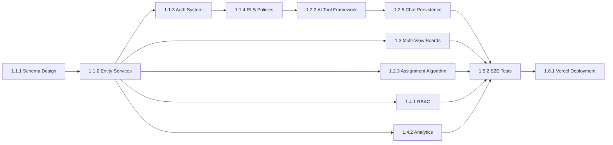
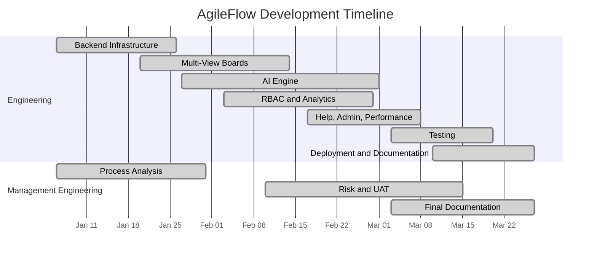

# 3. WORK PLAN

The Work Plan for AgileFlow covers the 12-week core development cycle (January 6 - March 27, 2026), during which the Supabase backend was built, an AI collaboration engine was developed, multiple board views were implemented, and a comprehensive testing infrastructure was established.

## 3.1. Work Breakdown Structure (WBS)

The AgileFlow WBS is divided into two parallel streams: Software Engineering (technical implementation) and Management Engineering (process analysis, documentation, and validation).

**Figure 3. Work Breakdown Structure**

```mermaid
flowchart TD
    A["1.0 AgileFlow"]

    A --> B["1.1 Backend Infrastructure"]
    B --> B1["1.1.1 PostgreSQL schema design"]
    B --> B2["1.1.2 Entity service layer"]
    B --> B3["1.1.3 Authentication system"]
    B --> B4["1.1.4 Row Level Security policies"]
    B --> B5["1.1.5 Data seeding and verification"]

    A --> C["1.2 AI Collaboration Engine"]
    C --> C1["1.2.1 OpenRouter integration"]
    C --> C2["1.2.2 Tool-calling framework"]
    C --> C3["1.2.3 Task assignment scoring"]
    C --> C4["1.2.4 Streaming response pipeline"]
    C --> C5["1.2.5 Chat session persistence"]
    C --> C6["1.2.6 AI explain system"]

    A --> D["1.3 Multi-View Board System"]
    D --> D1["1.3.1 Kanban view"]
    D --> D2["1.3.2 Timeline or Gantt view"]
    D --> D3["1.3.3 Calendar view"]
    D --> D4["1.3.4 Eleven cell type implementations"]

    A --> E["1.4 Advanced Features"]
    E --> E1["1.4.1 RBAC system"]
    E --> E2["1.4.2 Analytics dashboard"]
    E --> E3["1.4.3 Help center"]
    E --> E4["1.4.4 Admin panel"]
    E --> E5["1.4.5 Performance monitoring"]
    E --> E6["1.4.6 Full-page chat interface"]

    A --> F["1.5 Testing and Quality Assurance"]
    F --> F1["1.5.1 Unit tests"]
    F --> F2["1.5.2 End-to-end tests"]
    F --> F3["1.5.3 Accessibility audits"]
    F --> F4["1.5.4 Responsive design tests"]

    A --> G["1.6 Deployment and Documentation"]
    G --> G1["1.6.1 Vercel CI or CD setup"]
    G --> G2["1.6.2 Environment configuration"]
    G --> G3["1.6.3 Capstone report and plans"]
```

## 3.2. Responsibility Matrix (RM)

The matrix below assigns each team member as Responsible (R) or Support (S) across all work packages. The distribution reflects each member's specialization within the interdisciplinary team.

**Table 2. Responsibility Matrix**

| Work Package | Maria (SE) | Khalid (SE) | Mohammad (SE) | Abdul Rahman (SE) | Berra (ME) | Duygu (ME) | Sakir (ME) |
|---|:---:|:---:|:---:|:---:|:---:|:---:|:---:|
| **1.1 Backend Infrastructure** | | | | | | | |
| 1.1.1 Schema Design | S | R | S | | | | |
| 1.1.2 Entity Services | S | R | S | | | | |
| 1.1.3 Auth System | | R | | S | | | |
| 1.1.4 RLS Policies | | R | | S | | | |
| 1.1.5 Data Seeding | | R | | S | | S | |
| **1.2 AI Engine** | | | | | | | |
| 1.2.1 OpenRouter Integration | R | | | S | | | |
| 1.2.2 Tool-Calling Framework | R | S | | | | | |
| 1.2.3 Assignment Algorithm | R | | | | S | | |
| 1.2.4 Streaming Pipeline | R | | | S | | | |
| 1.2.5 Chat Persistence | R | S | | | | | |
| 1.2.6 AI Explain System | R | | S | | | | |
| **1.3 Multi-View Boards** | | | | | | | |
| 1.3.1 Kanban View | | | R | S | | | |
| 1.3.2 Timeline View | | | R | | | | |
| 1.3.3 Calendar View | | | R | | | | |
| 1.3.4 Cell Types (11) | S | | R | S | | | |
| **1.4 Advanced Features** | | | | | | | |
| 1.4.1 RBAC System | | S | R | | | | |
| 1.4.2 Analytics Dashboard | S | | R | | R | | |
| 1.4.3 Help Center | | | R | | | | S |
| 1.4.4 Admin Panel | | S | R | | | | |
| 1.4.5 Performance Page | | | | R | | | S |
| 1.4.6 Chat Page | R | | S | | | | |
| **1.5 Testing** | | | | | | | |
| 1.5.1 Unit Tests | S | S | | R | | | |
| 1.5.2 E2E Tests | | | S | R | | | |
| 1.5.3 Accessibility Audits | | | | R | | S | |
| 1.5.4 Responsive Tests | | | S | R | | | |
| **1.6 Deployment & Docs** | | | | | | | |
| 1.6.1 Vercel CI/CD | | | | R | | | |
| 1.6.2 Env Configuration | | R | | S | | | |
| 1.6.3 Documentation | | | | | S | R | R |

## 3.3. Project Network (PN)

The AgileFlow project network follows a parallel processing model with identified dependencies:

**Critical Path:** Schema Design (1.1.1) -> Entity Services (1.1.2) -> Auth System (1.1.3) -> RLS Policies (1.1.4) -> AI Tool Framework (1.2.2) -> Chat Persistence (1.2.5) -> E2E Tests (1.5.2) -> Vercel Deployment (1.6.1)

**Key Dependencies:**
- Entity services (1.1.2) depend on schema design (1.1.1) — services need table definitions
- AI tool framework (1.2.2) depends on entity services (1.1.2) — tools call CRUD operations
- Assignment algorithm (1.2.3) depends on entity services — needs to query items and profiles
- All testing (1.5.*) depends on feature completion (1.3, 1.4)
- Deployment (1.6.1) depends on testing (1.5) passing

**Parallel Streams:**
- Multi-view board work (1.3) runs in parallel with AI engine work (1.2) once entity services are available
- Analytics (1.4.2) and RBAC (1.4.1) run in parallel
- Help center (1.4.3), admin panel (1.4.4), and performance page (1.4.5) are independent of each other
- Management Engineering documentation runs continuously alongside technical implementation

**Figure 4. Project Network Diagram**

## 3.4. Gantt Chart

**Figure 5. Gantt Chart (Development Timeline)**

**Table 3. AgileFlow Development Timeline (12 Weeks)**

| Work Package | W1 | W2 | W3 | W4 | W5 | W6 | W7 | W8 | W9 | W10 | W11 | W12 |
|---|:---:|:---:|:---:|:---:|:---:|:---:|:---:|:---:|:---:|:---:|:---:|:---:|
| 1.1 Backend Infrastructure | XX | XX | XX | | | | | | | | | |
| 1.2 AI Engine | | | XX | XX | XX | XX | XX | XX | | | | |
| 1.3 Multi-View Boards | | XX | XX | XX | XX | | | | | | | |
| 1.4.1 RBAC | | | | XX | XX | XX | XX | | | | | |
| 1.4.2 Analytics | | | | XX | XX | XX | XX | | | | | |
| 1.4.3 Help Center | | | | | | XX | XX | XX | | | | |
| 1.4.4 Admin Panel | | | | | | XX | XX | XX | | | | |
| 1.4.5 Performance | | | | | | | XX | XX | | | | |
| 1.4.6 Chat Page | | | | | | | | XX | XX | | | |
| 1.5 Testing | | | | | | | | XX | XX | XX | | |
| 1.6 Deployment & Docs | | | | | | | | | | XX | XX | XX |
| ME: Process Analysis | XX | XX | XX | XX | | | | | | | | |
| ME: Risk & UAT | | | | | XX | XX | XX | XX | XX | XX | | |
| ME: Documentation | | | | | | | | | XX | XX | XX | XX |

**Milestones:**
- Week 3: Backend infrastructure complete, data seeded and verified
- Week 5: Multi-view boards functional (Kanban, Timeline, Calendar)
- Week 8: AI engine operational with tool calling and streaming
- Week 10: All features complete, testing phase begins
- Week 12: Deployment verified, documentation submitted

## 3.5. Costs

AgileFlow was developed almost entirely using free-tier services and open-source tools. The total expenditure over the 12-week period was approximately $10-15 USD (roughly 350-500 TRY at current exchange rates), spent entirely on OpenRouter API credits for AI model usage during development and testing.

**Table 4. AgileFlow Cost Breakdown**

| Item | Monthly Cost | 3-Month Total | Notes |
|---|---|---|---|
| Supabase (Free Tier) | $0 | $0 | 500MB DB (using ~5MB), 50K MAU (using ~10) |
| Vercel (Hobby Tier) | $0 | $0 | 100GB BW (using ~2GB), auto SSL, CDN |
| OpenRouter API | ~$3-5 | ~$10-15 | Paid models (Haiku, GPT-4o-mini). Free fallbacks (Llama, Gemini) |
| GitHub (Free Tier) | $0 | $0 | Unlimited private repos, version control |
| VS Code | $0 | $0 | Open-source IDE |
| NPM Libraries | $0 | $0 | All open-source (React, Tailwind, shadcn, etc.) |
| Domain (optional) | - | - | Using Vercel default URL (agileflow-one.vercel.app) |
| **Total** | **~$3-5** | **~$10-15 (~350-500 TRY)** | |

**Cost Efficiency:** By leveraging Supabase's free tier and Vercel's hobby plan, the project achieved near-zero infrastructure costs while maintaining production-grade capabilities including managed PostgreSQL, built-in authentication, and global CDN distribution.

**What is free (not included above):**
- All NPM libraries: React 18, Tailwind CSS, Radix UI, shadcn/ui, TanStack React Query, Recharts, Framer Motion, Playwright, Vitest, and 40+ other packages
- Supabase free tier includes: PostgreSQL database, authentication, Row Level Security, auto-generated REST API, and real-time subscriptions
- Vercel hobby tier includes: global CDN, automatic HTTPS, continuous deployment, preview deployments

## 3.6. Risk Assessment

**Table 5. Risk Severity Matrix**

| | Low Impact | Medium Impact | High Impact |
|---|---|---|---|
| **High Probability** | | Scope Creep | |
| **Medium Probability** | | AI Rate Limiting, AI Hallucination | Data Integrity |
| **Low Probability** | Browser Compatibility | Supabase Auto-Pause | Security Vulnerabilities |

**Table 6. Risk Register**

| # | Risk | Probability | Impact | Mitigation Strategy |
|---|---|---|---|---|
| R1 | **AI API Rate Limiting** — OpenRouter imposes daily request limits (1,000/day with credits) | Medium | Medium | Cascading model fallback (4 models). Free-tier models as backup. With 10+ credits, 1,000 req/day is sufficient for team usage. |
| R2 | **Supabase Free Tier Limits** — 500MB database, 5GB egress/month | Low | Medium | Current usage is ~5MB (1% of limit). Monitor via Supabase dashboard. Upgrade path available ($25/mo Pro tier). |
| R3 | **Supabase Auto-Pause** — Free projects pause after 7 days of inactivity | Low | High | Team members access the app at least weekly. Set a calendar reminder before demos. Wake-up takes ~60 seconds. |
| R4 | **Data Integrity** — Risk of data corruption from invalid inputs or schema inconsistencies | Medium | High | Schema validation with Zod. RLS policy testing. Foreign key constraints with cascading deletes. Manual verification of all entity CRUD operations. |
| R5 | **AI Hallucination in Tool Calls** — LLM may generate invalid tool parameters (e.g., wrong board_id) | Medium | Medium | Input validation before tool execution. Error handling with user-friendly messages. Tool results sent back to LLM for verification. |
| R6 | **Browser Compatibility** — UI rendering differences across Chrome, Firefox, Safari | Low | Low | Playwright cross-browser testing. Tailwind CSS handles vendor prefixes via Autoprefixer. Radix UI components are cross-browser tested. |
| R7 | **Security Vulnerabilities** — Unauthorized data access, XSS, injection attacks | Low | High | Defense-in-depth: Supabase Auth (JWT) + RLS (database-level) + service-layer auth + frontend RBAC. No raw SQL queries (Supabase SDK parameterizes). HTTPS enforced by Vercel. |
| R8 | **Scope Creep** — Feature requests exceeding available development time | High | Medium | Strict sprint planning with capacity limits. PRD with phased implementation priorities. Weekly team check-ins to re-prioritize. |
