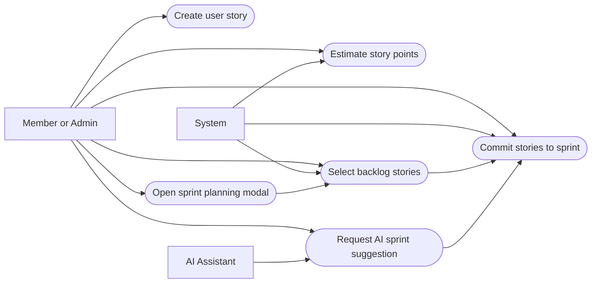
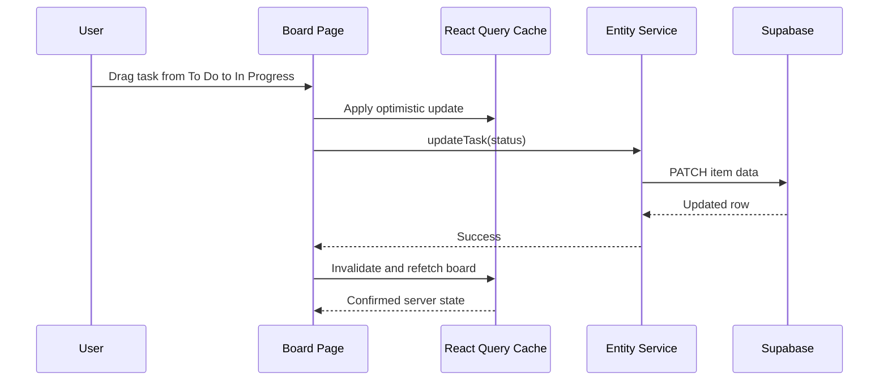
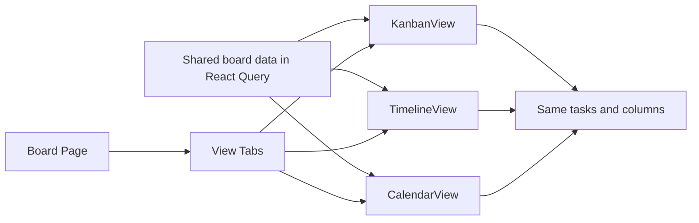
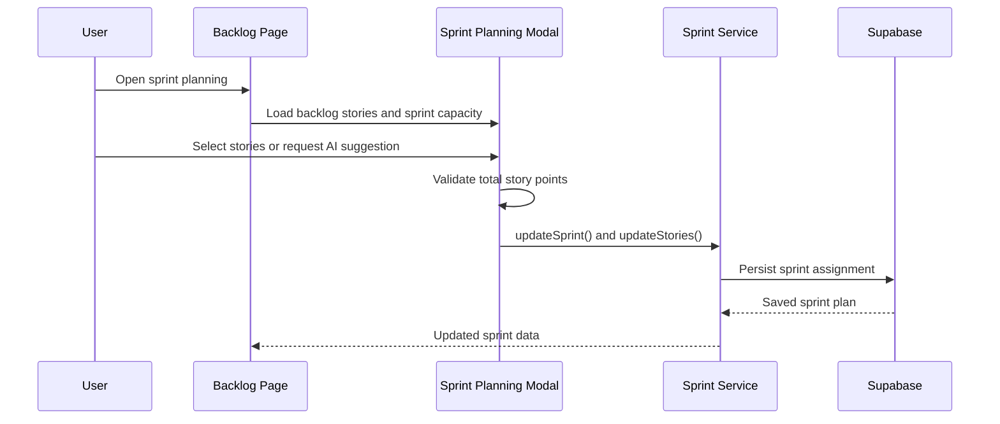
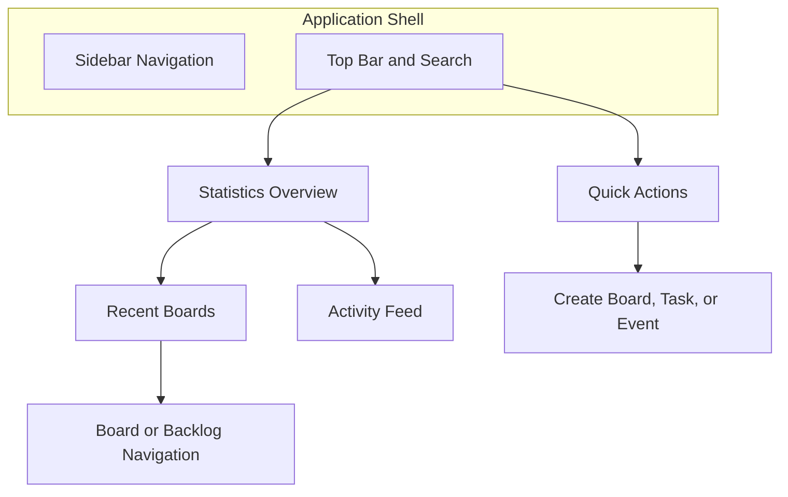
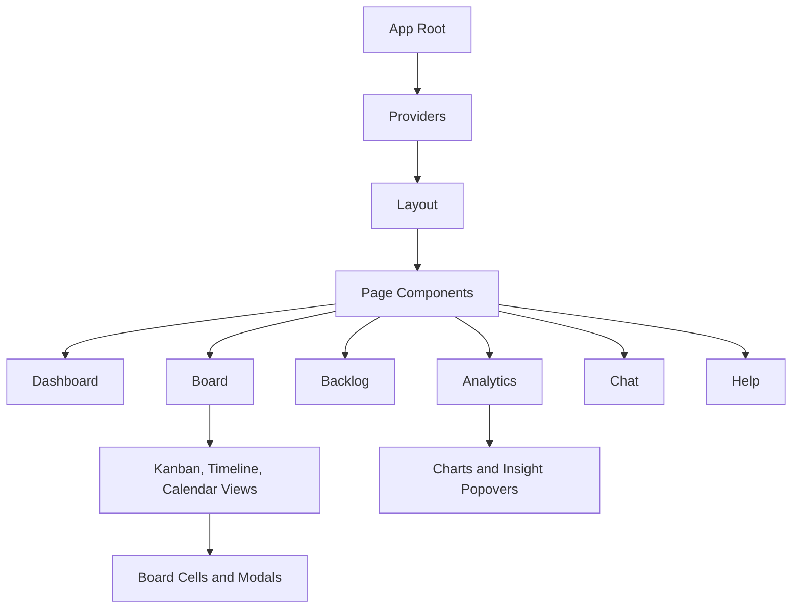
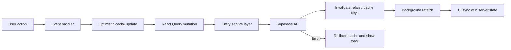

# 4. SUB-SYSTEMS

AgileFlow Phase 2 consists of three core sub-systems: the Frontend Client Application (React SPA), the Backend Data Service (Supabase), and the AI Collaboration & Analytics Engine. Each sub-system is documented below with its requirements, technologies, architecture, and evaluation plan.

## 4.1. Frontend Client Application

The Frontend sub-system is a Single Page Application (SPA) built with React 18 and bundled by Vite 6. It provides all user interface rendering, client-side routing, state management, and interaction logic. The application is deployed as static assets on Vercel's edge CDN and communicates with Supabase for data persistence and OpenRouter for AI capabilities.

### 4.1.1. Requirements

**Behaviors of the Software Application**

| Actor | Behavior | Description |
|---|---|---|
| User | Drag & Drop Task | Move task cards between columns or groups to update their status. The UI responds instantly via optimistic update. |
| User | Switch Board View | Toggle between Kanban, Timeline, and Calendar views over the same board data. |
| User | Plan Sprint | Select backlog stories and assign them to a sprint cycle with capacity validation. |
| User | Chat with AI | Send natural-language messages to the AI assistant, which can execute tools (create tasks, assign, etc.). |
| User | View Analytics | Access performance charts: sprint velocity, burndown, task distributions, team workload. |
| User | Browse Help | Navigate categorized help articles with full-text search and AI-powered Q&A. |
| Admin | Manage Users | Search, invite, and assign roles to team members from the admin panel. |
| User | Toggle Theme | Switch between light and dark mode, persisted in user preferences. |

**Attributes of the Software Application**

| Entity | Attribute | Description |
|---|---|---|
| User Story | Story Points | Numeric estimate of implementation effort, used for sprint capacity planning. |
| Task | Priority Level | Classification (Critical, High, Medium, Low) displayed with color-coded badges. |
| Board | Column Types | 11 customizable cell types: text, status, priority, people, date, timeline, tags, number, checkbox, budget, dropdown. |
| User | Role | Permission tier: viewer, member, admin, or super-admin. |
| User | Theme Preference | Light or dark mode, stored in profile settings. |
| AI Session | Messages | Conversation history persisted across sessions in the ai_messages table. |
| Board | Groups | Sections within a board for organizing tasks (e.g., "To Do", "In Progress", "Done"). |
| Notification | Type | Category of alert: info, success, warning, error, task, or mention. |

**Performance Requirements**
- Dashboard and Board pages shall load and become interactive within 2 seconds on broadband connections.
- Drag-and-drop operations shall provide visual feedback within 100ms via optimistic UI updates.
- View switching (Kanban/Timeline/Calendar) shall complete within 500ms without full page reload.

**Security Requirements**
- Unauthenticated users are automatically redirected to the login page on any protected route.
- Expired sessions trigger a dedicated SessionExpired screen with a re-login prompt.
- The usePermissions hook enforces RBAC at the component level, conditionally hiding or disabling UI elements based on user role.

**Safety Requirements**
- All form inputs are validated using Zod schemas before submission.
- An ErrorBoundary component wraps the application root, catching rendering errors and displaying a recovery UI.
- Every async data operation shows a loading indicator and handles errors with toast notifications.

**Business Rules**
- Board deletion is restricted to admin and super-admin roles.
- User Stories cannot be assigned to sprints marked as "Completed."
- Only super-admins can access the Admin panel and manage other users' roles.

### 4.1.2. Technologies and Methods

**Literature Survey**

Modern web development favors the Single Page Application pattern for data-intensive, interactive interfaces. SPAs load a single HTML document and update content dynamically via JavaScript, reducing page transitions and maintaining application state across views. This approach is well-suited to project management tools where users frequently switch between boards, backlogs, and analytics without losing context.

Component-Based Architecture has become the standard for building maintainable SPAs. By decomposing the UI into isolated, reusable components with well-defined interfaces (props and state), teams can develop and test features independently. React's Virtual DOM reconciliation further improves rendering performance by minimizing actual DOM mutations.

The utility-first CSS approach, led by Tailwind CSS, has gained widespread adoption for its ability to co-locate styling with component markup, eliminate naming conflicts, and enable responsive design without custom media queries.

**Software and Libraries**

The following libraries were selected based on the literature survey and the project's requirements. All are sourced from the NPM registry and are open-source.

| Category | Library | Version | Purpose |
|---|---|---|---|
| **Core** | React | 18.2.0 | Component UI library with Virtual DOM |
| | React DOM | 18.2.0 | DOM rendering for React |
| | Vite | 6.1.0 | Build tool and development server |
| | React Router DOM | 6.26.0 | Client-side routing and navigation |
| **UI Primitives** | Radix UI | various | 22 headless, accessible component primitives (dialog, dropdown, tabs, tooltip, etc.) |
| | shadcn/ui | - | Pre-composed Radix + Tailwind component library |
| **Styling** | Tailwind CSS | 3.4.17 | Utility-first CSS framework |
| | tailwind-merge | 3.0.2 | Intelligent Tailwind class merging |
| | class-variance-authority | 0.7.1 | Component variant management |
| | tailwindcss-animate | 1.0.7 | Animation utilities |
| **State** | TanStack React Query | 5.84.1 | Server state management, caching, background sync |
| | Supabase JS | 2.100.1 | Database client (used as data layer) |
| **Drag & Drop** | @hello-pangea/dnd | 17.0.0 | Maintained fork of react-beautiful-dnd |
| **Charts** | Recharts | 2.15.4 | Composable charting library |
| **Animation** | Framer Motion | 11.16.4 | Layout animations and transitions |
| **Forms** | React Hook Form | 7.54.2 | Performant form state management |
| | Zod | 3.24.2 | Schema validation |
| | @hookform/resolvers | 4.1.2 | Zod-RHF integration |
| **Icons** | Lucide React | 0.475.0 | 475+ SVG icon components |
| **Dates** | date-fns | 3.6.0 | Date manipulation utilities |
| | moment | 2.30.1 | Date formatting (legacy usage) |
| | react-day-picker | 8.10.1 | Date picker component |
| **Markdown** | react-markdown | 9.1.0 | Markdown rendering (AI responses) |
| | remark-gfm | 4.0.1 | GitHub Flavored Markdown support |
| **Theme** | next-themes | 0.4.4 | Dark/light mode management |
| **Notifications** | sonner | 2.0.1 | Toast notification library |
| | react-hot-toast | 2.6.0 | Toast notifications (secondary) |
| **Other** | lodash | 4.17.21 | Utility functions |
| | html2canvas | 1.4.1 | Screenshot/export to image |
| | canvas-confetti | 1.9.4 | Celebration animations |
| | cmdk | 1.0.0 | Command palette component |

**Development Dependencies**

| Library | Version | Purpose |
|---|---|---|
| Vitest | 4.1.0 | Unit test runner (Vite-native) |
| @testing-library/react | 16.3.2 | Component testing utilities |
| @playwright/test | 1.58.2 | End-to-end testing framework |
| @axe-core/playwright | 4.11.1 | Accessibility testing |
| ESLint | 9.19.0 | Code linting |
| TypeScript | 5.8.2 | Type checking (via jsconfig) |
| Autoprefixer | 10.4.20 | CSS vendor prefixes |
| PostCSS | 8.5.3 | CSS processing pipeline |

### 4.1.3. Conceptualization

**Actor Glossary**

| Actor | Description |
|---|---|
| Team Member (Viewer) | An authenticated user with view-only access. Can browse boards and analytics but cannot modify data. |
| Team Member (Member) | An authenticated user who can create tasks, drag-and-drop items, edit board data, and use the AI assistant. |
| Admin | A user with elevated permissions who can configure board settings, manage columns, and delete boards. |
| Super Admin | The highest permission tier. Can access the Admin panel, manage user roles, reset passwords, and invite members. |
| System | The automated backend (Supabase) that processes requests, validates sessions, enforces RLS, and returns data. |
| AI Assistant | The OpenRouter-powered language model that responds to natural-language queries and executes tool calls. |

**Use-Case Glossary**

| Use Case | Description | Actors |
|---|---|---|
| Authenticate | User logs in with email/password to access the application. | User, System |
| Manage Board | User creates, edits, or deletes a project board. | Admin+, System |
| Execute Task | User updates task status via drag-and-drop or inline editing. | Member+, System |
| Plan Sprint | User assigns backlog stories to an active sprint with capacity checks. | Member+, System |
| View Analytics | User accesses performance charts and metrics. | Any User, System |
| Switch View | User toggles between Kanban, Timeline, and Calendar visualizations. | Any User |
| Chat with AI | User sends messages to the AI assistant, which may execute tools. | Member+, AI Assistant |
| Browse Help | User navigates the help center documentation. | Any User |
| Manage Users | Super Admin searches, invites, and assigns roles to users. | Super Admin, System |

**Figure 9. Manage Sprint Backlog Use-Case Diagram**

**Use-Case Scenario: Execute Task (Drag & Drop)**

| Field | Detail |
|---|---|
| **Use Case** | Execute Task (Drag & Drop) |
| **Description** | A team member updates a task's status by dragging its card between Kanban columns. |
| **Actors** | Team Member (Member+), System |
| **Pre-Condition** | User is authenticated and viewing a board in Kanban view. User has member or higher role. |
| **Post-Condition** | Task status is updated in the database and reflected in all views. |
| **Normal Flow** | 1. User drags a task card from the "To Do" column to "In Progress." 2. The SPA immediately updates the UI (optimistic update). 3. The SPA sends a PATCH request to Supabase to update the item's status field. 4. Supabase validates the JWT, checks RLS policies, and persists the change. 5. React Query invalidates the board cache and refetches to confirm server state. |
| **Alternative Flow** | Step 4a: User does not have write permission (viewer role). System returns 403. The SPA reverts the card to its original column and displays an error toast. |

**Figure 10. Execute Task (Drag & Drop) Sequence Diagram**

**Use-Case Scenario: Switch Board View**

| Field | Detail |
|---|---|
| **Use Case** | Switch Board View |
| **Description** | A user switches between Kanban, Timeline, and Calendar views on the same board. |
| **Actors** | Any authenticated user |
| **Pre-Condition** | User is viewing a board detail page. Board data is loaded in React Query cache. |
| **Post-Condition** | The selected view renders using the same underlying board and item data. |
| **Normal Flow** | 1. User clicks a view tab (Kanban / Timeline / Calendar). 2. The Board page updates the active view state variable. 3. React renders the corresponding view component (KanbanView, TimelineView, or CalendarView). 4. The view component reads board data from the shared React Query cache (no additional API call). 5. Items are displayed according to the view's visualization logic. |
| **Alternative Flow** | Step 5a: Timeline view requires date columns. If no date columns exist on the board, the view displays an empty state message: "Add a date or timeline column to see tasks on the timeline." |

**Figure 8. Board View Switching - Kanban, Timeline, Calendar**

**Figure 11. Sprint Planning Sequence Diagram**

**Interface Designs**

The Dashboard serves as the landing page after authentication. It presents a greeting with time-based text ("Good morning/afternoon/evening"), a statistics overview (board count, pending tasks, in-progress percentage, completion rate), a list of recent boards, an activity feed showing the latest task updates, and quick-action buttons for creating boards, tasks, and events.

The Board Workspace is the primary work area. A toolbar at the top provides view-switching tabs, filter/sort/group controls, and a search bar. Below the toolbar, the active view renders: Kanban shows drag-and-drop columns grouped by status; Timeline shows a Gantt-style chart with horizontal bars colored by priority; Calendar shows a monthly grid with task indicators on their due dates. An "Add Group" button allows creating new task sections, and an AI panel can be opened as a right-side drawer.

**Figure 12. AgileFlow Dashboard Interface**

### 4.1.4. Software Architecture

**Component Hierarchy**

The frontend architecture consists of four distinct layers:

**Figure 6. Frontend Component Hierarchy Diagram**

**Layer 1 — Providers (Root):** The application entry point wraps the entire component tree with context providers:
- `QueryClientProvider` (TanStack React Query) — manages server state caching
- `AuthProvider` — provides authentication state and methods (login, logout, user)
- `AIProvider` — manages AI chat state, streaming, and tool calling
- `ThemeProvider` (next-themes) — handles dark/light mode switching
- `BrowserRouter` (React Router) — enables client-side routing
- `Toaster` (sonner) — provides toast notification rendering

**Layer 2 — Routing:** React Router maps URL paths to page components. Pages are auto-registered via `pages.config.js`, which exports a configuration array mapping page names to their components. The Layout component wraps all pages with a collapsible sidebar and top navigation bar.

**Layer 3 — Pages (11 total):**

| Page | Route | Purpose |
|---|---|---|
| Dashboard | / | Landing page with KPIs, recent boards, activity feed |
| Boards | /Boards | Board listing with create/edit/delete |
| Board | /Board?id=X | Board detail with Kanban/Timeline/Calendar views |
| Backlog | /Backlog | User story management and sprint planning |
| Calendar | /Calendar | Monthly event calendar |
| Analytics | /Analytics | Performance charts and metrics |
| Chat | /Chat | Full-page AI assistant interface |
| Help | /Help | Documentation center with search |
| Settings | /Settings | User profile and preferences |
| Admin | /Admin | User management (super-admin only) |
| Performance | /Performance | System monitoring and capacity info |

**Layer 4 — Atomic Components:** Reusable UI building blocks from shadcn/ui (30+ components: Button, Card, Dialog, DropdownMenu, Tabs, etc.), board-specific components (11 cell types, view components, filter/sort panels), and feature components (modals, sidebars, widgets).

**Process Chart (Data Flow)**

The application follows a unidirectional data flow pattern:

**Figure 7. Frontend Data Flow Process Chart**

1. **User Interaction** — The user triggers an action (e.g., drops a task card, submits a form).
2. **Event Handler** — A page-level handler calls a React Query mutation function.
3. **Optimistic Update** — The local cache is updated immediately, giving instant visual feedback.
4. **API Call** — React Query sends an async request to Supabase via the entity service layer.
5. **Server Persistence** — Supabase validates the JWT, applies RLS, and persists the change in PostgreSQL.
6. **Cache Invalidation** — On success (HTTP 200), React Query invalidates related cache keys, triggering a background refetch.
7. **UI Sync** — The refetched data confirms the server state, ensuring consistency between what the user sees and what the database holds.

If the server returns an error (e.g., 403 Forbidden due to RLS), the optimistic update is rolled back and an error toast is displayed.

### 4.1.5. Materialization

**Component Sourcing**
- All libraries are sourced from the NPM registry via `npm install`.
- shadcn/ui components are added via the shadcn CLI (`npx shadcn@latest add [component]`), which generates source files in `src/components/ui/` that can be customized.
- Radix UI primitives are installed as peer dependencies of shadcn/ui.

**Development Environment**
- IDE: Visual Studio Code with ESLint and Tailwind CSS IntelliSense extensions.
- Version Control: GitHub (repository: hoop-ai/agileflow).
- Dev Server: `npm run dev` starts Vite's dev server with hot module replacement (HMR).
- Build: `npm run build` produces an optimized static bundle in `dist/`.

**Build Plan**

| Phase | Activities |
|---|---|
| Phase 1: Environment | Initialize Vite project, configure Tailwind CSS, set up path aliases, install shadcn/ui. |
| Phase 2: Components | Create atomic UI components (Button, Card, Dialog), build page layouts, implement sidebar navigation. |
| Phase 3: Logic | Integrate Supabase SDK, implement React Query hooks for data fetching, build drag-and-drop logic, wire form validation. |
| Phase 4: Polish | Add Framer Motion animations, implement dark mode, responsive breakpoints, error boundaries, loading states. |

### 4.1.6. Evaluation

**Cross-Browser Testing**
- Tools: Playwright with Chromium, Firefox, and WebKit browser engines.
- Scope: Core user flows (authentication, board CRUD, drag-and-drop, view switching) are tested across all three browsers.
- Criteria: All critical scenarios must pass identically across browsers.

**Performance Testing**
- Tool: Chrome DevTools Performance tab and Lighthouse.
- Metrics: Dashboard load time (target: <2s), interaction responsiveness (target: <100ms for DnD), bundle size analysis.
- Method: Record load times across multiple trials on a broadband connection.

**Responsive Design Testing**
- Tool: Playwright with viewport emulation.
- Breakpoints tested:

| Breakpoint | Width | Expected Behavior |
|---|---|---|
| Mobile | 375px | Sidebar collapses to hamburger menu, single-column layouts, touch-friendly buttons (44px minimum). |
| Tablet | 768px | Condensed sidebar, two-column layouts where appropriate, drawer-based navigation. |
| Desktop | 1024px | Full sidebar visible, multi-column board layouts, all controls accessible. |
| Large Desktop | 1440px | Maximum content width, spacious layouts, side-by-side panels. |

**Accessibility Testing**
- Tool: axe-core integrated with Playwright (`@axe-core/playwright`).
- Standard: WCAG 2.1 Level AA compliance.
- Scope: Automated audits run against all 11 pages in both light and dark mode.
- Checks: Color contrast ratios, ARIA labels, keyboard navigation, focus management in modals, semantic HTML structure.
