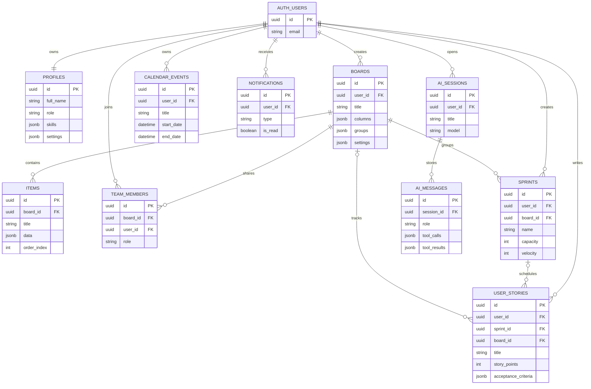

## 4.2. Backend Data Service (Supabase)

The Backend sub-system provides data persistence, authentication, and authorization via Supabase — an open-source Backend-as-a-Service platform built on PostgreSQL. Unlike traditional server-based architectures, AgileFlow communicates directly from the React client to Supabase's auto-generated REST API, eliminating the need for custom middleware.

### 4.2.1. Requirements

**Behavioral Requirements**

| # | Requirement | Description |
|---|---|---|
| BR-1 | CRUD Operations | Every entity (boards, items, stories, sprints, events, notifications) shall support create, read, update, and delete operations via the REST API. |
| BR-2 | User Isolation | Users shall only access their own data, enforced at the database level via Row Level Security. |
| BR-3 | Team Sharing | Board owners can share boards with team members who receive read/write or read-only access. |
| BR-4 | Auto-Profile | A new profile record is automatically created when a user registers, via a database trigger. |
| BR-5 | First-User Admin | The first registered user automatically receives the "admin" role; subsequent users default to "member." |
| BR-6 | Session Management | JWT session tokens are issued on login, automatically refreshed, and invalidated on logout. |
| BR-7 | Cascading Deletes | Deleting a board cascades to all associated items and team_members. Deleting a user cascades to all their data. |

**Performance Requirements**

| # | Metric | Target |
|---|---|---|
| PR-1 | Query Response Time | < 200ms for typical read operations (list boards, fetch items) |
| PR-2 | Connection Pooling | Up to 200 pooled connections via Supavisor (free tier) |
| PR-3 | Database Size | < 500MB (free tier limit; current usage ~5MB) |

**Security Requirements**

| # | Requirement | Description |
|---|---|---|
| SR-1 | Row Level Security | Every table has RLS enabled with per-operation policies (SELECT, INSERT, UPDATE, DELETE). |
| SR-2 | JWT Authentication | All API requests require a valid JWT token in the Authorization header. |
| SR-3 | Password Hashing | Supabase Auth uses bcrypt for password storage; plaintext passwords are never stored. |
| SR-4 | HTTPS Only | All communication between client and Supabase is over TLS (enforced by Supabase infrastructure). |
| SR-5 | SQL Injection Prevention | The Supabase SDK uses parameterized queries; no raw SQL is executed from the client. |

### 4.2.2. Technologies and Methods

**Literature Survey**

The Backend-as-a-Service (BaaS) paradigm represents a significant shift from traditional server-client architectures. BaaS platforms provide managed databases, authentication, and APIs out of the box, allowing frontend developers to build full-stack applications without writing server code. Supabase, launched in 2020 as an open-source Firebase alternative, has gained rapid adoption due to its use of PostgreSQL (providing ACID compliance, relational joins, and JSONB flexibility) over Firebase's Firestore (a document database with eventual consistency).

Row Level Security (RLS) is a PostgreSQL feature that embeds authorization logic directly in the database engine. RLS policies are evaluated on every query, ensuring that even if the application code has bugs, unauthorized data access is prevented at the storage layer. This "defense-in-depth" approach is recommended by OWASP for applications where data isolation is critical.

**Technologies**

| Technology | Version | Role |
|---|---|---|
| Supabase | Hosted (Free Tier) | Backend-as-a-Service platform |
| PostgreSQL | 15 | Relational database engine |
| PostgREST | Auto-managed | Auto-generates REST API from database schema |
| Supabase Auth | Built-in | JWT-based email/password authentication |
| Supabase JS SDK | 2.100.1 | JavaScript client library for browser-to-Supabase communication |
| PL/pgSQL | Built-in | Server-side trigger functions (e.g., handle_new_user) |
| Supavisor | Built-in | Connection pooling (replaces PgBouncer on free tier) |

### 4.2.3. Conceptualization

**Database Entity-Relationship Diagram (ERD)**

The AgileFlow database consists of 10 tables with the following relationships:



**Table Definitions**

| Table | Columns | Key Features |
|---|---|---|
| **profiles** | id (UUID PK), full_name, email, avatar, role, theme, settings (JSONB), job_title, department, skills (JSONB), description | Extends auth.users. Role: admin/member/viewer. Skills stored as JSONB array for AI matching. |
| **boards** | id (UUID PK), user_id (FK), title, description, color, icon, columns (JSONB), groups (JSONB), settings (JSONB), visibility | Columns/groups stored as JSONB arrays, allowing fully customizable board structures without schema changes. |
| **items** | id (UUID PK), board_id (FK), group_id, title, description, data (JSONB), order_index | The `data` JSONB column stores all cell values keyed by column ID, enabling 11 different cell types without separate tables. |
| **calendar_events** | id (UUID PK), user_id (FK), title, description, start_date, end_date, color, event_type, location, attendees (JSONB), all_day | Supports full-day events, time-specific events, and multi-attendee scheduling. |
| **user_stories** | id (UUID PK), user_id (FK), title, description, priority, status, story_points, sprint_id (FK), board_id (FK), assigned_to, acceptance_criteria (JSONB) | Links to both sprints and boards. Acceptance criteria stored as JSONB array. |
| **sprints** | id (UUID PK), user_id (FK), board_id (FK), name, goal, start_date, end_date, status, capacity, committed_points, completed_points, velocity | Tracks capacity vs. committed points for sprint planning. |
| **notifications** | id (UUID PK), user_id (FK), title, message, type, is_read, link | Type CHECK constraint: info, success, warning, error, task, mention, sprint. |
| **team_members** | id (UUID PK), board_id (FK), user_id (FK), role, invited_by (FK) | UNIQUE(board_id, user_id) prevents duplicate memberships. Role: owner/editor/viewer. |
| **ai_sessions** | id (UUID PK), user_id (FK), title, model, created_date, updated_date | Groups AI chat messages into named sessions for history. |
| **ai_messages** | id (UUID PK), session_id (FK), role, content, tool_calls (JSONB), tool_results (JSONB), model, tokens_used, created_date | Stores full conversation including tool call/result pairs for replay. |

**JSONB Column Strategy**

A key design decision was the use of PostgreSQL's JSONB type for flexible schema fields:

- **boards.columns**: Stores the column definitions (title, type, options) as an array. This allows users to add/remove/reorder columns without ALTER TABLE statements.
- **boards.groups**: Stores task groupings (sections) as an array.
- **items.data**: Stores all cell values as a key-value map where keys are column IDs. This single JSONB column supports 11 different cell types (text, status, priority, people, date, timeline, tags, number, checkbox, budget, dropdown) without requiring separate typed columns.
- **profiles.skills**: Stores user skills as a string array for the AI assignment algorithm to match against task keywords.

This hybrid approach (relational structure for entities + JSONB for flexible attributes) provides the best of both worlds: referential integrity via foreign keys and strong consistency via ACID transactions, combined with the schema flexibility typically associated with document databases.

### 4.2.4. Software Architecture

**Request Processing Flow**

Every client request to Supabase follows this path:

1. **Client SDK Call** — The entity service (e.g., `Board.list()`) calls `supabase.from('boards').select('*')`.
2. **JWT Injection** — The Supabase JS SDK automatically attaches the user's JWT token to the `Authorization` header.
3. **PostgREST** — Supabase's PostgREST layer receives the HTTP request, parses the query parameters (filters, sorts, limits), and translates them into a SQL query.
4. **RLS Evaluation** — PostgreSQL evaluates the Row Level Security policies for the target table and operation. The `auth.uid()` function extracts the user ID from the JWT and applies the policy conditions (e.g., `WHERE user_id = auth.uid()`).
5. **Query Execution** — PostgreSQL executes the filtered query against the table, applying any additional WHERE clauses, ORDER BY, and LIMIT from the client request.
6. **Response** — Results are serialized as JSON and returned to the client via the PostgREST response. The Supabase SDK deserializes them into JavaScript objects.

**Row Level Security Policy Summary**

| Table | SELECT Policy | INSERT Policy | UPDATE Policy | DELETE Policy |
|---|---|---|---|---|
| profiles | Any authenticated user | Own profile only (auth.uid() = id) | Own profile OR admin role | - |
| boards | Own boards OR team member | Own boards only (user_id = auth.uid()) | Own boards OR team editor/owner | Own boards only |
| items | Items on accessible boards | Items on boards with editor+ access | Items on boards with editor+ access | Items on boards with editor+ access |
| calendar_events | Own events only | Own events only | Own events only | Own events only |
| user_stories | Own stories only | Own stories only | Own stories only | Own stories only |
| sprints | Own sprints only | Own sprints only | Own sprints only | Own sprints only |
| notifications | Own notifications only | Own notifications only | Own notifications only | Own notifications only |
| team_members | Own memberships OR board owner | Board owner only | Board owner only | Board owner only |

**Entity Service Layer**

The `src/api/entities/` directory contains 11 service modules that wrap Supabase SDK calls with a consistent interface:

```javascript
// Common interface for all entity services
Entity.list(sortField, limit)     // SELECT with optional sort and limit
Entity.get(id)                    // SELECT by primary key
Entity.create(data)               // INSERT with auth user injection
Entity.update(id, data)           // UPDATE by primary key
Entity.delete(id)                 // DELETE by primary key
Entity.filter(filterObj, sort)    // SELECT with WHERE conditions
```

Each service validates authentication before executing queries, picks only valid columns to prevent injection of unexpected fields, and wraps errors in meaningful messages.

**Database Triggers**

| Trigger | Table | Event | Function | Purpose |
|---|---|---|---|---|
| on_auth_user_created | auth.users | AFTER INSERT | handle_new_user() | Auto-creates a profile row when a user signs up. First user gets "admin" role; subsequent users get "member." |

### 4.2.5. Materialization

**Schema Deployment Process**

1. Create a Supabase project via the Supabase Dashboard (supabase.com).
2. Navigate to the SQL Editor in the Supabase Dashboard.
3. Paste and execute `supabase/schema.sql`, which creates all 10 tables, enables RLS, creates policies, and installs triggers.
4. Enable Email Auth in Authentication > Providers.
5. Copy the project URL and anon key to `.env.local`.

**Environment Configuration**

| Variable | Purpose |
|---|---|
| VITE_SUPABASE_URL | Supabase project URL (e.g., https://xxxx.supabase.co) |
| VITE_SUPABASE_ANON_KEY | Public anon key for client-side authentication |
| VITE_OPENROUTER_API_KEY | API key for AI assistant (OpenRouter) |

### 4.2.6. Evaluation

**Functional Test Cases**

| # | Test Case | Method | Expected Result |
|---|---|---|---|
| TC-1 | User registration | Manual | New profile created with "member" role. JWT issued. |
| TC-2 | Board CRUD | Unit test | Board created, listed, updated, deleted without errors. |
| TC-3 | Item CRUD | Unit test | Items associated with board, data JSONB persisted correctly. |
| TC-4 | RLS data isolation | Manual | User A cannot see User B's boards, items, or events. |
| TC-5 | Team member access | Manual | Invited team member can view shared board and its items. |
| TC-6 | Cascading delete | Manual | Deleting a board removes all associated items and team_members. |
| TC-7 | First-user admin | Manual | First registered user has role "admin"; second has "member." |
| TC-8 | JSONB column operations | Unit test | Board columns/groups stored and retrieved correctly from JSONB. |

**Security Test Cases**

| # | Test Case | Method | Expected Result |
|---|---|---|---|
| ST-1 | Unauthenticated access | Manual (curl) | HTTP 401 returned for any table query without JWT. |
| ST-2 | Cross-user data access | Manual | RLS blocks SELECT on another user's boards (empty result set). |
| ST-3 | Viewer write attempt | Manual | RLS blocks INSERT/UPDATE for team members with "viewer" role. |
| ST-4 | SQL injection via SDK | Code review | Supabase SDK parameterizes all queries; no raw SQL paths exist. |
