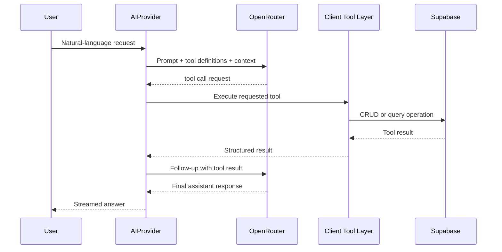
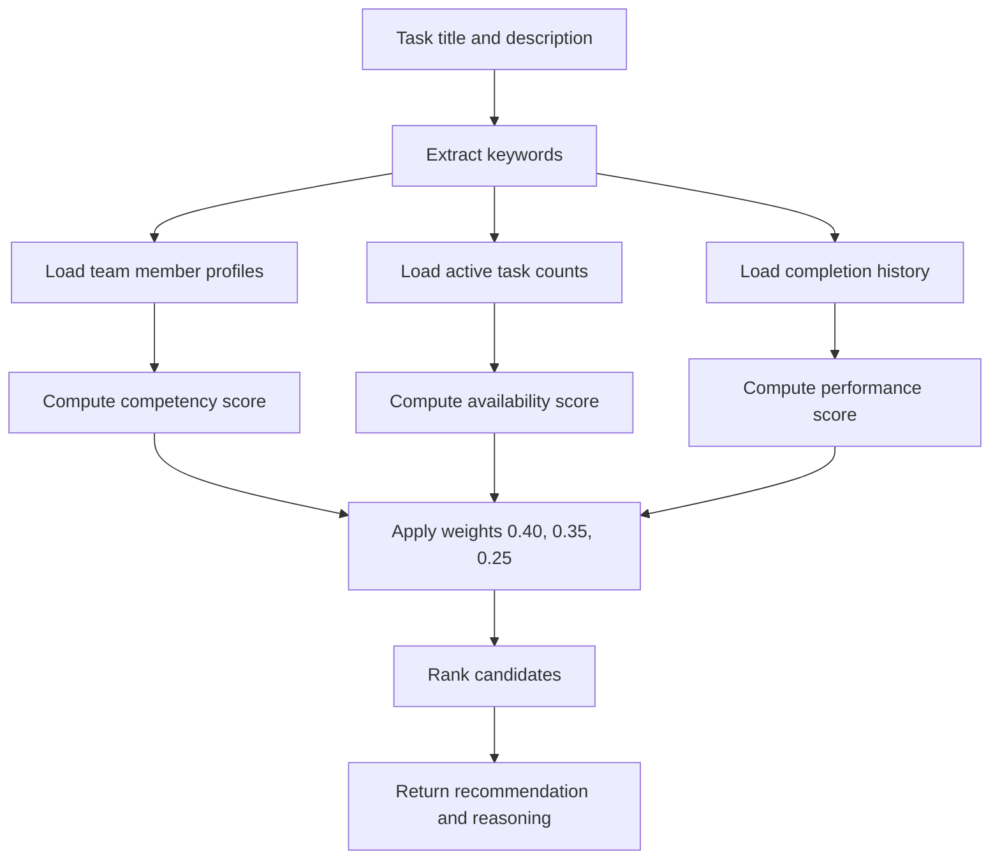
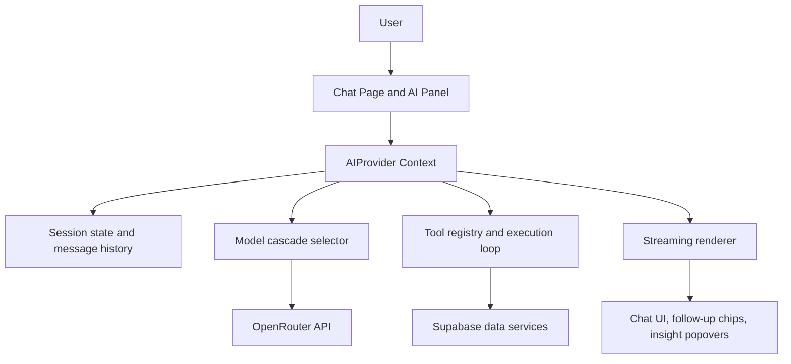
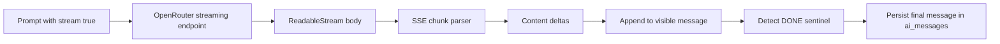
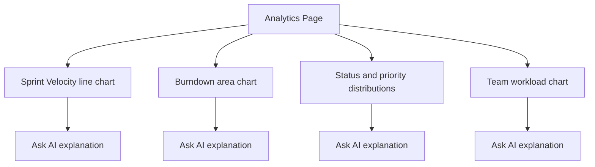

## 4.3. AI Collaboration & Analytics Engine

The AI sub-system provides intelligent collaboration features through the OpenRouter API, a unified gateway to multiple large language model (LLM) providers. It encompasses a conversational assistant with tool-calling capabilities, an intelligent task assignment algorithm, streaming response delivery, persistent chat sessions, and analytics dashboards augmented by AI-generated explanations.

### 4.3.1. Requirements

**Behavioral Requirements**

| # | Requirement | Description |
|---|---|---|
| AR-1 | Natural Language Chat | Users can send messages in natural language and receive contextual responses about their project data. |
| AR-2 | Tool Calling | The AI can execute actions (create tasks, assign members, list boards) by generating structured tool calls that the client executes against Supabase. |
| AR-3 | Multi-Turn Tool Loops | The system supports up to 3 rounds of tool calls per message, allowing the AI to chain operations (e.g., list boards -> find task -> update task). |
| AR-4 | Task Assignment Scoring | The AI can recommend the best team member for a task using a weighted scoring algorithm combining competency (40%), availability (35%), and performance (25%). |
| AR-5 | Sprint Composition | The AI can suggest which backlog stories to include in a sprint based on priority, capacity, and team skills. |
| AR-6 | Streaming Responses | AI responses are delivered token-by-token via streaming, providing progressive rendering as the model generates text. |
| AR-7 | Chat Persistence | Conversations are stored in ai_sessions and ai_messages tables, allowing users to resume previous chats. |
| AR-8 | Model Fallback | If a model fails (rate limit, error, timeout), the system automatically tries the next model in the cascade. |
| AR-9 | Mode Selection | Users can choose between "Fast" mode (optimized for speed with lighter models) and "Thinking" mode (optimized for accuracy with heavier models). |
| AR-10 | Analytics Explanation | An "Ask AI" button on analytics widgets sends chart data to the AI for plain-language interpretation. |

**Performance Requirements**

| # | Metric | Target |
|---|---|---|
| AP-1 | First Token Latency | < 3 seconds from message submission |
| AP-2 | Streaming Throughput | Progressive rendering at model generation speed (~30-60 tokens/sec) |
| AP-3 | Tool Execution | < 500ms per tool call (Supabase CRUD operation) |
| AP-4 | Daily Request Capacity | Up to 1,000 requests/day (with 10+ OpenRouter credits) |

### 4.3.2. Technologies and Methods

**Literature Survey**

Large Language Models (LLMs) have rapidly evolved from text-generation tools to function-calling agents capable of interacting with external systems. The tool-calling paradigm — where the LLM outputs structured JSON describing which function to call and with what parameters — enables AI assistants to perform real actions rather than just providing advice. This pattern, pioneered by OpenAI's function calling API and adopted by Anthropic, Google, and Meta, is now standard across major LLM providers.

The multi-model approach, facilitated by API aggregators like OpenRouter, addresses the reliability and cost concerns inherent to single-provider integrations. By defining a cascade of models ordered by cost and capability, applications can maintain high availability while minimizing per-request costs. Free-tier models (Llama, Gemini Flash) serve as fallbacks when premium models (GPT-4o-mini, Claude Haiku) are rate-limited.

For task assignment, the team implemented a Multi-Criteria Decision Making (MCDM) approach inspired by the Analytic Hierarchy Process (AHP). The scoring algorithm evaluates candidates across three weighted dimensions — competency match, workload availability, and historical performance — producing a normalized suitability score that can be explained to the user.

**Technologies**

| Technology | Role |
|---|---|
| OpenRouter API | Unified LLM gateway providing access to multiple model providers |
| GPT-4o-mini (OpenAI) | Primary model for general queries (low cost, high capability) |
| Llama 3.3 8B (Meta) | Free-tier fallback model |
| Gemini 2.0 Flash (Google) | Free-tier fallback model |
| Claude 3.5 Haiku (Anthropic) | High-quality fallback model |
| Recharts 2.15.4 | Composable React charting library for analytics |
| react-markdown 9.1.0 | Markdown rendering for AI responses |
| remark-gfm 4.0.1 | GitHub Flavored Markdown support (tables, task lists) |

### 4.3.3. Conceptualization

**AI Tool Definitions**

The AI assistant has access to 16 tools organized by domain:

| Category | Tool | Description |
|---|---|---|
| **Team** | listTeamMembers | List all team members with profiles, skills, roles, and workload |
| **Boards** | listBoards | List all boards with column structure and groups |
| | createBoard | Create a new board with custom columns and groups |
| | updateBoard | Update board title or description |
| | deleteBoard | Permanently delete a board and all its tasks |
| **Tasks** | createTask | Create a task with title, description, status, priority, assignee |
| | updateTask | Update any task property (status, assignee, priority, etc.) |
| | deleteTask | Permanently delete a task |
| | getTaskDetails | Fetch full details of a specific task with resolved column values |
| | listTasks | List tasks on a board with optional status/assignee filters |
| | assignTask | Assign a task to a team member by name search |
| **AI Assignment** | suggestAssignment | Score and rank team members for a task by competency, availability, performance |
| | suggestSprintPlan | Suggest which backlog stories to include in the next sprint |
| **Navigation** | getPageContext | Get information about the user's current page and visible data |
| | navigateToPage | Navigate the user to a different page or board |
| **Analytics** | explainAnalytics | Generate natural-language explanations of analytics chart data |

**Tool-Calling Sequence**

The tool-calling flow follows an iterative pattern:

**Figure 19. AI Tool-Calling Sequence Diagram**


1. **User Message** — The user sends a natural-language message (e.g., "Create a task called 'Fix login bug' on the Development board and assign it to Khalid").
2. **Prompt Construction** — The AIProvider builds a prompt containing:
   - System instructions (platform description, capabilities)
   - Last 10 messages for conversation context
   - Current page context (active board, visible data)
   - Full tool definition array (16 tools with JSON schemas)
3. **LLM Response** — The model returns a response that may contain tool calls:
   ```json
   {
     "tool_calls": [
       { "function": { "name": "listBoards", "arguments": "{}" } }
     ]
   }
   ```
4. **Tool Execution** — The client executes the tool against Supabase and returns the result.
5. **Follow-Up** — The tool result is appended to the conversation and sent back to the LLM.
6. **Iteration** — Steps 3-5 repeat for up to 3 rounds until the LLM produces a final text response.
7. **Rendering** — The final text is streamed token-by-token and rendered with Markdown formatting.

**Task Assignment Scoring Algorithm**

The assignment engine in `src/lib/ai-assignment.js` calculates a suitability score for each team member:

**Figure 20. AI Task Assignment Scoring Algorithm Flow**


```
Suitability = w1 * Competency + w2 * Availability + w3 * Performance
```

Where:
- **w1 = 0.40 (Competency)** — Measures skill match between the task keywords (extracted from title and text columns) and the member's profile (skills array, job title, department, description). Uses keyword overlap with substring matching.
- **w2 = 0.35 (Availability)** — Inverse of current workload. Counts active tasks (status: "in progress", "working on it") assigned to the member. More active tasks = lower availability score.
- **w3 = 0.25 (Performance)** — Historical completion rate. Calculates the ratio of completed tasks to total assigned tasks for the member. Higher completion rates = higher performance score.

The algorithm:
1. Extracts keywords from the task title and description, filtering stop words.
2. For each team member, scores competency by matching keywords against the member's skills, job title, department, and description fields.
3. Queries all items across boards to count active and completed tasks per member.
4. Normalizes all scores to [0, 1] and applies the weighted formula.
5. Returns ranked candidates with scores and reasoning text.

**Sprint Composition Suggestion**

The `suggestSprintComposition` function selects backlog stories for a sprint:
1. Fetches all backlog stories (status = "backlog") sorted by priority.
2. Reads the sprint's remaining capacity (capacity - committed_points).
3. Greedily selects stories by priority until capacity is filled.
4. Returns the suggested set with total story points and remaining capacity.

### 4.3.4. Software Architecture

**AI Provider Architecture**

The AI system is implemented as a React Context (`AIProvider`) that wraps the application:

**Figure 18. AI Assistant Architecture Diagram**


- **AIProvider** (`src/lib/AIContext.jsx`) — Manages AI state: active session, message history, streaming state, model selection, tool execution loop.
- **Chat Page** (`src/pages/Chat.jsx`) — Full-page chat interface with session sidebar, message list, and input.
- **AI Panel** (`src/components/utils/AIAssistant.jsx`) — Slide-out panel accessible from any page.
- **AI Follow-Up Chips** (`src/components/ai/AIFollowUpChips.jsx`) — Suggested follow-up questions after AI responses.
- **AI Explain Button** (`src/components/ai/AIExplainButton.jsx`) — "Ask AI" button on analytics widgets.
- **AI Insight Popover** (`src/components/ai/AIInsightPopover.jsx`) — Inline AI explanations on dashboard widgets.

**Model Cascade Configuration**

```javascript
const MODEL_CASCADE = [
  'openai/gpt-4o-mini',                        // Primary: low cost, high capability
  'meta-llama/llama-3.3-8b-instruct:free',     // Fallback 1: free tier
  'google/gemini-2.0-flash-001',               // Fallback 2: free tier
  'anthropic/claude-3.5-haiku',                // Fallback 3: high quality
];
```

The cascade is tried sequentially. If a model returns an error (rate limit, server error, invalid response), the system catches the error and tries the next model. If all models fail, a user-friendly error message is displayed.

**Streaming Pipeline**

For streaming responses, the system:

**Figure 21. AI Streaming Response Pipeline**

1. Sends the prompt with `stream: true` to the OpenRouter API.
2. Reads the response body as a `ReadableStream`.
3. Processes Server-Sent Events (SSE) chunks, extracting `data: {...}` payloads.
4. Appends each content delta to the displayed message in real-time.
5. Detects `[DONE]` sentinel to finalize the message.
6. Persists the complete message to the `ai_messages` table.

### 4.3.5. Analytics Dashboard

The Analytics page (`src/pages/Analytics.jsx`) provides data-driven insights through Recharts visualizations:

**Figure 22. Analytics Dashboard - Sprint Velocity and Burndown**


| Widget | Chart Type | Data Source | Description |
|---|---|---|---|
| Task Completion Rate | Radial bar | All items | Percentage of tasks with "Done" status across all boards |
| Status Distribution | Pie chart | All items | Breakdown of tasks by status (To Do, In Progress, Done, Stuck) |
| Priority Distribution | Bar chart | All items | Count of tasks by priority level (Critical, High, Medium, Low) |
| Sprint Velocity | Line chart | Sprints | Completed story points per sprint over time |
| Team Workload | Bar chart | Items + Profiles | Number of active tasks assigned to each team member |
| Overdue Tasks | Table | Items with dates | Tasks whose due date has passed without "Done" status |
| Burndown Chart | Area chart | Sprint items | Ideal vs. actual remaining work over sprint duration |
| Cycle Time | Bar chart | Items with dates | Average time from "To Do" to "Done" per task |

Each analytics widget includes an "Ask AI" button that sends the widget's data to the AI assistant for a natural-language explanation (e.g., "Your sprint velocity has been increasing over the last 3 sprints, averaging 28 story points. The team's throughput appears stable.").

### 4.3.6. Evaluation

**AI Functional Test Cases**

| # | Test Case | Method | Expected Result |
|---|---|---|---|
| AT-1 | Basic conversation | Manual | AI responds to "Hello" with a contextual greeting mentioning the user's project data. |
| AT-2 | Task creation via tool call | Manual | "Create a task called X on board Y" triggers createTask tool and confirms creation. |
| AT-3 | Multi-step tool chain | Manual | "Assign the latest task to the best person" triggers listBoards -> listTasks -> suggestAssignment -> assignTask. |
| AT-4 | Model fallback | Manual (disable primary key) | If GPT-4o-mini fails, the system falls back to Llama or Gemini and still responds. |
| AT-5 | Streaming rendering | Manual | Response appears token-by-token as the model generates, not as a single block. |
| AT-6 | Session persistence | Manual | Refreshing the Chat page and selecting a previous session displays the full message history. |
| AT-7 | Assignment scoring | Manual | suggestAssignment returns ranked candidates with scores and reasoning. |
| AT-8 | Sprint suggestion | Manual | suggestSprintPlan returns prioritized stories fitting within sprint capacity. |
| AT-9 | Analytics explanation | Manual | Clicking "Ask AI" on a chart widget produces a natural-language summary of the data. |
| AT-10 | Error handling | Manual | Invalid tool parameters (e.g., non-existent board_id) return a friendly error, not a crash. |
