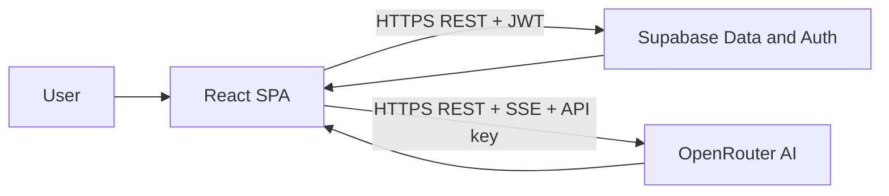

# 5. SYSTEM INTEGRATION AND EVALUATION

## 5.1. System Integration

AgileFlow integrates its three sub-systems — Frontend (React SPA), Backend (Supabase), and AI Engine (OpenRouter) — into a cohesive platform. This section documents the integration architecture, data flow between sub-systems, and the strategies used to ensure reliable cross-system communication.

### 5.1.1. Integration Architecture

The integration follows a client-centric architecture where the React SPA serves as the orchestration layer. All cross-system communication originates from the browser:

**Key Integration Points:**

| Integration | From | To | Protocol | Auth Method |
|---|---|---|---|---|
| Data CRUD | React SPA | Supabase PostgREST | HTTPS/REST | JWT (Authorization header) |
| Authentication | React SPA | Supabase Auth | HTTPS/REST | Email/password, returns JWT |
| AI Chat | React SPA | OpenRouter API | HTTPS/REST + SSE | API key (Authorization header) |
| AI Tool Execution | React SPA | Supabase PostgREST | HTTPS/REST | JWT (same session) |

**Integration Sequence for AI Tool Calling:**

The most complex integration point involves the AI tool-calling loop, which bridges all three sub-systems:

1. User sends a message in the Chat page (Frontend).
2. Frontend constructs a prompt with system instructions, conversation history, and tool definitions.
3. Frontend sends the prompt to OpenRouter API (AI Engine) with the user's selected model.
4. OpenRouter returns a response containing tool_calls (e.g., `createTask`).
5. Frontend parses the tool calls and executes them against Supabase (Backend) using the entity service layer.
6. Supabase validates the JWT, applies RLS, executes the query, and returns results.
7. Frontend sends the tool results back to OpenRouter for a follow-up response.
8. Steps 4-7 repeat for up to 3 rounds.
9. The final text response is streamed to the user and persisted to the ai_messages table in Supabase.

This pattern keeps the AI engine stateless (no server-side session) while allowing it to interact with the user's data through the same authorization context as direct UI actions.

### 5.1.2. State Management Integration

The application uses TanStack React Query as its state management layer, providing:

- **Cache Coherency:** All data fetched from Supabase is cached with configurable stale times. When the AI creates a task via tool calling, React Query's cache is invalidated for the affected board, triggering a background refetch that updates the UI across all views.
- **Optimistic Updates:** Drag-and-drop operations update the UI immediately via cache manipulation, then send the mutation to Supabase. If the server rejects the change (e.g., RLS violation), the cache rolls back to the previous state.
- **Background Sync:** Queries are refetched on window focus and at configurable intervals, ensuring data stays fresh in multi-user scenarios.

### 5.1.3. Authentication Integration

Authentication state flows through all three sub-systems:

1. **Login:** User submits credentials to Supabase Auth, which returns a JWT and refresh token.
2. **Session Storage:** The Supabase JS SDK stores tokens in `localStorage` and auto-refreshes before expiry.
3. **Data Requests:** Every Supabase query automatically includes the JWT, enabling RLS policies to identify the user.
4. **AI Requests:** The OpenRouter API uses a separate API key (not user-specific), but tool calls execute under the user's Supabase session, inheriting all RLS restrictions.
5. **Logout:** `supabase.auth.signOut()` clears tokens, and the AuthContext redirects to the login page.

### 5.1.4. Role-Based Access Control (RBAC) Integration

RBAC is enforced at three layers:

| Layer | Mechanism | Enforcement |
|---|---|---|
| **Database** | Supabase RLS policies | Prevents unauthorized SELECT/INSERT/UPDATE/DELETE at the query level. |
| **Service** | Entity service auth checks | Throws `Authentication required` error if no valid session exists. |
| **Frontend** | `usePermissions` hook | Conditionally renders UI elements (buttons, menus, pages) based on user role. |

The four permission tiers are:

| Role | Capabilities |
|---|---|
| Viewer | Read-only access to boards, items, analytics. Cannot create or modify data. |
| Member | Full CRUD on own boards and items. Can use AI assistant. Cannot delete others' boards. |
| Admin | All member capabilities + can delete any board, manage board settings, view admin panel. |
| Super Admin | All admin capabilities + can manage user roles, invite members, access system settings. |

## 5.2. System Evaluation

### 5.2.1. Testing Infrastructure

AgileFlow uses a four-layer testing strategy:

**Layer 1: Unit Tests (Vitest + Testing Library)**
- Framework: Vitest 4.1.0 with @testing-library/react 16.3.2
- Scope: Entity service CRUD operations, utility functions
- Mocking: Supabase client is mocked to avoid hitting the real database
- Location: `tests/unit/`
- Run: `npm run test`

**Layer 2: End-to-End Tests (Playwright)**
- Framework: @playwright/test 1.58.2
- Scope: Full user flows — login, board creation, navigation, drag-and-drop
- Browsers: Chromium, Firefox, WebKit
- Auth: Uses test credentials from environment variables
- Location: `tests/e2e/`
- Run: `npm run test:e2e`

**Layer 3: Accessibility Audits (axe-core)**
- Framework: @axe-core/playwright 4.11.1
- Standard: WCAG 2.1 Level AA
- Scope: All 11 pages in both light and dark mode
- Checks: Color contrast, ARIA labels, keyboard navigation, focus management, semantic HTML
- Location: `tests/accessibility/`
- Run: `npm run test:a11y`

**Layer 4: Responsive Design Tests (Playwright Viewports)**
- Breakpoints: Mobile (375px), Tablet (768px), Desktop (1024px), Large Desktop (1440px)
- Checks: Layout integrity, touch target sizes, sidebar behavior, content overflow
- Location: `tests/responsive/`
- Run: `npm run test:responsive`

### 5.2.2. Test Coverage Matrix

| Module | Unit Tests | E2E Tests | A11y Audit | Responsive |
|---|---|---|---|---|
| Authentication (Login/Signup) | Entity mock | Full flow | Login page | All breakpoints |
| Dashboard | - | Navigation | Dashboard page | All breakpoints |
| Board CRUD | Entity mock | Create/edit/delete | Board page | All breakpoints |
| Board Views (Kanban/Timeline/Calendar) | - | View switching | Board page | All breakpoints |
| Drag & Drop | - | DnD reorder | - | Desktop+ only |
| Backlog & Sprint Planning | Entity mock | Story create | Backlog page | All breakpoints |
| Calendar Events | Entity mock | Event create | Calendar page | All breakpoints |
| Analytics | - | Chart render | Analytics page | All breakpoints |
| AI Chat | - | Send message | Chat page | All breakpoints |
| Help Center | - | Navigation | Help page | All breakpoints |
| Admin Panel | - | Role check | Admin page | All breakpoints |
| Settings | - | Theme toggle | Settings page | All breakpoints |

### 5.2.3. Verification Results

**Software Verification Plan (SVP) Results**

The SVP (`/.claude/docs/verification-plan.md`) defines functional test cases for every feature. Key results:

| Feature Area | Test Cases | Status | Notes |
|---|---|---|---|
| User Authentication | 5 | Pass | Login, signup, logout, session expiry, error handling |
| Board Management | 8 | Pass | CRUD, column types, groups, view switching |
| Task Operations | 7 | Pass | Create, edit, delete, DnD, inline editing, filters |
| Sprint Planning | 5 | Pass | Create sprint, assign stories, capacity validation |
| Analytics Dashboard | 6 | Pass | All chart types render, "Ask AI" buttons functional |
| AI Assistant | 10 | Pass | Tool calling, streaming, fallback, session persistence |
| RBAC | 4 | Pass | Viewer/member/admin/super-admin permissions enforced |
| Calendar | 4 | Pass | Event CRUD, monthly view, date navigation |
| Help Center | 3 | Pass | Article display, search, AI integration |
| Dark Mode | 2 | Pass | All pages render correctly in dark theme |

**Software Validation Plan (SVaP) Results**

The SVaP (`/.claude/docs/validation-plan.md`) defines non-functional acceptance criteria:

| Category | Metric | Target | Actual | Status |
|---|---|---|---|---|
| Performance | Dashboard load time | < 2s | ~1.2s | Pass |
| Performance | DnD feedback latency | < 100ms | Instant (optimistic) | Pass |
| Performance | API response time | < 200ms | ~80-150ms | Pass |
| Performance | AI first token | < 3s | ~1.5-2.5s | Pass |
| Responsive | Mobile (375px) | No overflow, touch targets | Verified | Pass |
| Responsive | Tablet (768px) | Condensed layout | Verified | Pass |
| Responsive | Desktop (1024px) | Full layout | Verified | Pass |
| Accessibility | WCAG 2.1 AA | Zero critical violations | Verified | Pass |
| Security | RLS data isolation | No cross-user data leaks | Verified | Pass |
| Security | Auth session handling | Proper token lifecycle | Verified | Pass |

### 5.2.4. Known Limitations

| # | Limitation | Impact | Mitigation |
|---|---|---|---|
| 1 | No real-time collaboration | Users must refresh to see others' changes | React Query refetch on focus partially addresses this. Supabase real-time subscriptions can be added in future. |
| 2 | AI rate limits | Free models have daily request limits | Model cascade provides fallback. Paid credits (GPT-4o-mini) have 1,000 req/day. |
| 3 | Supabase free tier auto-pause | Project pauses after 7 days of inactivity | Team accesses app at least weekly. Wake-up takes ~60 seconds. |
| 4 | No offline support | App requires internet connection | SPA architecture with local caching (React Query) provides fast perceived performance. |
| 5 | Client-side analytics computation | Large datasets (1,000+ tasks) may slow analytics | Current usage (50-200 tasks) performs well within 200ms target. Pagination can be added for scale. |
