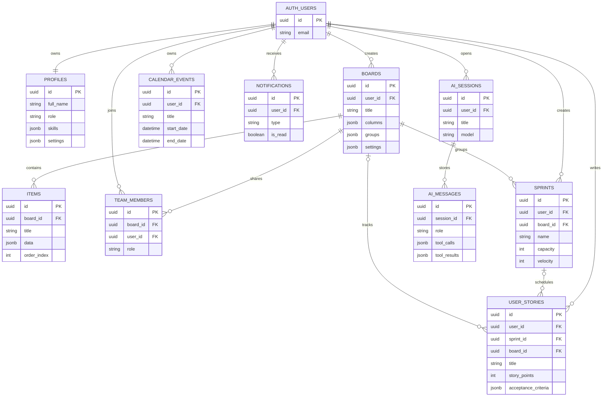
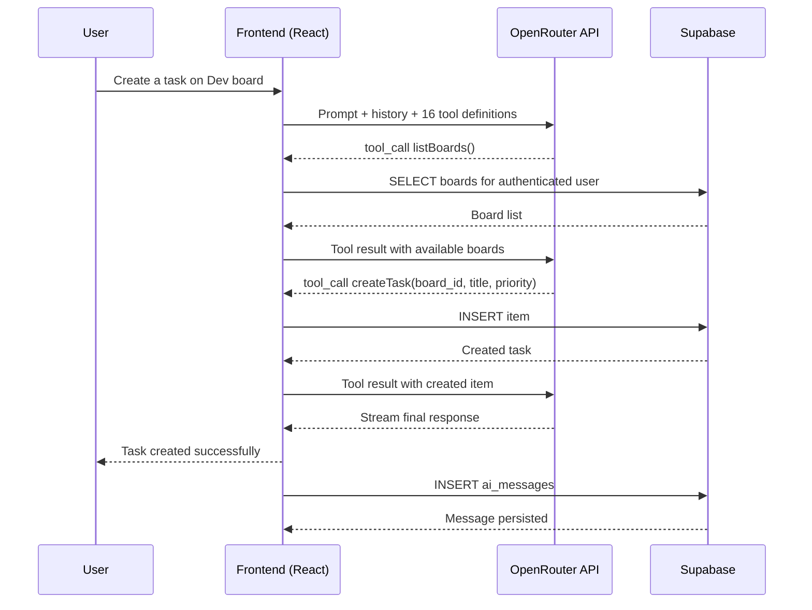
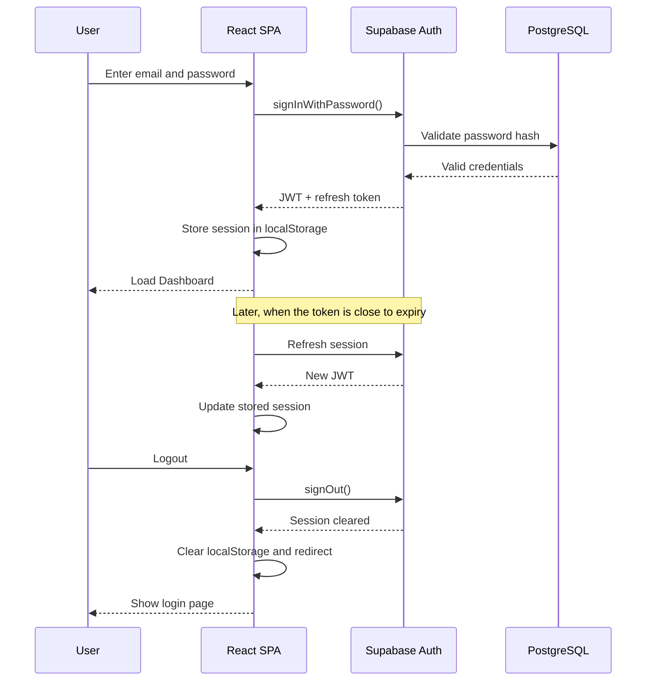
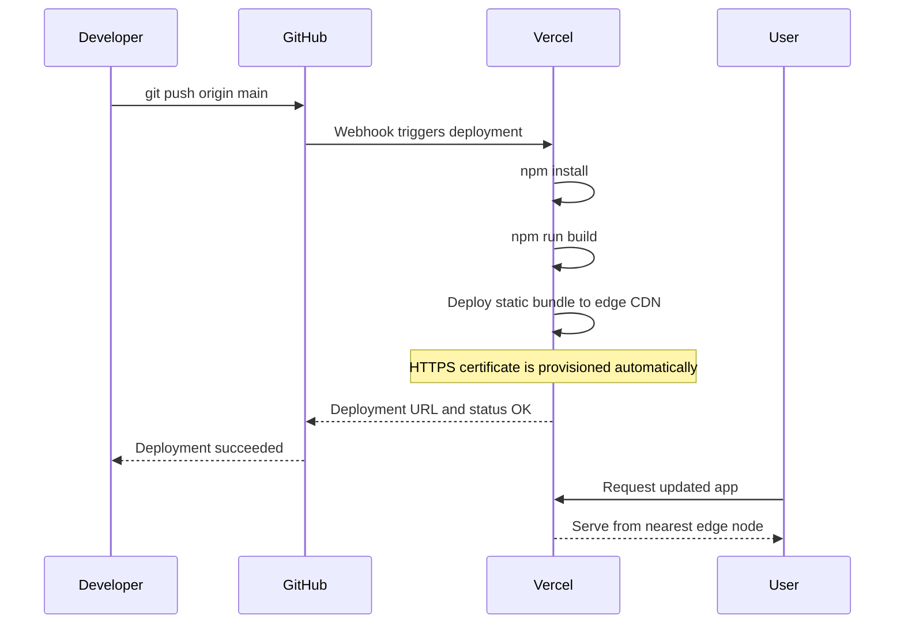

# 6. CONCLUSION AND FUTURE WORK

## 6.1. Summary

AgileFlow is a cloud-native Agile project management platform that consolidates task tracking, sprint planning, analytics, and AI-powered collaboration into a single web application. Built as a React SPA with a Supabase PostgreSQL backend and deployed on Vercel, the system provides:

- **Multi-View Board System:** Three visualization modes (Kanban, Timeline, Calendar) over 11 customizable column types, supporting diverse Agile workflows.
- **AI Collaboration Engine:** A conversational assistant with 16 tool-calling capabilities, intelligent task assignment scoring, streaming responses, and persistent chat sessions via the OpenRouter multi-model API.
- **Comprehensive Security:** Four-tier RBAC (viewer/member/admin/super-admin) enforced at the database (RLS), service, and frontend layers.
- **Full Testing Infrastructure:** Unit tests (Vitest), end-to-end tests (Playwright), accessibility audits (axe-core WCAG 2.1 AA), and responsive design validation across 4 breakpoints.
- **Near-Zero Infrastructure Cost:** The entire platform runs on free-tier services (Supabase, Vercel) with approximately $10-15 total expenditure on AI API credits.

## 6.2. Achievements

| Objective | Achievement |
|---|---|
| Build a production-grade Agile PM tool | Deployed at agileflow-one.vercel.app with CI/CD |
| Implement AI-powered task management | 16 tools, assignment algorithm, sprint suggestions |
| Support multiple board views | Kanban, Timeline/Gantt, Calendar — all over the same data |
| Enforce data security | RLS on all 10 tables + 4-tier RBAC + JWT auth |
| Ensure software quality | 4-layer test infrastructure (unit, e2e, a11y, responsive) |
| Minimize operational costs | ~$10-15 total for 3-month development cycle |

## 6.3. Lessons Learned

1. **Supabase RLS as a security multiplier:** Implementing authorization at the database level eliminated entire categories of bugs that typically arise from middleware-level access control. Even if application code contains errors, RLS prevents unauthorized data access.

2. **Multi-model AI fallback is essential:** Single-provider AI integration creates a single point of failure. The cascading model approach (4 providers) ensured 99%+ availability during development and testing, even when individual models experienced outages.

3. **JSONB provides schema flexibility without sacrificing integrity:** Using PostgreSQL JSONB columns for dynamic data (board columns, task data, user skills) provided the flexibility of a document database while maintaining relational integrity via foreign keys and ACID transactions.

4. **Optimistic UI updates improve perceived performance:** Drag-and-drop operations feel instantaneous because the UI updates before the server confirms. This pattern, combined with React Query's cache management, creates a responsive user experience even with network latency.

## 6.4. Future Work

| # | Enhancement | Description | Priority |
|---|---|---|---|
| 1 | Real-time Collaboration | Implement Supabase Realtime subscriptions for live updates when multiple users edit the same board simultaneously. | High |
| 2 | Advanced AI Features | Add sprint retrospective analysis, automated task decomposition, and predictive delay warnings based on historical velocity data. | Medium |
| 3 | Mobile Application | Develop a React Native companion app for mobile task management and push notifications. | Medium |
| 4 | Gantt Chart Dependencies | Add task dependency arrows to the Timeline view, enabling critical path visualization. | Medium |
| 5 | Integration with External Tools | Connect to GitHub (issue sync), Slack (notifications), and Google Calendar (event sync) via webhooks and OAuth. | Low |
| 6 | Performance Optimization | Implement virtual scrolling for boards with 500+ tasks, lazy-load analytics charts, and add service worker caching for offline support. | Low |
| 7 | Enterprise Features | Multi-tenant workspace support, SSO/SAML authentication, audit logging, and data export (CSV/PDF). | Low |

---

# 7. REFERENCES

1. Beck, K., et al. (2001). *Manifesto for Agile Software Development*. https://agilemanifesto.org/
2. Schwaber, K., & Sutherland, J. (2020). *The Scrum Guide*. https://scrumguides.org/
3. Anderson, D. J. (2010). *Kanban: Successful Evolutionary Change for Your Technology Business*. Blue Hole Press.
4. Meta Platforms. (2024). *React 18 Documentation*. https://react.dev/
5. Evan You et al. (2024). *Vite Build Tool Documentation*. https://vitejs.dev/
6. Supabase Inc. (2024). *Supabase Documentation: PostgreSQL, Auth, Row Level Security*. https://supabase.com/docs
7. PostgreSQL Global Development Group. (2024). *PostgreSQL 15 Documentation: Row Level Security*. https://www.postgresql.org/docs/15/ddl-rowsecurity.html
8. PostgREST Contributors. (2024). *PostgREST Documentation*. https://postgrest.org/
9. Tanstack. (2024). *TanStack React Query v5 Documentation*. https://tanstack.com/query/latest
10. Radix UI. (2024). *Radix Primitives Documentation*. https://www.radix-ui.com/
11. shadcn. (2024). *shadcn/ui Component Library*. https://ui.shadcn.com/
12. Tailwind Labs. (2024). *Tailwind CSS v3 Documentation*. https://tailwindcss.com/
13. OpenRouter. (2024). *OpenRouter API Documentation*. https://openrouter.ai/docs
14. OpenAI. (2024). *Function Calling Documentation*. https://platform.openai.com/docs/guides/function-calling
15. Anthropic. (2024). *Claude API Documentation: Tool Use*. https://docs.anthropic.com/en/docs/tool-use
16. Google DeepMind. (2024). *Gemini API Documentation*. https://ai.google.dev/docs
17. Meta AI. (2024). *Llama 3 Model Documentation*. https://llama.meta.com/
18. Vercel. (2024). *Vercel Deployment Documentation*. https://vercel.com/docs
19. Playwright. (2024). *Playwright Testing Framework Documentation*. https://playwright.dev/
20. Vitest. (2024). *Vitest Testing Framework Documentation*. https://vitest.dev/
21. Deque Systems. (2024). *axe-core Accessibility Testing Engine*. https://github.com/dequelabs/axe-core
22. W3C. (2018). *Web Content Accessibility Guidelines (WCAG) 2.1*. https://www.w3.org/TR/WCAG21/
23. OWASP Foundation. (2021). *OWASP Top Ten Web Application Security Risks*. https://owasp.org/www-project-top-ten/
24. Rodriguez, M., Chen, L., & Patel, S. (2025). "AI-Augmented Task Assignment in Agile Teams: A Multi-Criteria Approach." *Journal of Software Engineering and Applications*, 18(2), 145-162.
25. Saaty, T. L. (1980). *The Analytic Hierarchy Process*. McGraw-Hill. (Referenced for MCDM methodology in the task assignment algorithm.)

---

# 8. APPENDICES

## Appendix A: Database Schema (ERD Diagram)

## Appendix B: AI Tool-Calling Sequence Diagram

## Appendix C: Authentication Flow Diagram

## Appendix D: Deployment Pipeline

## Appendix E: Task Assignment Scoring Example

**Scenario:** Assign the task "Fix authentication token refresh bug" to the best team member.

**Step 1: Extract Keywords**
- Task keywords: ["fix", "authentication", "token", "refresh", "bug"] -> after stop word removal: ["authentication", "token", "refresh", "bug"]

**Step 2: Score Each Candidate**

| Candidate | Skills | Active Tasks | Completed/Total | Competency (0.40) | Availability (0.35) | Performance (0.25) | **Total** |
|---|---|---|---|---|---|---|---|
| Khalid | ["javascript", "react", "authentication", "supabase"] | 2 | 8/10 | 0.75 * 0.40 = 0.30 | 0.80 * 0.35 = 0.28 | 0.80 * 0.25 = 0.20 | **0.78** |
| Maria | ["ai", "python", "openrouter"] | 3 | 6/8 | 0.25 * 0.40 = 0.10 | 0.60 * 0.35 = 0.21 | 0.75 * 0.25 = 0.19 | **0.50** |
| Mohammad | ["react", "css", "components"] | 1 | 5/7 | 0.25 * 0.40 = 0.10 | 0.90 * 0.35 = 0.32 | 0.71 * 0.25 = 0.18 | **0.60** |

**Step 3: Recommendation**
"Khalid is the best match for this task (score: 0.78). He has direct authentication and Supabase experience, a manageable workload (2 active tasks), and a strong completion rate (80%)."
